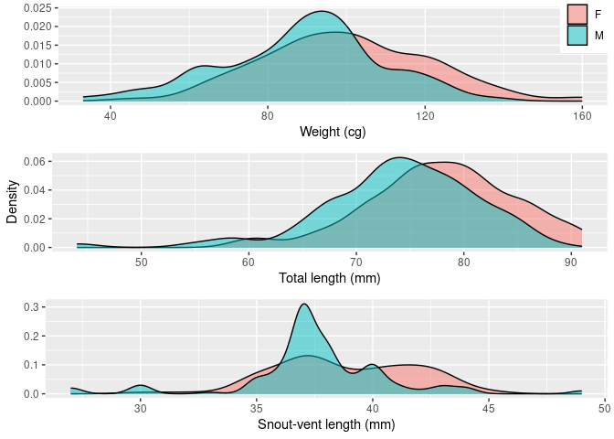

Red-backed salamander abundance and distribution in north-central
Massachusetts
================
Joshua A. Harkness
2024-02-13

``` r
#install.packages(gridExtra)
library(tidyverse)
```

    ## ── Attaching core tidyverse packages ──────────────────────── tidyverse 2.0.0 ──
    ## ✔ dplyr     1.1.4     ✔ readr     2.1.5
    ## ✔ forcats   1.0.0     ✔ stringr   1.5.1
    ## ✔ ggplot2   3.4.4     ✔ tibble    3.2.1
    ## ✔ lubridate 1.9.3     ✔ tidyr     1.3.1
    ## ✔ purrr     1.0.2     
    ## ── Conflicts ────────────────────────────────────────── tidyverse_conflicts() ──
    ## ✖ dplyr::filter() masks stats::filter()
    ## ✖ dplyr::lag()    masks stats::lag()
    ## ℹ Use the conflicted package (<http://conflicted.r-lib.org/>) to force all conflicts to become errors

``` r
library(broom)
library(stringr)
library(sf)
```

    ## Linking to GEOS 3.8.0, GDAL 3.0.4, PROJ 6.3.1; sf_use_s2() is TRUE

``` r
library(ggspatial)
library(readxl)
library(GGally)
```

    ## Registered S3 method overwritten by 'GGally':
    ##   method from   
    ##   +.gg   ggplot2

``` r
library(gridExtra)
```

    ## 
    ## Attaching package: 'gridExtra'
    ## 
    ## The following object is masked from 'package:dplyr':
    ## 
    ##     combine

``` r
library(tidymodels)
```

    ## ── Attaching packages ────────────────────────────────────── tidymodels 1.1.1 ──
    ## ✔ dials        1.2.0     ✔ rsample      1.2.0
    ## ✔ infer        1.0.6     ✔ tune         1.1.2
    ## ✔ modeldata    1.3.0     ✔ workflows    1.1.3
    ## ✔ parsnip      1.1.1     ✔ workflowsets 1.0.1
    ## ✔ recipes      1.0.9     ✔ yardstick    1.3.0
    ## ── Conflicts ───────────────────────────────────────── tidymodels_conflicts() ──
    ## ✖ gridExtra::combine() masks dplyr::combine()
    ## ✖ scales::discard()    masks purrr::discard()
    ## ✖ dplyr::filter()      masks stats::filter()
    ## ✖ recipes::fixed()     masks stringr::fixed()
    ## ✖ dplyr::lag()         masks stats::lag()
    ## ✖ yardstick::spec()    masks readr::spec()
    ## ✖ recipes::step()      masks stats::step()
    ## • Use suppressPackageStartupMessages() to eliminate package startup messages

``` r
library(MASS)
```

    ## 
    ## Attaching package: 'MASS'
    ## 
    ## The following object is masked from 'package:dplyr':
    ## 
    ##     select

``` r
library(simfit)
library(ggpmisc)
```

    ## Loading required package: ggpp
    ## Registered S3 methods overwritten by 'ggpp':
    ##   method                  from   
    ##   heightDetails.titleGrob ggplot2
    ##   widthDetails.titleGrob  ggplot2
    ## 
    ## Attaching package: 'ggpp'
    ## 
    ## The following object is masked from 'package:ggplot2':
    ## 
    ##     annotate
    ## 
    ## Registered S3 method overwritten by 'ggpmisc':
    ##   method                  from   
    ##   as.character.polynomial polynom

``` r
library(iNEXT)
```

#### Load data

``` r
df <- read_csv("/cloud/project/data/df.csv")
```

    ## Warning: One or more parsing issues, call `problems()` on your data frame for details,
    ## e.g.:
    ##   dat <- vroom(...)
    ##   problems(dat)

    ## Rows: 2484 Columns: 51
    ## ── Column specification ────────────────────────────────────────────────────────
    ## Delimiter: ","
    ## chr  (16): plot, site, ft, lat, long, datum, bearing, aspect, slope, pcn, ot...
    ## dbl  (32): asn, ba, st.ha, ts, canopy.cover, cwd.no, cwd.con, vcwd, vcwd.con...
    ## dttm  (1): datetime
    ## date  (1): date
    ## time  (1): time
    ## 
    ## ℹ Use `spec()` to retrieve the full column specification for this data.
    ## ℹ Specify the column types or set `show_col_types = FALSE` to quiet this message.

## P. cinereus abundance

#### Calculate abundance

``` r
pc_abund <- df %>%
  group_by(ft, site, plot, asn, aco) %>%
  count(pca, sort = TRUE) %>%
  summarise(n_ind = n*pca) %>%
  arrange(desc(n_ind))
```

    ## Warning: Returning more (or less) than 1 row per `summarise()` group was deprecated in
    ## dplyr 1.1.0.
    ## ℹ Please use `reframe()` instead.
    ## ℹ When switching from `summarise()` to `reframe()`, remember that `reframe()`
    ##   always returns an ungrouped data frame and adjust accordingly.
    ## Call `lifecycle::last_lifecycle_warnings()` to see where this warning was
    ## generated.

    ## `summarise()` has grouped output by 'ft', 'site', 'plot', 'asn', 'aco'. You can
    ## override using the `.groups` argument.

``` r
pc_abund
```

    ## # A tibble: 459 × 6
    ## # Groups:   ft, site, plot, asn, aco [310]
    ##    ft    site  plot    asn   aco n_ind
    ##    <chr> <chr> <chr> <dbl> <dbl> <dbl>
    ##  1 TS    SC1   SC1TS     1   202    24
    ##  2 TS    SC1   SC1TS     1   201    12
    ##  3 TS    SC1   SC1TS     1   202    12
    ##  4 MD    ER2   ER2MD     4   138     9
    ##  5 TS    TS1   TS1TS     5   230     9
    ##  6 TS    SC1   SC1TS     5   209     5
    ##  7 MD    ER2   ER2MD     4   138     4
    ##  8 MD    NSF   NSFMD     1   172     4
    ##  9 MD    NSF   NSFMD     3   175     4
    ## 10 MD    SC2   SC2MD     5   299     4
    ## # ℹ 449 more rows

#### Join dataframes

``` r
df_pc <- left_join(df, pc_abund)
```

    ## Joining with `by = join_by(plot, site, ft, asn, aco)`

    ## Warning in left_join(df, pc_abund): Detected an unexpected many-to-many relationship between `x` and `y`.
    ## ℹ Row 17 of `x` matches multiple rows in `y`.
    ## ℹ Row 420 of `y` matches multiple rows in `x`.
    ## ℹ If a many-to-many relationship is expected, set `relationship =
    ##   "many-to-many"` to silence this warning.

### Modeling

Using negative binomial framework here as it provided the lowest AICs in
model testing, given highly skewed count data with variance not equal to
mean. Quasi-Poisson may also be applicable here.

#### Environmental Model with no interaction effects

``` r
nb_env <- glm.nb(n_ind ~ ts + ba + st.ha + canopy.cover + avg.dc + vcwd.con + cwd.con + tot.snags + avg.snag.dbh + soil.ph + soilt + airt + rh, data = df_pc)
summary(nb_env)
```

    ## 
    ## Call:
    ## glm.nb(formula = n_ind ~ ts + ba + st.ha + canopy.cover + avg.dc + 
    ##     vcwd.con + cwd.con + tot.snags + avg.snag.dbh + soil.ph + 
    ##     soilt + airt + rh, data = df_pc, init.theta = 0.3334912498, 
    ##     link = log)
    ## 
    ## Coefficients:
    ##                Estimate Std. Error z value Pr(>|z|)    
    ## (Intercept)  -7.5747194  1.3476337  -5.621 1.90e-08 ***
    ## ts            0.1560814  0.1324075   1.179 0.238480    
    ## ba            0.0123401  0.0027385   4.506 6.60e-06 ***
    ## st.ha        -0.0003415  0.0001156  -2.954 0.003141 ** 
    ## canopy.cover  0.0457254  0.0115918   3.945 7.99e-05 ***
    ## avg.dc        0.2182468  0.0661709   3.298 0.000973 ***
    ## vcwd.con     -0.0040718  0.0015825  -2.573 0.010080 *  
    ## cwd.con       0.1683653  0.0131070  12.845  < 2e-16 ***
    ## tot.snags     0.1216429  0.0161569   7.529 5.12e-14 ***
    ## avg.snag.dbh -0.0264678  0.0053891  -4.911 9.05e-07 ***
    ## soil.ph      -0.0116016  0.1222355  -0.095 0.924385    
    ## soilt        -0.0609587  0.0258883  -2.355 0.018538 *  
    ## airt          0.0340116  0.0172297   1.974 0.048381 *  
    ## rh            0.0212920  0.0045695   4.660 3.17e-06 ***
    ## ---
    ## Signif. codes:  0 '***' 0.001 '**' 0.01 '*' 0.05 '.' 0.1 ' ' 1
    ## 
    ## (Dispersion parameter for Negative Binomial(0.3335) family taken to be 1)
    ## 
    ##     Null deviance: 3145.9  on 3273  degrees of freedom
    ## Residual deviance: 2459.1  on 3260  degrees of freedom
    ##   (552 observations deleted due to missingness)
    ## AIC: 8273.9
    ## 
    ## Number of Fisher Scoring iterations: 1
    ## 
    ## 
    ##               Theta:  0.3335 
    ##           Std. Err.:  0.0161 
    ## 
    ##  2 x log-likelihood:  -8243.9350

#### Environmental model with forest type effect

``` r
nb_env_effect1 <- glm.nb(n_ind ~ soil.ph * ts * ba * st.ha * canopy.cover + avg.dc + vcwd.con * cwd.con + tot.snags + avg.snag.dbh + soilt * airt * rh, data = df_pc)
summary(nb_env_effect1)
```

    ## 
    ## Call:
    ## glm.nb(formula = n_ind ~ soil.ph * ts * ba * st.ha * canopy.cover + 
    ##     avg.dc + vcwd.con * cwd.con + tot.snags + avg.snag.dbh + 
    ##     soilt * airt * rh, data = df_pc, init.theta = 0.4052451287, 
    ##     link = log)
    ## 
    ## Coefficients:
    ##                                    Estimate Std. Error z value Pr(>|z|)    
    ## (Intercept)                      -1.743e+02  1.557e+02  -1.119 0.262927    
    ## soil.ph                           2.371e+01  3.908e+01   0.607 0.544159    
    ## ts                                2.368e+03  1.090e+03   2.172 0.029825 *  
    ## ba                               -1.016e-01  5.333e+00  -0.019 0.984800    
    ## st.ha                             5.040e-02  1.368e-01   0.368 0.712659    
    ## canopy.cover                      1.769e+00  1.720e+00   1.028 0.303717    
    ## avg.dc                            7.088e-02  7.355e-02   0.964 0.335164    
    ## vcwd.con                         -1.865e-03  4.100e-03  -0.455 0.649148    
    ## cwd.con                           1.415e-01  2.186e-02   6.471 9.73e-11 ***
    ## tot.snags                         1.015e-01  1.789e-02   5.675 1.39e-08 ***
    ## avg.snag.dbh                     -2.150e-02  5.750e-03  -3.738 0.000185 ***
    ## soilt                            -3.781e-01  2.179e-01  -1.735 0.082669 .  
    ## airt                             -4.213e-01  2.616e-01  -1.610 0.107370    
    ## rh                               -4.345e-02  4.552e-02  -0.955 0.339825    
    ## soil.ph:ts                       -6.224e+02  2.878e+02  -2.162 0.030594 *  
    ## soil.ph:ba                        6.510e-01  1.389e+00   0.469 0.639244    
    ## ts:ba                            -3.826e+01  2.748e+01  -1.392 0.163796    
    ## soil.ph:st.ha                    -1.902e-04  3.391e-02  -0.006 0.995525    
    ## ts:st.ha                         -3.216e+00  1.336e+00  -2.407 0.016084 *  
    ## ba:st.ha                          5.749e-03  4.691e-03   1.226 0.220300    
    ## soil.ph:canopy.cover             -2.247e-01  4.332e-01  -0.519 0.603936    
    ## ts:canopy.cover                  -2.579e+01  1.185e+01  -2.176 0.029536 *  
    ## ba:canopy.cover                   7.002e-03  5.803e-02   0.121 0.903957    
    ## st.ha:canopy.cover               -4.722e-04  1.524e-03  -0.310 0.756670    
    ## vcwd.con:cwd.con                 -1.682e-04  5.853e-04  -0.287 0.773874    
    ## soilt:airt                        2.383e-02  1.397e-02   1.705 0.088136 .  
    ## soilt:rh                          3.232e-03  2.764e-03   1.169 0.242368    
    ## airt:rh                           5.127e-03  3.376e-03   1.519 0.128783    
    ## soil.ph:ts:ba                     9.548e+00  7.229e+00   1.321 0.186596    
    ## soil.ph:ts:st.ha                  8.714e-01  3.543e-01   2.459 0.013913 *  
    ## soil.ph:ba:st.ha                 -1.919e-03  1.218e-03  -1.577 0.114907    
    ## ts:ba:st.ha                       4.540e-02  3.218e-02   1.411 0.158299    
    ## soil.ph:ts:canopy.cover           6.787e+00  3.130e+00   2.169 0.030115 *  
    ## soil.ph:ba:canopy.cover          -8.294e-03  1.513e-02  -0.548 0.583587    
    ## ts:ba:canopy.cover                4.098e-01  2.990e-01   1.371 0.170524    
    ## soil.ph:st.ha:canopy.cover       -1.189e-05  3.786e-04  -0.031 0.974942    
    ## ts:st.ha:canopy.cover             3.547e-02  1.453e-02   2.441 0.014649 *  
    ## ba:st.ha:canopy.cover            -6.668e-05  5.120e-05  -1.302 0.192845    
    ## soilt:airt:rh                    -2.571e-04  1.806e-04  -1.423 0.154616    
    ## soil.ph:ts:ba:st.ha              -1.189e-02  8.507e-03  -1.398 0.162151    
    ## soil.ph:ts:ba:canopy.cover       -1.026e-01  7.871e-02  -1.303 0.192581    
    ## soil.ph:ts:st.ha:canopy.cover    -9.610e-03  3.855e-03  -2.493 0.012664 *  
    ## soil.ph:ba:st.ha:canopy.cover     2.171e-05  1.330e-05   1.633 0.102528    
    ## ts:ba:st.ha:canopy.cover         -4.959e-04  3.501e-04  -1.417 0.156616    
    ## soil.ph:ts:ba:st.ha:canopy.cover  1.301e-04  9.261e-05   1.405 0.159975    
    ## ---
    ## Signif. codes:  0 '***' 0.001 '**' 0.01 '*' 0.05 '.' 0.1 ' ' 1
    ## 
    ## (Dispersion parameter for Negative Binomial(0.4052) family taken to be 1)
    ## 
    ##     Null deviance: 3531.1  on 3273  degrees of freedom
    ## Residual deviance: 2489.0  on 3229  degrees of freedom
    ##   (552 observations deleted due to missingness)
    ## AIC: 8112.8
    ## 
    ## Number of Fisher Scoring iterations: 1
    ## 
    ## 
    ##               Theta:  0.4052 
    ##           Std. Err.:  0.0209 
    ## 
    ##  2 x log-likelihood:  -8020.8460

#### Are P. cinereus more abundant in hemlock or mixed deciduous forests?

``` r
df_pc %>%
  ggplot(aes(x = ft, y = n_ind, fill = ft)) +
  geom_violin() +
  theme_classic() +
  scale_x_discrete(labels = c("Mixed deciduous", "Hemlock")) +
  labs(x = "Forest type",
       y = "P. cinereus counts") +
  theme(legend.position = "none")
```

<!-- -->
Wilcoxon-signed rank test since response variable is not normally
distributed.

``` r
wilcox.test(df_pc$n_ind ~ df_pc$ft)
```

    ## 
    ##  Wilcoxon rank sum test with continuity correction
    ## 
    ## data:  df_pc$n_ind by df_pc$ft
    ## W = 1675726, p-value = 5.28e-07
    ## alternative hypothesis: true location shift is not equal to 0

Mean P. cinereus abundance is significantly higher in hemlock-dominated
stands than in mixed-deciduous stands (Wilcoxon rank sum test, W = 1676,
P = \<0.001).

``` r
df_pc %>%
  ggplot(aes(x = ts, y = n_ind)) +
  geom_jitter(alpha = 0.25) +
  geom_smooth(method = "lm")
```

    ## `geom_smooth()` using formula = 'y ~ x'

<!-- --> Simple
linear model is not a good fit, so we’ll also try this with a negative
binomial regression.

``` r
nb1 <- glm.nb(n_ind ~ ts, data = df_pc)
summary(nb1)
```

    ## 
    ## Call:
    ## glm.nb(formula = n_ind ~ ts, data = df_pc, init.theta = 0.2322885931, 
    ##     link = log)
    ## 
    ## Coefficients:
    ##             Estimate Std. Error z value Pr(>|z|)    
    ## (Intercept) -0.53132    0.06104  -8.705   <2e-16 ***
    ## ts           1.70506    0.11656  14.628   <2e-16 ***
    ## ---
    ## Signif. codes:  0 '***' 0.001 '**' 0.01 '*' 0.05 '.' 0.1 ' ' 1
    ## 
    ## (Dispersion parameter for Negative Binomial(0.2323) family taken to be 1)
    ## 
    ##     Null deviance: 2909.7  on 3825  degrees of freedom
    ## Residual deviance: 2756.3  on 3824  degrees of freedom
    ## AIC: 10117
    ## 
    ## Number of Fisher Scoring iterations: 1
    ## 
    ## 
    ##               Theta:  0.23229 
    ##           Std. Err.:  0.00911 
    ## 
    ##  2 x log-likelihood:  -10110.87800

``` r
pred.plot(nb1, xpred = "ts") +
  labs(x = "Percent hemlock basal area (m2/ha)",
       y = "P. cinereus count")
```

<!-- -->

``` r
glance(nb1)
```

    ## # A tibble: 1 × 8
    ##   null.deviance df.null logLik       AIC    BIC deviance df.residual  nobs
    ##           <dbl>   <int> <logLik>   <dbl>  <dbl>    <dbl>       <int> <int>
    ## 1         2910.    3825 -5055.439 10117. 10136.    2756.        3824  3826

``` r
nb_cwd <- glm.nb(n_ind ~ vcwd.con, data = df_pc)
summary(nb_cwd)
```

    ## 
    ## Call:
    ## glm.nb(formula = n_ind ~ vcwd.con, data = df_pc, init.theta = 0.2188374821, 
    ##     link = log)
    ## 
    ## Coefficients:
    ##              Estimate Std. Error z value Pr(>|z|)    
    ## (Intercept) -0.193514   0.051226  -3.778 0.000158 ***
    ## vcwd.con     0.015875   0.001346  11.790  < 2e-16 ***
    ## ---
    ## Signif. codes:  0 '***' 0.001 '**' 0.01 '*' 0.05 '.' 0.1 ' ' 1
    ## 
    ## (Dispersion parameter for Negative Binomial(0.2188) family taken to be 1)
    ## 
    ##     Null deviance: 2800.4  on 3825  degrees of freedom
    ## Residual deviance: 2745.7  on 3824  degrees of freedom
    ## AIC: 10211
    ## 
    ## Number of Fisher Scoring iterations: 1
    ## 
    ## 
    ##               Theta:  0.21884 
    ##           Std. Err.:  0.00845 
    ## 
    ##  2 x log-likelihood:  -10204.93600

``` r
pred.plot(nb_cwd, xpred = "vcwd.con") +
  labs(x = "CWD volume in contact with ground",
       y = "P. cinereus count")
```

<!-- -->

## P. cinereus Morphometrics

``` r
wt_plot <- df_pc %>%
  drop_na(sex) %>%
  ggplot(aes(x = wt, fill = sex)) +
  geom_density(alpha = 0.5) +
  labs(x = "Weight (cg)",
       y = "",
       fill = "Sex") +
  theme(legend.position = c(0.96, 0.85)) +
  theme(legend.title = element_blank())

tl_plot <- df_pc %>%
  drop_na(sex) %>%
  ggplot(aes(x = tl, fill = sex)) +
  geom_density(alpha = 0.5) +
  labs(x = "Total length (mm)",
       y = "Density") +
  theme(legend.position = "none")

svl_plot <- df_pc %>%
  drop_na(sex) %>%
  ggplot(aes(x = svl, fill = sex)) +
  geom_density(alpha = 0.5) +
  labs(x = "Snout-vent length (mm)",
       y = "") +
  theme(legend.position = "none") 

grid.arrange(wt_plot, tl_plot, svl_plot)
```

<!-- -->

``` r
#  ggpairs(aes(color = sex), columns = c("wt", "tl", "svl"))
```

Density distributions for Plethodon cinereus weight (in centigrams),
total and snout-vent length (in millimeters). Females appear to be
somewhat heavier and longer than males. Observations with missing values
removed. Skew in total length but not snout-vent length may be due to
salamanders with missing/regenerating tails.

``` r
df_pc %>%
  drop_na(sex) %>%
  ggplot(aes(x = sex, y = wt, fill = sex)) +
  geom_boxplot() +
  geom_jitter(width = 0.025, alpha = 0.25) +
  labs(x = "Sex",
       y = "Weight (cg)") +
  theme_bw() +
  theme(legend.position = "none")
```

<!-- -->

Normally distributed, so we can use a T-test or simple linear model.

T-test first:

``` r
t.test(wt ~ sex, data = df_pc)
```

    ## 
    ##  Welch Two Sample t-test
    ## 
    ## data:  wt by sex
    ## t = 5.0598, df = 342.97, p-value = 6.854e-07
    ## alternative hypothesis: true difference in means between group F and group M is not equal to 0
    ## 95 percent confidence interval:
    ##   6.931318 15.747052
    ## sample estimates:
    ## mean in group F mean in group M 
    ##       100.11299        88.77381

Now simple linear model.

``` r
lm_wt_sex <- linear_reg(engine = "lm") %>%
  fit(wt ~ sex, data = df_pc)

lm_wt_sex_tidy <- lm_wt_sex %>%
  tidy()

lm_wt_sex_tidy
```

    ## # A tibble: 2 × 5
    ##   term        estimate std.error statistic   p.value
    ##   <chr>          <dbl>     <dbl>     <dbl>     <dbl>
    ## 1 (Intercept)    100.       1.57     63.9  1.15e-192
    ## 2 sexM           -11.3      2.24     -5.05 7.05e-  7

``` r
glance(lm_wt_sex)
```

    ## # A tibble: 1 × 12
    ##   r.squared adj.r.squared sigma statistic     p.value    df logLik   AIC   BIC
    ##       <dbl>         <dbl> <dbl>     <dbl>       <dbl> <dbl>  <dbl> <dbl> <dbl>
    ## 1    0.0693        0.0666  20.8      25.5 0.000000705     1 -1536. 3078. 3090.
    ## # ℹ 3 more variables: deviance <dbl>, df.residual <int>, nobs <int>

Not sure which one of these is the better fit here. Data is normally
distributed and meets the assumptions of the t-test. Also meets the
assumptions of the linear model, except that sex is a discrete category
and not a continuous vector, so it gives us a low R^2 but it does seem
to be an applicable method here; interesting how similar but slightly
different the P values are.

I will also run T-tests for total length and snout-vent length as a
function of sex.

``` r
t.test(tl ~ sex, data = df_pc)
```

    ## 
    ##  Welch Two Sample t-test
    ## 
    ## data:  tl by sex
    ## t = 5.2088, df = 337.2, p-value = 3.316e-07
    ## alternative hypothesis: true difference in means between group F and group M is not equal to 0
    ## 95 percent confidence interval:
    ##  2.458932 5.443005
    ## sample estimates:
    ## mean in group F mean in group M 
    ##        77.91525        73.96429

``` r
t.test(svl ~ sex, data = df_pc)
```

    ## 
    ##  Welch Two Sample t-test
    ## 
    ## data:  svl by sex
    ## t = 3.7137, df = 337.8, p-value = 0.0002389
    ## alternative hypothesis: true difference in means between group F and group M is not equal to 0
    ## 95 percent confidence interval:
    ##  0.5865907 1.9077595
    ## sample estimates:
    ## mean in group F mean in group M 
    ##        38.83051        37.58333

Female P. cinereus are significantly heavier than males; total length
and snout-vent length were also significantly longer in females than
males.

#### By forest type

``` r
box1 <- df_pc %>%
  ggplot(aes(x = ft, y = wt, fill = ft)) +
  geom_boxplot() +
  labs(x = "Forest type",
       y = "Weight (cg)")

box2 <- df_pc %>%
  ggplot(aes(x = ft, y = tl, fill = ft)) +
  geom_boxplot() +
  labs(x = "Forest type",
       y = "Total length (mm)")

box3 <- df_pc %>%
  ggplot(aes(x = ft, y = svl, fill = ft)) +
  geom_boxplot() +
  labs(x = "Forest type",
       y = "Snout-vent length (mm)")

grid.arrange(box1, box2, box3, ncol = 2)
```

    ## Warning: Removed 3220 rows containing non-finite values (`stat_boxplot()`).

    ## Warning: Removed 3218 rows containing non-finite values (`stat_boxplot()`).
    ## Removed 3218 rows containing non-finite values (`stat_boxplot()`).

<!-- -->

``` r
t.test(wt ~ ft, data = df_pc)
```

    ## 
    ##  Welch Two Sample t-test
    ## 
    ## data:  wt by ft
    ## t = -0.88567, df = 401.96, p-value = 0.3763
    ## alternative hypothesis: true difference in means between group MD and group TS is not equal to 0
    ## 95 percent confidence interval:
    ##  -7.999669  3.030407
    ## sample estimates:
    ## mean in group MD mean in group TS 
    ##         77.69915         80.18378

No significant difference in mean weight between mixed deciduous and
hemlock-dominated stands.

``` r
t.test(tl ~ ft, data = df_pc)
```

    ## 
    ##  Welch Two Sample t-test
    ## 
    ## data:  tl by ft
    ## t = -1.6698, df = 389.57, p-value = 0.09576
    ## alternative hypothesis: true difference in means between group MD and group TS is not equal to 0
    ## 95 percent confidence interval:
    ##  -4.5071452  0.3672691
    ## sample estimates:
    ## mean in group MD mean in group TS 
    ##         68.11017         70.18011

No significant difference in mean total length between mixed deciduous
and hemlock stands.

``` r
t.test(svl ~ ft, data = df_pc)
```

    ## 
    ##  Welch Two Sample t-test
    ## 
    ## data:  svl by ft
    ## t = -1.3668, df = 375.26, p-value = 0.1725
    ## alternative hypothesis: true difference in means between group MD and group TS is not equal to 0
    ## 95 percent confidence interval:
    ##  -1.9556591  0.3517772
    ## sample estimates:
    ## mean in group MD mean in group TS 
    ##         34.59322         35.39516

No significant difference in mean snout-vent length between mixed
deciduous and hemlock forests.

We can also model this with the continuous variable `ts` instead of
categorical `ft`.

``` r
lm_wt_ts <- linear_reg(engine = "lm") %>%
  fit(wt ~ ts, data = df_pc)

lm_wt_ts_tidy <- lm_wt_ts %>%
  tidy()

lm_wt_ts_tidy
```

    ## # A tibble: 2 × 5
    ##   term        estimate std.error statistic   p.value
    ##   <chr>          <dbl>     <dbl>     <dbl>     <dbl>
    ## 1 (Intercept)    76.0       2.27     33.5  5.41e-140
    ## 2 ts              7.56      4.43      1.71 8.84e-  2

``` r
glance(lm_wt_ts)
```

    ## # A tibble: 1 × 12
    ##   r.squared adj.r.squared sigma statistic p.value    df logLik   AIC   BIC
    ##       <dbl>         <dbl> <dbl>     <dbl>   <dbl> <dbl>  <dbl> <dbl> <dbl>
    ## 1   0.00480       0.00315  31.6      2.91  0.0884     1 -2952. 5910. 5923.
    ## # ℹ 3 more variables: deviance <dbl>, df.residual <int>, nobs <int>

Not significant with very low R^2.

``` r
lm_tl_ts <- linear_reg(engine = "lm") %>%
  fit(tl ~ ts, data = df_pc)

lm_tl_ts_tidy <- lm_tl_ts %>%
  tidy()

lm_tl_ts_tidy
```

    ## # A tibble: 2 × 5
    ##   term        estimate std.error statistic   p.value
    ##   <chr>          <dbl>     <dbl>     <dbl>     <dbl>
    ## 1 (Intercept)    67.5      0.994     67.9  2.19e-285
    ## 2 ts              4.53     1.94       2.33 1.99e-  2

``` r
glance(lm_tl_ts)
```

    ## # A tibble: 1 × 12
    ##   r.squared adj.r.squared sigma statistic p.value    df logLik   AIC   BIC
    ##       <dbl>         <dbl> <dbl>     <dbl>   <dbl> <dbl>  <dbl> <dbl> <dbl>
    ## 1   0.00891       0.00728  13.9      5.45  0.0199     1 -2460. 4926. 4939.
    ## # ℹ 3 more variables: deviance <dbl>, df.residual <int>, nobs <int>

Significant (P = 0.02), but note very low R^2 (0.0089).

``` r
lm_svl_ts <- linear_reg(engine = "lm") %>%
  fit(svl ~ ts, data = df_pc)

lm_svl_ts_tidy <- lm_svl_ts %>%
  tidy()

lm_svl_ts_tidy
```

    ## # A tibble: 2 × 5
    ##   term        estimate std.error statistic   p.value
    ##   <chr>          <dbl>     <dbl>     <dbl>     <dbl>
    ## 1 (Intercept)    34.2      0.465     73.5  4.48e-304
    ## 2 ts              2.10     0.909      2.31 2.10e-  2

``` r
glance(lm_svl_ts)
```

    ## # A tibble: 1 × 12
    ##   r.squared adj.r.squared sigma statistic p.value    df logLik   AIC   BIC
    ##       <dbl>         <dbl> <dbl>     <dbl>   <dbl> <dbl>  <dbl> <dbl> <dbl>
    ## 1   0.00876       0.00712  6.49      5.35  0.0210     1 -1999. 4003. 4016.
    ## # ℹ 3 more variables: deviance <dbl>, df.residual <int>, nobs <int>

Also significant (P = 0.02), again with very low R^2 (0.0088).

## Biodiversity

``` r
herps <- read_csv("/cloud/project/data/hf131-06-herps.csv")
```

    ## Rows: 48 Columns: 8
    ## ── Column specification ────────────────────────────────────────────────────────
    ## Delimiter: ","
    ## chr  (2): plot, species
    ## dbl  (5): osn, aco, svl, tl, weight
    ## date (1): date
    ## 
    ## ℹ Use `spec()` to retrieve the full column specification for this data.
    ## ℹ Specify the column types or set `show_col_types = FALSE` to quiet this message.

``` r
herps <- herps %>%
  mutate(herp_species = species)

herps %>%
  count(herp_species)
```

    ## # A tibble: 6 × 2
    ##   herp_species     n
    ##   <chr>        <int>
    ## 1 AMMA             3
    ## 2 EUBI             3
    ## 3 NOVI            34
    ## 4 RASY             4
    ## 5 STOC             3
    ## 6 THIS             1

We also have 323 observations of individual P. cinereus we need to add
here as well as check to see if there are any instances of multiple
individuals of other herps in one observation. Add PLCI to species with
case_when or if_else.

``` r
herps %>%
  filter(str_detect(osn, ","))
```

    ## # A tibble: 0 × 9
    ## # ℹ 9 variables: osn <dbl>, date <date>, plot <chr>, aco <dbl>, species <chr>,
    ## #   svl <dbl>, tl <dbl>, weight <dbl>, herp_species <chr>

No commas in the unique identifiers assigned to other herp species, so
we can assume there are no cases of multiple individuals per
observation.

There is no variable for forest type assigned in the `herps` dataframe,
so I will assign it based on the the plot code.

``` r
herps <- herps %>%
  mutate(ft = str_extract(plot, "(?<=.)TS|MD"))

herps
```

    ## # A tibble: 48 × 10
    ##      osn date       plot    aco species   svl    tl weight herp_species ft   
    ##    <dbl> <date>     <chr> <dbl> <chr>   <dbl> <dbl>  <dbl> <chr>        <chr>
    ##  1     1 2005-06-14 TS2TS   263 NOVI        7    NA     NA NOVI         TS   
    ##  2     2 2005-06-30 MRMD     75 THIS       NA    30     NA THIS         MD   
    ##  3     3 2005-07-01 PHMD    259 AMMA       45   100    525 AMMA         MD   
    ##  4     4 2004-07-05 WA1MD    13 RASY       NA    NA     NA RASY         MD   
    ##  5     5 2005-07-11 MRMD     73 NOVI       NA    NA     NA NOVI         MD   
    ##  6     6 2005-07-25 PHTS    244 NOVI       35    60     NA NOVI         TS   
    ##  7     7 2005-07-25 TS2MD   279 NOVI       40    80     NA NOVI         MD   
    ##  8     8 2005-07-25 TS2TS   262 NOVI       35    60     NA NOVI         TS   
    ##  9     9 2005-07-25 TS2TS   268 NOVI       35    60     NA NOVI         TS   
    ## 10    10 2005-07-25 TS2TS   263 NOVI       30    45     NA NOVI         TS   
    ## # ℹ 38 more rows

I need to duplicate these rows with `pca` \> 1 by the conditional value
of `pca` so that each row is one individual P. cinereus observation.

`uncount` seems to work here.

``` r
pc_obs <- df %>%
  uncount(pca)

pc_obs$herp_species = "PLCI"

pc_obs
```

    ## # A tibble: 323 × 51
    ##    plot  site  ft      asn lat      long  datum    ba st.ha    ts bearing aspect
    ##    <chr> <chr> <chr> <dbl> <chr>    <chr> <chr> <dbl> <dbl> <dbl> <chr>   <chr> 
    ##  1 WA1TS WA1   TS        2 "N 42\x… "W 7… NAD83  60.2   736  0.8  298     NW    
    ##  2 WA1MD WA1   MD        1 "N 42\x… "W 7… NAD83  39.4   905  0    265     W     
    ##  3 WA1MD WA1   MD        4 "N 42\x… "W 7… NAD83  41.2   566  0    268     W     
    ##  4 WA1MD WA1   MD        4 "N 42\x… "W 7… NAD83  41.2   566  0    268     W     
    ##  5 WA1MD WA1   MD        4 "N 42\x… "W 7… NAD83  41.2   566  0    268     W     
    ##  6 WA1MD WA1   MD        4 "N 42\x… "W 7… NAD83  41.2   566  0    268     W     
    ##  7 WA1MD WA1   MD        5 "N 42\x… "W 7… NAD83  22.7   905  0    280     W     
    ##  8 WA2TS WA2   TS        1 "N 42\x… "W 7… NAD83  33.5   340  1    256     W     
    ##  9 WA2TS WA2   TS        2 "N 42\x… "W 7… NAD83  45.7   283  0.31 268     W     
    ## 10 WA2TS WA2   TS        2 "N 42\x… "W 7… NAD83  45.7   283  0.31 268     W     
    ## # ℹ 313 more rows
    ## # ℹ 39 more variables: slope <chr>, canopy.cover <dbl>, cwd.no <dbl>,
    ## #   cwd.con <dbl>, vcwd <dbl>, vcwd.con <dbl>, avg.dc <dbl>, tot.snags <dbl>,
    ## #   avg.snag.ht <dbl>, avg.snag.dbh <dbl>, soil.ph <dbl>, datetime <dttm>,
    ## #   date <date>, aco <dbl>, airt <dbl>, rh <dbl>, soilt <dbl>, time <time>,
    ## #   pcn <chr>, em.aco <dbl>, osn <dbl>, other.sp <chr>, tr <dbl>,
    ## #   species <chr>, diam <dbl>, dc <dbl>, c <chr>, stem.master <dbl>, …

323 rows all labeled by species (PLCI = Plethodon cinereus).

``` r
sp <- full_join(pc_obs, herps)
```

    ## Joining with `by = join_by(plot, ft, date, aco, osn, species, svl, tl,
    ## herp_species)`

``` r
sp <- sp %>%
  dplyr::select(ft, herp_species)
sp
```

    ## # A tibble: 371 × 2
    ##    ft    herp_species
    ##    <chr> <chr>       
    ##  1 TS    PLCI        
    ##  2 MD    PLCI        
    ##  3 MD    PLCI        
    ##  4 MD    PLCI        
    ##  5 MD    PLCI        
    ##  6 MD    PLCI        
    ##  7 MD    PLCI        
    ##  8 TS    PLCI        
    ##  9 TS    PLCI        
    ## 10 TS    PLCI        
    ## # ℹ 361 more rows

``` r
sp %>%
  count(herp_species) %>%
  arrange(desc(n))
```

    ## # A tibble: 7 × 2
    ##   herp_species     n
    ##   <chr>        <int>
    ## 1 PLCI           323
    ## 2 NOVI            34
    ## 3 RASY             4
    ## 4 AMMA             3
    ## 5 EUBI             3
    ## 6 STOC             3
    ## 7 THIS             1

``` r
sp %>%
  group_by(ft) %>%
  count(herp_species) %>%
  arrange(herp_species)
```

    ## # A tibble: 11 × 3
    ## # Groups:   ft [2]
    ##    ft    herp_species     n
    ##    <chr> <chr>        <int>
    ##  1 MD    AMMA             1
    ##  2 TS    AMMA             2
    ##  3 TS    EUBI             3
    ##  4 MD    NOVI            11
    ##  5 TS    NOVI            23
    ##  6 MD    PLCI           127
    ##  7 TS    PLCI           196
    ##  8 MD    RASY             1
    ##  9 TS    RASY             3
    ## 10 MD    STOC             3
    ## 11 MD    THIS             1

Looks like all amphibian species were detected more frequently in
hemlock stands than mixed deciduous; only the two snake species were
more frequently detected in mixed deciduous stands. Since snakes are a
separate taxonomic group and are only found in one habitat, they are
adding noise to the analysis. We will remove them for analyzing
biodiversity.

``` r
amph <- sp %>%
  filter(herp_species %in% c("AMMA", "PLCI", "NOVI", "EUBI", "RASY"))

amph
```

    ## # A tibble: 367 × 2
    ##    ft    herp_species
    ##    <chr> <chr>       
    ##  1 TS    PLCI        
    ##  2 MD    PLCI        
    ##  3 MD    PLCI        
    ##  4 MD    PLCI        
    ##  5 MD    PLCI        
    ##  6 MD    PLCI        
    ##  7 MD    PLCI        
    ##  8 TS    PLCI        
    ##  9 TS    PLCI        
    ## 10 TS    PLCI        
    ## # ℹ 357 more rows

``` r
md <- amph %>%
  filter(ft == "MD")

md
```

    ## # A tibble: 140 × 2
    ##    ft    herp_species
    ##    <chr> <chr>       
    ##  1 MD    PLCI        
    ##  2 MD    PLCI        
    ##  3 MD    PLCI        
    ##  4 MD    PLCI        
    ##  5 MD    PLCI        
    ##  6 MD    PLCI        
    ##  7 MD    PLCI        
    ##  8 MD    PLCI        
    ##  9 MD    PLCI        
    ## 10 MD    PLCI        
    ## # ℹ 130 more rows

``` r
ts <- amph %>%
  filter(ft == "TS")

ts
```

    ## # A tibble: 227 × 2
    ##    ft    herp_species
    ##    <chr> <chr>       
    ##  1 TS    PLCI        
    ##  2 TS    PLCI        
    ##  3 TS    PLCI        
    ##  4 TS    PLCI        
    ##  5 TS    PLCI        
    ##  6 TS    PLCI        
    ##  7 TS    PLCI        
    ##  8 TS    PLCI        
    ##  9 TS    PLCI        
    ## 10 TS    PLCI        
    ## # ℹ 217 more rows

``` r
md_matrix <- matrix(table(md))
md_abund <- as.abucount(md_matrix)
glimpse(md_abund)
```

    ##  num [1:4] 1 11 127 1

``` r
ts_matrix <- matrix(table(ts))
ts_abund <- as.abucount(ts_matrix)
glimpse(ts_abund)
```

    ##  num [1:5] 2 3 23 196 3

``` r
richness_list <- list(md_abund, ts_abund)
```

``` r
richness <- iNEXT(richness_list, q = 0, datatype="abundance")
richness
```

    ## Compare 2 assemblages with Hill number order q = 0.
    ## $class: iNEXT
    ## 
    ## $DataInfo: basic data information
    ##    Assemblage   n S.obs     SC f1 f2 f3 f4 f5 f6 f7 f8 f9 f10
    ## 1 assemblage1 140     4 0.9859  2  0  0  0  0  0  0  0  0   0
    ## 2 assemblage2 227     5 1.0000  0  1  2  0  0  0  0  0  0   0
    ## 
    ## $iNextEst: diversity estimates with rarefied and extrapolated samples.
    ## $size_based (LCL and UCL are obtained for fixed size.)
    ## 
    ##     Assemblage   m        Method Order.q       qD   qD.LCL   qD.UCL        SC
    ## 1  assemblage1   1   Rarefaction       0 1.000000 1.000000 1.000000 0.8279548
    ## 10 assemblage1  70   Rarefaction       0 2.999681 2.317207 3.682155 0.9856641
    ## 20 assemblage1 140      Observed       0 4.000000 3.043089 4.956911 0.9859169
    ## 30 assemblage1 206 Extrapolation       0 4.606132 3.495508 5.716757 0.9945145
    ## 40 assemblage1 280 Extrapolation       0 4.858493 3.674475 6.042511 0.9980941
    ## 41 assemblage2   1   Rarefaction       0 1.000000 1.000000 1.000000 0.7551363
    ## 50 assemblage2 113   Rarefaction       0 4.498913 3.640047 5.357780 0.9890161
    ## 60 assemblage2 227      Observed       0 5.000000 4.131564 5.868436 1.0000000
    ## 70 assemblage2 335 Extrapolation       0 5.000000 4.029512 5.970488 1.0000000
    ## 80 assemblage2 454 Extrapolation       0 5.000000 3.946503 6.053497 1.0000000
    ##       SC.LCL    SC.UCL
    ## 1  0.7529730 0.9029366
    ## 10 0.9787569 0.9925714
    ## 20 0.9801688 0.9916651
    ## 30 0.9922756 0.9967535
    ## 40 0.9973162 0.9988720
    ## 41 0.6920660 0.8182065
    ## 50 0.9835521 0.9944802
    ## 60 0.9956627 1.0000000
    ## 70 0.9980360 1.0000000
    ## 80 0.9990143 1.0000000
    ## 
    ## NOTE: The above output only shows five estimates for each assemblage; call iNEXT.object$iNextEst$size_based to view complete output.
    ## 
    ## $coverage_based (LCL and UCL are obtained for fixed coverage; interval length is wider due to varying size in bootstraps.)
    ## 
    ##     Assemblage        SC   m        Method Order.q       qD    qD.LCL   qD.UCL
    ## 1  assemblage1 0.8279562   1   Rarefaction       0 1.000001 0.9570516 1.042951
    ## 10 assemblage1 0.9856641  70   Rarefaction       0 2.999681 2.2835328 3.715829
    ## 20 assemblage1 0.9859169 140      Observed       0 4.000000 3.0699848 4.930015
    ## 30 assemblage1 0.9945145 206 Extrapolation       0 4.606132 3.4914500 5.720814
    ## 40 assemblage1 0.9980941 280 Extrapolation       0 4.858493 3.6734228 6.043563
    ## 41 assemblage2 0.7551394   1   Rarefaction       0 1.000003 0.9497208 1.050286
    ## 45 assemblage2 0.9770852  51   Rarefaction       0 3.469042 2.4495243 4.488560
    ## 50 assemblage2 0.9890161 113   Rarefaction       0 4.498913 3.4203692 5.577457
    ## 55 assemblage2 0.9967773 176   Rarefaction       0 4.928645 3.9092074 5.948082
    ## 59 assemblage2 1.0000000 227      Observed       0 5.000000 3.8342006 6.165799
    ## 
    ## NOTE: The above output only shows five estimates for each assemblage; call iNEXT.object$iNextEst$coverage_based to view complete output.
    ## 
    ## $AsyEst: asymptotic diversity estimates along with related statistics.
    ##    Assemblage         Diversity Observed Estimator       s.e.      LCL      UCL
    ## 1 assemblage1  Species richness 4.000000  4.992857 0.41688829 4.175771 5.809943
    ## 2 assemblage1 Shannon diversity 1.431706  1.456269 0.10700503 1.246543 1.665995
    ## 3 assemblage1 Simpson diversity 1.206005  1.207795 0.06266932 1.084966 1.330625
    ## 4 assemblage2  Species richness 5.000000  5.000000 0.65116776 5.000000 6.276265
    ## 5 assemblage2 Shannon diversity 1.673298  1.688845 0.11247907 1.468390 1.909300
    ## 6 assemblage2 Simpson diversity 1.322375  1.324264 0.06081916 1.205061 1.443468

``` r
ggiNEXT(richness, type=1, facet.var = "None", color.var = "Assemblage") +
  scale_color_discrete(name = "None", labels = c("Mixed deciduous", "Hemlock")) +
  scale_shape_discrete(name = "None", labels = c("Mixed deciduous", "Hemlock")) +
  scale_fill_discrete(name = "None", labels = c("Mixed deciduous", "Hemlock")) +
  labs(caption = "Amphibian species only")
```

    ## Scale for colour is already present.
    ## Adding another scale for colour, which will replace the existing scale.
    ## Scale for fill is already present.
    ## Adding another scale for fill, which will replace the existing scale.

<!-- -->

Not particularly meaningful due to small sample size and sampling design
targeted to detect P. cinereus, but it does suggest that amphibian
biodiversity may be higher in hemlock stands.
