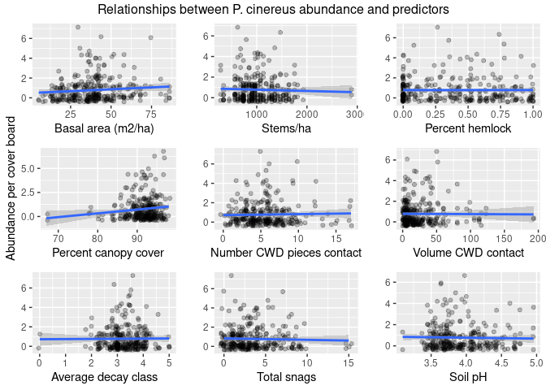
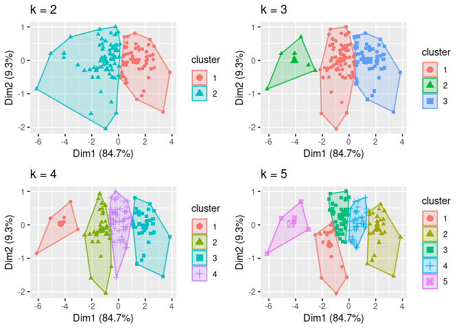
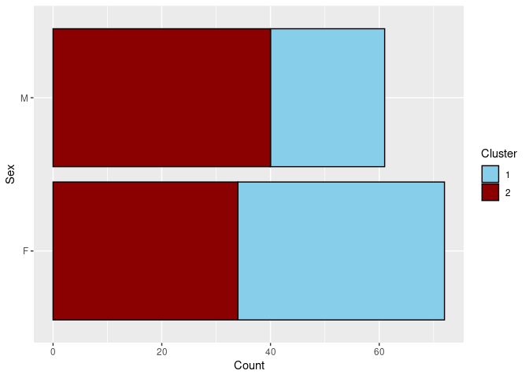

Red-backed salamander and distribution in north-central Massachusetts
================
Joshua A. Harkness
2024-02-13

## Load packages

``` r
#install.packages(gridExtra)
library(tidyverse)
```

    ## ── Attaching core tidyverse packages ──────────────────────── tidyverse 2.0.0 ──
    ## ✔ dplyr     1.1.4     ✔ readr     2.1.5
    ## ✔ forcats   1.0.0     ✔ stringr   1.5.1
    ## ✔ ggplot2   3.4.4     ✔ tibble    3.2.1
    ## ✔ lubridate 1.9.3     ✔ tidyr     1.3.1
    ## ✔ purrr     1.0.2     
    ## ── Conflicts ────────────────────────────────────────── tidyverse_conflicts() ──
    ## ✖ dplyr::filter() masks stats::filter()
    ## ✖ dplyr::lag()    masks stats::lag()
    ## ℹ Use the conflicted package (<http://conflicted.r-lib.org/>) to force all conflicts to become errors

``` r
library(broom)
library(stringr)
library(sf)
```

    ## Linking to GEOS 3.8.0, GDAL 3.0.4, PROJ 6.3.1; sf_use_s2() is TRUE

``` r
library(ggspatial)
library(readxl)
library(GGally)
```

    ## Registered S3 method overwritten by 'GGally':
    ##   method from   
    ##   +.gg   ggplot2

``` r
library(gridExtra)
```

    ## 
    ## Attaching package: 'gridExtra'
    ## 
    ## The following object is masked from 'package:dplyr':
    ## 
    ##     combine

``` r
library(grid)
library(tidymodels)
```

    ## ── Attaching packages ────────────────────────────────────── tidymodels 1.1.1 ──
    ## ✔ dials        1.2.0     ✔ rsample      1.2.0
    ## ✔ infer        1.0.6     ✔ tune         1.1.2
    ## ✔ modeldata    1.3.0     ✔ workflows    1.1.3
    ## ✔ parsnip      1.1.1     ✔ workflowsets 1.0.1
    ## ✔ recipes      1.0.9     ✔ yardstick    1.3.0
    ## ── Conflicts ───────────────────────────────────────── tidymodels_conflicts() ──
    ## ✖ gridExtra::combine() masks dplyr::combine()
    ## ✖ scales::discard()    masks purrr::discard()
    ## ✖ dplyr::filter()      masks stats::filter()
    ## ✖ recipes::fixed()     masks stringr::fixed()
    ## ✖ dplyr::lag()         masks stats::lag()
    ## ✖ yardstick::spec()    masks readr::spec()
    ## ✖ recipes::step()      masks stats::step()
    ## • Use suppressPackageStartupMessages() to eliminate package startup messages

``` r
library(MASS)
```

    ## 
    ## Attaching package: 'MASS'
    ## 
    ## The following object is masked from 'package:dplyr':
    ## 
    ##     select

``` r
library(simfit)
library(ggpmisc)
```

    ## Loading required package: ggpp
    ## Registered S3 methods overwritten by 'ggpp':
    ##   method                  from   
    ##   heightDetails.titleGrob ggplot2
    ##   widthDetails.titleGrob  ggplot2
    ## 
    ## Attaching package: 'ggpp'
    ## 
    ## The following object is masked from 'package:ggplot2':
    ## 
    ##     annotate
    ## 
    ## Registered S3 method overwritten by 'ggpmisc':
    ##   method                  from   
    ##   as.character.polynomial polynom

``` r
library(iNEXT)
library(pscl)
```

    ## Classes and Methods for R originally developed in the
    ## Political Science Computational Laboratory
    ## Department of Political Science
    ## Stanford University (2002-2015),
    ## by and under the direction of Simon Jackman.
    ## hurdle and zeroinfl functions by Achim Zeileis.

``` r
library(cowplot)
```

    ## 
    ## Attaching package: 'cowplot'
    ## 
    ## The following object is masked from 'package:lubridate':
    ## 
    ##     stamp

## Load Data

``` r
plots <- read_csv("/cloud/project/data/hf131-01-plot.csv")
```

    ## Rows: 150 Columns: 23
    ## ── Column specification ────────────────────────────────────────────────────────
    ## Delimiter: ","
    ## chr  (9): plot, site, ft, lat, long, datum, bearing, aspect, slope
    ## dbl (14): asn, ba, st.ha, ts, canopy.cover, cwd.no, cwd.con, vcwd, vcwd.con,...
    ## 
    ## ℹ Use `spec()` to retrieve the full column specification for this data.
    ## ℹ Specify the column types or set `show_col_types = FALSE` to quiet this message.

``` r
aco <- read_csv("/cloud/project/data/hf131-04-aco.csv")
```

    ## Rows: 2380 Columns: 14
    ## ── Column specification ────────────────────────────────────────────────────────
    ## Delimiter: ","
    ## chr  (4): plot, pcn, osn, other.sp
    ## dbl  (7): aco, asn, airt, rh, soilt, pca, em.aco
    ## dttm (1): datetime
    ## date (1): date
    ## time (1): time
    ## 
    ## ℹ Use `spec()` to retrieve the full column specification for this data.
    ## ℹ Specify the column types or set `show_col_types = FALSE` to quiet this message.

``` r
pc <- read_csv("/cloud/project/data/hf131-05-pc-abund.csv")
```

    ## Rows: 250 Columns: 9
    ## ── Column specification ────────────────────────────────────────────────────────
    ## Delimiter: ","
    ## chr  (3): plot, p, sex
    ## dbl  (5): pc.no, aco, svl, tl, wt
    ## date (1): date
    ## 
    ## ℹ Use `spec()` to retrieve the full column specification for this data.
    ## ℹ Specify the column types or set `show_col_types = FALSE` to quiet this message.

``` r
herps <- read_csv("/cloud/project/data/hf131-06-herps.csv")
```

    ## Rows: 48 Columns: 8
    ## ── Column specification ────────────────────────────────────────────────────────
    ## Delimiter: ","
    ## chr  (2): plot, species
    ## dbl  (5): osn, aco, svl, tl, weight
    ## date (1): date
    ## 
    ## ℹ Use `spec()` to retrieve the full column specification for this data.
    ## ℹ Specify the column types or set `show_col_types = FALSE` to quiet this message.

``` r
mass_towns <- st_read("/cloud/project/data/Community Boundaries (Towns) from Survey Points.shp")
```

    ## Reading layer `Community Boundaries (Towns) from Survey Points' from data source `/cloud/project/data/Community Boundaries (Towns) from Survey Points.shp' 
    ##   using driver `ESRI Shapefile'
    ## Simple feature collection with 351 features and 14 fields
    ## Geometry type: MULTIPOLYGON
    ## Dimension:     XY
    ## Bounding box:  xmin: 33863.73 ymin: 777606.4 xmax: 330837 ymax: 959743
    ## Projected CRS: NAD83 / Massachusetts Mainland

``` r
coords <- read_csv("/cloud/project/data/coords.csv")
```

    ## Rows: 2408 Columns: 7
    ## ── Column specification ────────────────────────────────────────────────────────
    ## Delimiter: ","
    ## chr (3): ft, site, plot
    ## dbl (4): asn, aco, lat_dd, long_dd
    ## 
    ## ℹ Use `spec()` to retrieve the full column specification for this data.
    ## ℹ Specify the column types or set `show_col_types = FALSE` to quiet this message.

## Map plots

``` r
mass_towns <- st_transform(mass_towns, "+init=epsg:4326")
```

    ## Warning in CPL_crs_from_input(x): GDAL Message 1: +init=epsg:XXXX syntax is
    ## deprecated. It might return a CRS with a non-EPSG compliant axis order.

``` r
state_map <- ggplot(mass_towns) +
  geom_sf() +
  geom_point(data = coords, (aes(x = long_dd, y = lat_dd)), alpha = 0.5) +
   theme_bw() +
  theme(panel.grid.major = element_blank(),
        panel.grid.minor = element_blank(),
        axis.text = element_blank(),
        axis.ticks = element_blank(),
        axis.title = element_blank()) +
  ggspatial::annotation_scale(
    location = "bl",
    bar_cols = c("grey60", "white"),
    text_family = "ArcherPro Book")

site_map <- ggplot(mass_towns) +
  geom_sf() +
  geom_point(data = coords, (aes(x = long_dd, y = lat_dd)), alpha = 0.5) +
  labs(title = "Paired sites in north central Massachusetts",
       x = "Longitude",
       y = "Latitude",
       caption = "WGS 1984") +
  xlim(-72.43, -71.75) +
  ylim(42.33, 42.7) +
  theme_bw() +
  theme(panel.grid.major = element_blank(),
        panel.grid.minor = element_blank()) +
   ggspatial::annotation_north_arrow(
    location = "tr", which_north = "true",
    pad_x = unit(0, "in"), pad_y = unit(0.2, "in"),
    style = ggspatial::north_arrow_fancy_orienteering(
      fill = c("grey40", "white"),
      line_col = "grey20",
      text_family = "ArcherPro Book")) +
  ggspatial::annotation_scale(
    location = "bl",
    bar_cols = c("grey60", "white"),
    text_family = "ArcherPro Book") +
  annotate("text", x = c(-71.9, -72.12, -72.27, -72.1, -72.13, -72.08, -72.23, -72.36, -72.39, -72.38), y = c(42.52, 42.44, 42.49, 42.54, 42.61, 42.68, 42.66, 42.7, 42.66, 42.6), label = c("Mount Wachusett", "Slab City", "Tom Swamp", "Prospect Hill", "Millers River", "Beryl Hill", "Warwick SF", "Mount Grace SF", "Northfield SF", "Erving SF"))

main.plot <- site_map

inset.plot <- state_map

map1 <-
  ggdraw() +
  draw_plot(main.plot) +
  draw_plot(inset.plot, x = 0.585, y = .145, width = .3, height = .3)
```

    ## Warning: Removed 57 rows containing missing values (`geom_point()`).
    ## Removed 57 rows containing missing values (`geom_point()`).

``` r
map1
```

<!-- -->

``` r
ggsave("sitemap.png")
```

    ## Saving 7 x 5 in image

## P. cinereus

### Calculate per cover board

``` r
aco <- aco %>%
  dplyr::select(plot, asn, aco, pca, osn, other.sp)
```

``` r
aco_abund <- aco %>%
  group_by(plot, asn, aco) %>%
  summarize(n_ind = sum(pca), .groups = "keep")

aco_abund
```

    ## # A tibble: 310 × 4
    ## # Groups:   plot, asn, aco [310]
    ##    plot    asn   aco n_ind
    ##    <chr> <dbl> <dbl> <dbl>
    ##  1 BHMD      1    91     1
    ##  2 BHMD      1    92     1
    ##  3 BHMD      2    93     1
    ##  4 BHMD      2    94     0
    ##  5 BHMD      3    95     0
    ##  6 BHMD      3    96     1
    ##  7 BHMD      4    97     3
    ##  8 BHMD      4    98     0
    ##  9 BHMD      5    99     1
    ## 10 BHMD      5   100     0
    ## # ℹ 300 more rows

Still getting 241 detections of P. cinereus, but when grouping by `plot`
and `asn`, we get 310 cover board observations instead of the original
300 – not sure why it’s doing this, but presumbly it’s only adding a ten
zeros to the dataframe, so I’m going to let it go at that.

``` r
df <- left_join(aco_abund, plots)
```

    ## Joining with `by = join_by(plot, asn)`

``` r
df
```

    ## # A tibble: 310 × 25
    ## # Groups:   plot, asn, aco [310]
    ##    plot    asn   aco n_ind site  ft    lat         long  datum    ba st.ha    ts
    ##    <chr> <dbl> <dbl> <dbl> <chr> <chr> <chr>       <chr> <chr> <dbl> <dbl> <dbl>
    ##  1 BHMD      1    91     1 BH    MD    "N 42\xb04… "W 7… NAD83  23.9   962  0.43
    ##  2 BHMD      1    92     1 BH    MD    "N 42\xb04… "W 7… NAD83  23.9   962  0.43
    ##  3 BHMD      2    93     1 BH    MD    "N 42\xb04… "W 7… NAD83  28.3  1019  0   
    ##  4 BHMD      2    94     0 BH    MD    "N 42\xb04… "W 7… NAD83  28.3  1019  0   
    ##  5 BHMD      3    95     0 BH    MD    "N 42\xb04… "W 7… NAD83  51.3  1302  0.01
    ##  6 BHMD      3    96     1 BH    MD    "N 42\xb04… "W 7… NAD83  51.3  1302  0.01
    ##  7 BHMD      4    97     3 BH    MD    "N 42\xb04… "W 7… NAD83  42.3  1132  0.09
    ##  8 BHMD      4    98     0 BH    MD    "N 42\xb04… "W 7… NAD83  42.3  1132  0.09
    ##  9 BHMD      5    99     1 BH    MD    "N 42\xb04… "W 7… NAD83  28.5  1245  0.1 
    ## 10 BHMD      5   100     0 BH    MD    "N 42\xb04… "W 7… NAD83  28.5  1245  0.1 
    ## # ℹ 300 more rows
    ## # ℹ 13 more variables: bearing <chr>, aspect <chr>, slope <chr>,
    ## #   canopy.cover <dbl>, cwd.no <dbl>, cwd.con <dbl>, vcwd <dbl>,
    ## #   vcwd.con <dbl>, avg.dc <dbl>, tot.snags <dbl>, avg.snag.ht <dbl>,
    ## #   avg.snag.dbh <dbl>, soil.ph <dbl>

``` r
write_csv(df, "/cloud/project/data/df.csv")
```

``` r
glimpse(df)
```

    ## Rows: 310
    ## Columns: 25
    ## Groups: plot, asn, aco [310]
    ## $ plot         <chr> "BHMD", "BHMD", "BHMD", "BHMD", "BHMD", "BHMD", "BHMD", "…
    ## $ asn          <dbl> 1, 1, 2, 2, 3, 3, 4, 4, 5, 5, 1, 1, 2, 2, 3, 3, 4, 4, 5, …
    ## $ aco          <dbl> 91, 92, 93, 94, 95, 96, 97, 98, 99, 100, 81, 82, 83, 84, …
    ## $ n_ind        <dbl> 1, 1, 1, 0, 0, 1, 3, 0, 1, 0, 0, 0, 0, 0, 0, 0, 0, 0, 0, …
    ## $ site         <chr> "BH", "BH", "BH", "BH", "BH", "BH", "BH", "BH", "BH", "BH…
    ## $ ft           <chr> "MD", "MD", "MD", "MD", "MD", "MD", "MD", "MD", "MD", "MD…
    ## $ lat          <chr> "N 42\xb040.571'", "N 42\xb040.571'", "N 42\xb040.558'", …
    ## $ long         <chr> "W 72\xb008.336'", "W 72\xb008.336'", "W 72\xb008.307'", …
    ## $ datum        <chr> "NAD83", "NAD83", "NAD83", "NAD83", "NAD83", "NAD83", "NA…
    ## $ ba           <dbl> 23.9, 23.9, 28.3, 28.3, 51.3, 51.3, 42.3, 42.3, 28.5, 28.…
    ## $ st.ha        <dbl> 962, 962, 1019, 1019, 1302, 1302, 1132, 1132, 1245, 1245,…
    ## $ ts           <dbl> 0.43, 0.43, 0.00, 0.00, 0.01, 0.01, 0.09, 0.09, 0.10, 0.1…
    ## $ bearing      <chr> "FLAT", "FLAT", "338", "338", "240", "240", "FLAT", "FLAT…
    ## $ aspect       <chr> NA, NA, "N", "N", "SW", "SW", NA, NA, NA, NA, "NE", "NE",…
    ## $ slope        <chr> "FLAT", "FLAT", "5", "5", "5", "5", "FLAT", "FLAT", "FLAT…
    ## $ canopy.cover <dbl> 92, 92, 87, 87, 90, 90, 87, 87, 90, 90, 91, 91, 92, 92, 9…
    ## $ cwd.no       <dbl> 5, 5, 9, 9, 3, 3, 9, 9, 7, 7, 9, 9, 8, 8, 6, 6, 1, 1, 11,…
    ## $ cwd.con      <dbl> 4, 4, 5, 5, 0, 0, 6, 6, 4, 4, 7, 7, 6, 6, 6, 6, 1, 1, 4, …
    ## $ vcwd         <dbl> 35.2, 35.2, 14.4, 14.4, 4.6, 4.6, 72.2, 72.2, 51.3, 51.3,…
    ## $ vcwd.con     <dbl> 34.2, 34.2, 11.0, 11.0, 0.0, 0.0, 67.4, 67.4, 45.1, 45.1,…
    ## $ avg.dc       <dbl> 4.2, 4.2, 3.0, 3.0, 2.3, 2.3, 3.2, 3.2, 4.0, 4.0, 3.4, 3.…
    ## $ tot.snags    <dbl> 1, 1, 5, 5, 7, 7, 8, 8, 4, 4, 3, 3, 1, 1, 2, 2, 7, 7, 7, …
    ## $ avg.snag.ht  <dbl> 7, 7, 8, 8, 7, 7, 6, 6, 7, 7, 4, 4, 7, 7, 5, 5, 13, 13, 6…
    ## $ avg.snag.dbh <dbl> 26, 26, 12, 12, 7, 7, 11, 11, 14, 14, 10, 10, 9, 9, 15, 1…
    ## $ soil.ph      <dbl> 3.762, 3.762, 4.097, 4.097, 3.523, 3.523, 3.744, 3.744, 3…

``` r
sum(df$n_ind)
```

    ## [1] 241

Now 310 cover board observations, still with 241 P. cinereus detections.

``` r
unique(df$n_ind)
```

    ## [1] 1 0 3 2 7 4 6 5

``` r
df %>%
  ggplot(aes(x = n_ind)) +
  geom_bar(fill = "seagreen4", color = "black") +
  labs(title = "P. cinereus abundance distribution",
       x = "Abundance per cover board",
       y = "Count")
```

<!-- -->

``` r
ggsave("abundance_dist.png")
```

    ## Saving 7 x 5 in image

#### Forest type comparisons

``` r
violin1 <- df %>%
  ggplot(aes(x = ft, y = n_ind, fill = ft)) +
  geom_violin() +
  labs(title = "P. cinereus by forest type",
       x = "Forest type",
       y = "Abundance per cover board") +
  theme_classic() +
  theme(legend.position = "none") +
  scale_x_discrete(labels = c("Mixed deciduous", "Hemlock")) +
  ylim(0,9)

errbar1 <- df %>%
  group_by(ft) %>%
  summarise(mean = mean(n_ind),
            sd = sd(n_ind),
            n = n(),
            SE = sd(n_ind) / sqrt(n())) %>%
  ggplot(aes(x = ft, y = mean)) +
  geom_point(shape = 15, size = 3) +
  geom_errorbar(aes(ymin = mean - SE, ymax = mean + SE), width = 0.2) +
  labs(title = "",
       x = "",
       y = "Mean ") +
  theme_classic() +
  annotate("text", x = 0.8, y = 0.9, label = "P = 0.982")

main.plot <- violin1

inset.plot <- errbar1

plot.with.inset <-
  ggdraw() +
  draw_plot(main.plot) +
  draw_plot(inset.plot, x = .65, y = .65, width = .4, height = .4)

plot.with.inset
```

<!-- -->

``` r
ggsave("abundance_comp_ft.png")
```

    ## Saving 7 x 5 in image

Interesting that the higher outliers in the hemlock group make the mean
higher for that group, while the medians of the two groups are the same.
Is median a good summary statistic when it is equal to zero?

Wilcoxon test for difference given the extreme skew.

``` r
wilcox.test(df$n_ind ~ df$ft)
```

    ## 
    ##  Wilcoxon rank sum test with continuity correction
    ## 
    ## data:  df$n_ind by df$ft
    ## W = 11984, p-value = 0.982
    ## alternative hypothesis: true location shift is not equal to 0

Report: I found no significant difference in mean per cover board
between mixed deciduous and hemlock forests (Wilcoxon rank sum test, W =
1198, P = 0.982).

#### Site comparisons

``` r
df %>%
  group_by(site) %>%
  summarise(mean = mean(n_ind),
            sd = sd(n_ind),
            n = n(),
            SE = sd(n_ind) / sqrt(n())) %>%
  ggplot(aes(x = site, y = mean)) +
  geom_point(shape = 15, size = 3) +
  geom_errorbar(aes(ymin = mean - SE, ymax = mean + SE), width = 0.2) +
  labs(title = "P. cinereus abundance by site",
       x = "Site",
       y = "Mean abundance per cover board") +
  theme_bw()
```

<!-- -->

``` r
ggsave("mean_site_abundance_comp.png")
```

    ## Saving 7 x 5 in image

``` r
kw1 = kruskal.test(df$n_ind ~ df$site)
kw1
```

    ## 
    ##  Kruskal-Wallis rank sum test
    ## 
    ## data:  df$n_ind by df$site
    ## Kruskal-Wallis chi-squared = 33.097, df = 14, p-value = 0.00279

Significant, so we will use a Dunn’s post hoc test.

``` r
library(dunn.test)

dunn.test(df$n_ind, df$site)
```

    ##   Kruskal-Wallis rank sum test
    ## 
    ## data: x and group
    ## Kruskal-Wallis chi-squared = 33.0966, df = 14, p-value = 0
    ## 
    ## 
    ##                            Comparison of x by group                            
    ##                                 (No adjustment)                                
    ## Col Mean-|
    ## Row Mean |         BH        ER1        ER2       MGSF         MR        NSF
    ## ---------+------------------------------------------------------------------
    ##      ER1 |  -0.091111
    ##          |     0.4637
    ##          |
    ##      ER2 |  -1.892997  -1.982563
    ##          |     0.0292    0.0237*
    ##          |
    ##     MGSF |  -0.465636  -0.418967   1.427361
    ##          |     0.3207     0.3376     0.0767
    ##          |
    ##       MR |   0.901801   1.078985   2.794798   1.367437
    ##          |     0.1836     0.1403    0.0026*     0.0857
    ##          |
    ##      NSF |  -1.198472  -1.221749   0.694524  -0.732836  -2.100274
    ##          |     0.1154     0.1109     0.2437     0.2318    0.0179*
    ##          |
    ##       PH |  -1.220084  -1.245424   0.672912  -0.754448  -2.121886  -0.021611
    ##          |     0.1112     0.1065     0.2505     0.2253    0.0169*     0.4914
    ##          |
    ##      SC1 |  -1.384137  -1.425135   0.508859  -0.918501  -2.285939  -0.185665
    ##          |     0.0832     0.0771     0.3054     0.1792    0.0111*     0.4264
    ##          |
    ##      SC2 |  -2.263345  -2.388259  -0.370347  -1.797709  -3.165146  -1.064872
    ##          |    0.0118*    0.0085*     0.3556     0.0361    0.0008*     0.1435
    ##          |
    ##      TS1 |  -1.120866  -1.136736   0.772130  -0.655230  -2.022668   0.077606
    ##          |     0.1312     0.1278     0.2200     0.2562    0.0216*     0.4691
    ##          |
    ##      TS2 |  -0.795707  -0.780542   1.097290  -0.330071  -1.697508   0.402765
    ##          |     0.2131     0.2175     0.1363     0.3707     0.0448     0.3436
    ##          |
    ##      WA1 |   0.791777   0.958460   2.684775   1.257413  -0.110023   1.990250
    ##          |     0.2142     0.1689    0.0036*     0.1043     0.4562    0.0233*
    ##          |
    ##      WA2 |   0.607095   0.756150   2.500092   1.072731  -0.294706   1.805567
    ##          |     0.2719     0.2248    0.0062*     0.1417     0.3841     0.0355
    ##          |
    ##      WA3 |  -1.418520  -1.462799   0.474477  -0.952884  -2.320321  -0.220047
    ##          |     0.0780     0.0718     0.3176     0.1703    0.0102*     0.4129
    ##          |
    ##      WSF |  -2.566892  -2.720778  -0.673895  -2.101256  -3.468694  -1.368420
    ##          |    0.0051*    0.0033*     0.2502    0.0178*    0.0003*     0.0856
    ## Col Mean-|
    ## Row Mean |         PH        SC1        SC2        TS1        TS2        WA1
    ## ---------+------------------------------------------------------------------
    ##      SC1 |  -0.164053
    ##          |     0.4348
    ##          |
    ##      SC2 |  -1.043260  -0.879207
    ##          |     0.1484     0.1896
    ##          |
    ##      TS1 |   0.099217   0.263271   1.142478
    ##          |     0.4605     0.3962     0.1266
    ##          |
    ##      TS2 |   0.424377   0.588430   1.467637   0.325159
    ##          |     0.3356     0.2781     0.0711     0.3725
    ##          |
    ##      WA1 |   2.011862   2.175915   3.055122   1.912644   1.587485
    ##          |    0.0221*    0.0148*    0.0011*     0.0279     0.0562
    ##          |
    ##      WA2 |   1.827179   1.991232   2.870440   1.727961   1.402802  -0.184682
    ##          |     0.0338    0.0232*    0.0020*     0.0420     0.0803     0.4267
    ##          |
    ##      WA3 |  -0.198435  -0.034382   0.844824  -0.297653  -0.622812  -2.210297
    ##          |     0.4214     0.4863     0.1991     0.3830     0.2667    0.0135*
    ##          |
    ##      WSF |  -1.346808  -1.182754  -0.303547  -1.446026  -1.771185  -3.358670
    ##          |     0.0890     0.1185     0.3807     0.0741     0.0383    0.0004*
    ## Col Mean-|
    ## Row Mean |        WA2        WA3
    ## ---------+----------------------
    ##      WA3 |  -2.025615
    ##          |    0.0214*
    ##          |
    ##      WSF |  -3.173987  -1.148372
    ##          |    0.0008*     0.1254
    ## 
    ## alpha = 0.05
    ## Reject Ho if p <= alpha/2

Add report, not sure if this will go into presentation, but it is worth
knowing differences between sites here.

### Modeling

#### Assess normality

``` r
p1 <- ggplot(df, aes(x = ba)) +
  geom_histogram(fill = "skyblue", color = "black") +
  labs(x = "Basal area (m2/ha)",
       y = "")
p2 <- ggplot(df, aes(x = st.ha)) +
  geom_histogram(fill = "skyblue", color = "black") +
  labs(x = "Stems/ha",
       y = "")
p3 <- ggplot(df, aes(x = ts)) +
  geom_histogram(fill = "skyblue", color = "black") +
  labs(x = "Percent hemlock",
       y = "Count")
p4 <- ggplot(df, aes(x = canopy.cover)) +
  geom_histogram(fill = "skyblue", color = "black") +
  labs(x = "Percent canopy cover",
       y = "")
p5 <- ggplot(df, aes(x = vcwd.con)) +
  geom_histogram(fill = "skyblue", color = "black") +
  labs(x = "Volume CWD (m3)",
       y = "")
p6 <- ggplot(df, aes(x = soil.ph)) +
  geom_histogram(fill = "skyblue", color = "black") +
  labs(x = "Soil pH",
       y = "")

grid.arrange(p1, p2, p3, p4, p5, p6)
```

    ## `stat_bin()` using `bins = 30`. Pick better value with `binwidth`.
    ## `stat_bin()` using `bins = 30`. Pick better value with `binwidth`.
    ## `stat_bin()` using `bins = 30`. Pick better value with `binwidth`.
    ## `stat_bin()` using `bins = 30`. Pick better value with `binwidth`.

    ## Warning: Removed 2 rows containing non-finite values (`stat_bin()`).

    ## `stat_bin()` using `bins = 30`. Pick better value with `binwidth`.
    ## `stat_bin()` using `bins = 30`. Pick better value with `binwidth`.

<!-- -->

``` r
ggsave("hist_some_predictors.png")
```

    ## Saving 7 x 5 in image
    ## `stat_bin()` using `bins = 30`. Pick better value with `binwidth`.

#### Assess relationships

``` r
p1 <- ggplot(df, aes(x = ba, y = n_ind)) +
  geom_jitter(alpha = 0.25) +
  geom_smooth(method = "lm") +
  labs(x = "Basal area (m2/ha)",
       y = "")
p2 <- ggplot(df, aes(x = st.ha, y = n_ind)) +
  geom_jitter(alpha = 0.25) +
  geom_smooth(method = "lm") +
  labs(x = "Stems/ha",
       y = "")
p3 <- ggplot(df, aes(x = ts, y = n_ind)) +
  geom_jitter(alpha = 0.25) +
  geom_smooth(method = "lm") +
  labs(x = "Percent hemlock",
       y = "")
p4 <- ggplot(df, aes(x = canopy.cover, y = n_ind)) +
  geom_jitter(alpha = 0.25) +
  geom_smooth(method = "lm") +
  labs(x = "Percent canopy cover",
       y = "Abundance per cover board")
p5 <- ggplot(df, aes(x = cwd.con, y = n_ind)) +
  geom_jitter(alpha = 0.25) +
  geom_smooth(method = "lm") +
  labs(x = "Number CWD pieces contact",
       y = "")
p6 <- ggplot(df, aes(x = vcwd.con, y = n_ind)) +
  geom_jitter(alpha = 0.25) +
  geom_smooth(method = "lm") +
  labs(x = "Volume CWD contact",
       y = "")
p7 <- ggplot(df, aes(x = avg.dc, y = n_ind)) +
  geom_jitter(alpha = 0.25) +
  geom_smooth(method = "lm") +
  labs(x = "Average decay class",
       y = "")
p8 <- ggplot(df, aes(x = tot.snags, y = n_ind)) +
  geom_jitter(alpha = 0.25) +
  geom_smooth(method = "lm") +
  labs(x = "Total snags",
       y = "")
p9 <- ggplot(df, aes(x = soil.ph, y = n_ind)) +
  geom_jitter(alpha = 0.25) +
  geom_smooth(method = "lm") +
  labs(x = "Soil pH",
       y = "")

grid.arrange(p1, p2, p3, p4, p5, p6, p7, p8, p9, top = grid::textGrob("Relationships between P. cinereus abundance and predictors"))
```

<!-- -->

``` r
ggsave("scatterplots_abundance_predictors.png")
```

#### Hurdle model without interaction

``` r
df1 <- na.omit(df)
hurdle_nb1 <- hurdle(n_ind ~ ft + ts + ba + st.ha + canopy.cover + cwd.con + vcwd.con + avg.dc + tot.snags + avg.snag.dbh + soil.ph, data = df1, dist = "negbin")
summary(hurdle_nb1)
```

    ## 
    ## Call:
    ## hurdle(formula = n_ind ~ ft + ts + ba + st.ha + canopy.cover + cwd.con + 
    ##     vcwd.con + avg.dc + tot.snags + avg.snag.dbh + soil.ph, data = df1, 
    ##     dist = "negbin")
    ## 
    ## Pearson residuals:
    ##     Min      1Q  Median      3Q     Max 
    ## -1.0957 -0.6828 -0.4594  0.3373  3.8278 
    ## 
    ## Count model coefficients (truncated negbin with log link):
    ##                Estimate Std. Error z value Pr(>|z|)  
    ## (Intercept)  -1.404e+01  8.228e+00  -1.706   0.0880 .
    ## ftTS          1.478e-01  6.867e-01   0.215   0.8296  
    ## ts            3.287e-01  9.020e-01   0.364   0.7156  
    ## ba            5.002e-03  1.296e-02   0.386   0.6995  
    ## st.ha        -6.300e-04  8.301e-04  -0.759   0.4479  
    ## canopy.cover  1.174e-01  6.389e-02   1.837   0.0662 .
    ## cwd.con       9.685e-02  6.812e-02   1.422   0.1551  
    ## vcwd.con     -5.408e-03  7.947e-03  -0.681   0.4961  
    ## avg.dc        1.820e-01  3.293e-01   0.553   0.5805  
    ## tot.snags     2.834e-02  8.360e-02   0.339   0.7346  
    ## avg.snag.dbh  3.385e-02  2.756e-02   1.228   0.2194  
    ## soil.ph       4.010e-01  5.372e-01   0.746   0.4554  
    ## Log(theta)   -2.700e-01  1.383e+00  -0.195   0.8452  
    ## Zero hurdle model coefficients (binomial with logit link):
    ##                Estimate Std. Error z value Pr(>|z|)  
    ## (Intercept)  -4.932e+00  4.015e+00  -1.229   0.2193  
    ## ftTS         -8.168e-02  5.132e-01  -0.159   0.8735  
    ## ts           -4.884e-01  7.238e-01  -0.675   0.4998  
    ## ba            1.176e-02  9.085e-03   1.295   0.1954  
    ## st.ha         1.125e-05  4.453e-04   0.025   0.9799  
    ## canopy.cover  7.111e-02  3.559e-02   1.998   0.0457 *
    ## cwd.con      -8.630e-03  4.686e-02  -0.184   0.8539  
    ## vcwd.con     -1.171e-03  4.955e-03  -0.236   0.8132  
    ## avg.dc       -1.195e-02  2.047e-01  -0.058   0.9534  
    ## tot.snags    -6.131e-02  4.776e-02  -1.284   0.1992  
    ## avg.snag.dbh -2.185e-02  1.786e-02  -1.223   0.2212  
    ## soil.ph      -3.653e-01  3.841e-01  -0.951   0.3417  
    ## ---
    ## Signif. codes:  0 '***' 0.001 '**' 0.01 '*' 0.05 '.' 0.1 ' ' 1 
    ## 
    ## Theta: count = 0.7633
    ## Number of iterations in BFGS optimization: 24 
    ## Log-likelihood: -316.2 on 25 Df

``` r
stepAIC(hurdle_nb1, direction = "both")
```

    ## Start:  AIC=682.37
    ## n_ind ~ ft + ts + ba + st.ha + canopy.cover + cwd.con + vcwd.con + 
    ##     avg.dc + tot.snags + avg.snag.dbh + soil.ph
    ## 
    ##                Df    AIC
    ## - ft            2 678.45
    ## - avg.dc        2 678.74
    ## - vcwd.con      2 678.91
    ## - ts            2 678.97
    ## - st.ha         2 679.94
    ## - soil.ph       2 680.00
    ## - tot.snags     2 680.20
    ## - ba            2 680.22
    ## - cwd.con       2 680.54
    ## - avg.snag.dbh  2 681.73
    ## <none>            682.37
    ## - canopy.cover  2 686.85
    ## 
    ## Step:  AIC=678.45
    ## n_ind ~ ts + ba + st.ha + canopy.cover + cwd.con + vcwd.con + 
    ##     avg.dc + tot.snags + avg.snag.dbh + soil.ph
    ## 
    ##                Df    AIC
    ## - avg.dc        2 674.78
    ## - vcwd.con      2 675.06
    ## - soil.ph       2 676.00
    ## - tot.snags     2 676.29
    ## - st.ha         2 676.32
    ## - ba            2 676.45
    ## - cwd.con       2 676.91
    ## - ts            2 676.92
    ## - avg.snag.dbh  2 678.18
    ## <none>            678.45
    ## + ft            2 682.37
    ## - canopy.cover  2 682.98
    ## 
    ## Step:  AIC=674.78
    ## n_ind ~ ts + ba + st.ha + canopy.cover + cwd.con + vcwd.con + 
    ##     tot.snags + avg.snag.dbh + soil.ph
    ## 
    ##                Df    AIC
    ## - vcwd.con      2 671.38
    ## - soil.ph       2 672.21
    ## - tot.snags     2 672.62
    ## - ba            2 672.79
    ## - st.ha         2 673.12
    ## - ts            2 673.17
    ## - cwd.con       2 674.35
    ## - avg.snag.dbh  2 674.57
    ## <none>            674.78
    ## + avg.dc        2 678.45
    ## + ft            2 678.74
    ## - canopy.cover  2 679.11
    ## 
    ## Step:  AIC=671.38
    ## n_ind ~ ts + ba + st.ha + canopy.cover + cwd.con + tot.snags + 
    ##     avg.snag.dbh + soil.ph
    ## 
    ##                Df    AIC
    ## - soil.ph       2 668.87
    ## - tot.snags     2 669.34
    ## - ba            2 669.66
    ## - st.ha         2 669.69
    ## - ts            2 669.87
    ## - cwd.con       2 670.59
    ## - avg.snag.dbh  2 670.74
    ## <none>            671.38
    ## + vcwd.con      2 674.78
    ## + avg.dc        2 675.06
    ## - canopy.cover  2 675.24
    ## + ft            2 675.29
    ## 
    ## Step:  AIC=668.87
    ## n_ind ~ ts + ba + st.ha + canopy.cover + cwd.con + tot.snags + 
    ##     avg.snag.dbh
    ## 
    ##                Df    AIC
    ## - tot.snags     2 666.47
    ## - ts            2 666.65
    ## - ba            2 667.26
    ## - st.ha         2 667.92
    ## - cwd.con       2 668.01
    ## - avg.snag.dbh  2 668.41
    ## <none>            668.87
    ## + soil.ph       2 671.38
    ## + vcwd.con      2 672.21
    ## + avg.dc        2 672.66
    ## + ft            2 672.85
    ## - canopy.cover  2 672.92
    ## 
    ## Step:  AIC=666.47
    ## n_ind ~ ts + ba + st.ha + canopy.cover + cwd.con + avg.snag.dbh
    ## 
    ##                Df    AIC
    ## - ts            2 664.41
    ## - ba            2 664.89
    ## - st.ha         2 665.29
    ## - cwd.con       2 665.90
    ## <none>            666.47
    ## - avg.snag.dbh  2 667.34
    ## + tot.snags     2 668.87
    ## + soil.ph       2 669.34
    ## + vcwd.con      2 669.74
    ## + avg.dc        2 670.29
    ## + ft            2 670.46
    ## - canopy.cover  2 671.13
    ## 
    ## Step:  AIC=664.41
    ## n_ind ~ ba + st.ha + canopy.cover + cwd.con + avg.snag.dbh
    ## 
    ##                Df    AIC
    ## - ba            2 662.11
    ## - st.ha         2 663.38
    ## - cwd.con       2 664.36
    ## <none>            664.41
    ## - avg.snag.dbh  2 665.36
    ## + ts            2 666.47
    ## + tot.snags     2 666.65
    ## + ft            2 667.13
    ## + vcwd.con      2 667.53
    ## + soil.ph       2 667.91
    ## + avg.dc        2 668.25
    ## - canopy.cover  2 668.71
    ## 
    ## Step:  AIC=662.11
    ## n_ind ~ st.ha + canopy.cover + cwd.con + avg.snag.dbh
    ## 
    ##                Df    AIC
    ## - st.ha         2 661.23
    ## - cwd.con       2 662.03
    ## <none>            662.11
    ## - avg.snag.dbh  2 662.93
    ## + tot.snags     2 664.40
    ## + ba            2 664.41
    ## + ts            2 664.89
    ## + vcwd.con      2 665.01
    ## + ft            2 665.22
    ## + soil.ph       2 665.51
    ## + avg.dc        2 665.94
    ## - canopy.cover  2 667.84
    ## 
    ## Step:  AIC=661.23
    ## n_ind ~ canopy.cover + cwd.con + avg.snag.dbh
    ## 
    ##                Df    AIC
    ## - cwd.con       2 660.70
    ## <none>            661.23
    ## + st.ha         2 662.11
    ## - avg.snag.dbh  2 662.48
    ## + ba            2 663.38
    ## + ts            2 663.76
    ## + tot.snags     2 663.76
    ## + ft            2 663.77
    ## + soil.ph       2 664.31
    ## + vcwd.con      2 664.40
    ## + avg.dc        2 664.61
    ## - canopy.cover  2 666.79
    ## 
    ## Step:  AIC=660.7
    ## n_ind ~ canopy.cover + avg.snag.dbh
    ## 
    ##                Df    AIC
    ## <none>            660.70
    ## + cwd.con       2 661.23
    ## - avg.snag.dbh  2 661.78
    ## + st.ha         2 662.03
    ## + avg.dc        2 662.59
    ## + ft            2 662.67
    ## + ts            2 662.72
    ## + ba            2 662.87
    ## + tot.snags     2 663.27
    ## + soil.ph       2 663.94
    ## + vcwd.con      2 663.94
    ## - canopy.cover  2 665.76

    ## 
    ## Call:
    ## hurdle(formula = n_ind ~ canopy.cover + avg.snag.dbh, data = df1, dist = "negbin")
    ## 
    ## Count model coefficients (truncated negbin with log link):
    ##  (Intercept)  canopy.cover  avg.snag.dbh  
    ##     -8.00482       0.07507       0.03633  
    ## Theta = 0.4397 
    ## 
    ## Zero hurdle model coefficients (binomial with logit link):
    ##  (Intercept)  canopy.cover  avg.snag.dbh  
    ##     -7.62745       0.08475      -0.02733

``` r
hurdle_nb2 <- hurdle(n_ind ~ canopy.cover + avg.snag.dbh, data = df1, dist = "negbin")
summary(hurdle_nb2)
```

    ## 
    ## Call:
    ## hurdle(formula = n_ind ~ canopy.cover + avg.snag.dbh, data = df1, dist = "negbin")
    ## 
    ## Pearson residuals:
    ##     Min      1Q  Median      3Q     Max 
    ## -0.8621 -0.6686 -0.4939  0.2794  4.5400 
    ## 
    ## Count model coefficients (truncated negbin with log link):
    ##              Estimate Std. Error z value Pr(>|z|)
    ## (Intercept)  -8.00482    5.31137  -1.507    0.132
    ## canopy.cover  0.07507    0.05511   1.362    0.173
    ## avg.snag.dbh  0.03633    0.02346   1.549    0.121
    ## Log(theta)   -0.82163    1.24090  -0.662    0.508
    ## Zero hurdle model coefficients (binomial with logit link):
    ##              Estimate Std. Error z value Pr(>|z|)  
    ## (Intercept)  -7.62745    3.10299  -2.458   0.0140 *
    ## canopy.cover  0.08475    0.03390   2.500   0.0124 *
    ## avg.snag.dbh -0.02733    0.01731  -1.579   0.1142  
    ## ---
    ## Signif. codes:  0 '***' 0.001 '**' 0.01 '*' 0.05 '.' 0.1 ' ' 1 
    ## 
    ## Theta: count = 0.4397
    ## Number of iterations in BFGS optimization: 20 
    ## Log-likelihood: -323.4 on 7 Df

#### Hurdle model with forest type interaction

``` r
hurdle_nb3 <- hurdle(n_ind ~ ft + ts + ba + st.ha + canopy.cover + cwd.con + vcwd.con + avg.dc + tot.snags + avg.snag.dbh + soil.ph + ft*ts + ts*ba + ts*soil.ph + ft*ba + ft*soil.ph, data = df1, dist = "negbin")
summary(hurdle_nb3)
```

    ## 
    ## Call:
    ## hurdle(formula = n_ind ~ ft + ts + ba + st.ha + canopy.cover + cwd.con + 
    ##     vcwd.con + avg.dc + tot.snags + avg.snag.dbh + soil.ph + ft * ts + 
    ##     ts * ba + ts * soil.ph + ft * ba + ft * soil.ph, data = df1, dist = "negbin")
    ## 
    ## Pearson residuals:
    ##     Min      1Q  Median      3Q     Max 
    ## -1.0698 -0.6626 -0.4025  0.4137  3.7953 
    ## 
    ## Count model coefficients (truncated negbin with log link):
    ##                Estimate Std. Error z value Pr(>|z|)
    ## (Intercept)  -1.414e+01  8.605e+00  -1.644    0.100
    ## ftTS         -8.469e+00  8.838e+00  -0.958    0.338
    ## ts            2.105e+01  1.700e+01   1.239    0.216
    ## ba            1.734e-02  2.238e-02   0.775    0.438
    ## st.ha        -5.940e-04  9.499e-04  -0.625    0.532
    ## canopy.cover  9.444e-02  6.491e-02   1.455    0.146
    ## cwd.con       8.749e-02  7.248e-02   1.207    0.227
    ## vcwd.con     -4.426e-03  8.109e-03  -0.546    0.585
    ## avg.dc        1.639e-01  3.525e-01   0.465    0.642
    ## tot.snags    -5.779e-03  1.016e-01  -0.057    0.955
    ## avg.snag.dbh  3.790e-02  3.211e-02   1.180    0.238
    ## soil.ph       8.802e-01  7.689e-01   1.145    0.252
    ## ftTS:ts       1.023e+00  2.691e+00   0.380    0.704
    ## ts:ba        -9.487e-02  1.128e-01  -0.841    0.400
    ## ts:soil.ph   -4.423e+00  3.720e+00  -1.189    0.234
    ## ftTS:ba       3.392e-02  5.478e-02   0.619    0.536
    ## ftTS:soil.ph  1.728e+00  1.944e+00   0.889    0.374
    ## Log(theta)   -2.748e-01  1.532e+00  -0.179    0.858
    ## Zero hurdle model coefficients (binomial with logit link):
    ##                Estimate Std. Error z value Pr(>|z|)  
    ## (Intercept)  -4.175e+00  4.319e+00  -0.967   0.3336  
    ## ftTS          4.249e+00  5.782e+00   0.735   0.4624  
    ## ts            2.311e+00  9.997e+00   0.231   0.8172  
    ## ba            2.582e-02  1.529e-02   1.689   0.0912 .
    ## st.ha        -8.912e-05  4.523e-04  -0.197   0.8438  
    ## canopy.cover  4.585e-02  3.815e-02   1.202   0.2294  
    ## cwd.con      -1.113e-02  4.767e-02  -0.233   0.8154  
    ## vcwd.con     -1.584e-03  5.182e-03  -0.306   0.7598  
    ## avg.dc       -2.142e-02  2.109e-01  -0.102   0.9191  
    ## tot.snags    -4.911e-02  4.980e-02  -0.986   0.3241  
    ## avg.snag.dbh -2.462e-02  1.845e-02  -1.334   0.1821  
    ## soil.ph      -8.508e-02  5.166e-01  -0.165   0.8692  
    ## ftTS:ts      -2.040e+00  1.929e+00  -1.058   0.2902  
    ## ts:ba        -1.391e-02  5.701e-02  -0.244   0.8073  
    ## ts:soil.ph   -1.969e-01  2.267e+00  -0.087   0.9308  
    ## ftTS:ba      -1.905e-02  3.207e-02  -0.594   0.5525  
    ## ftTS:soil.ph -7.999e-01  1.308e+00  -0.612   0.5408  
    ## ---
    ## Signif. codes:  0 '***' 0.001 '**' 0.01 '*' 0.05 '.' 0.1 ' ' 1 
    ## 
    ## Theta: count = 0.7597
    ## Number of iterations in BFGS optimization: 65 
    ## Log-likelihood: -312.5 on 35 Df

``` r
stepAIC(hurdle_nb3, direction = "both")
```

    ## Start:  AIC=694.93
    ## n_ind ~ ft + ts + ba + st.ha + canopy.cover + cwd.con + vcwd.con + 
    ##     avg.dc + tot.snags + avg.snag.dbh + soil.ph + ft * ts + ts * 
    ##     ba + ts * soil.ph + ft * ba + ft * soil.ph
    ## 
    ##                Df    AIC
    ## - avg.dc        2 691.20
    ## - vcwd.con      2 691.34
    ## - ft:ba         2 691.81
    ## - tot.snags     2 691.93
    ## - ts:ba         2 692.11
    ## - ft:ts         2 692.23
    ## - st.ha         2 692.24
    ## - ft:soil.ph    2 692.25
    ## - cwd.con       2 692.50
    ## - ts:soil.ph    2 692.58
    ## - avg.snag.dbh  2 694.70
    ## - canopy.cover  2 694.74
    ## <none>            694.93
    ## 
    ## Step:  AIC=691.2
    ## n_ind ~ ft + ts + ba + st.ha + canopy.cover + cwd.con + vcwd.con + 
    ##     tot.snags + avg.snag.dbh + soil.ph + ft:ts + ts:ba + ts:soil.ph + 
    ##     ft:ba + ft:soil.ph
    ## 
    ##                Df    AIC
    ## - vcwd.con      2 687.64
    ## - ft:ba         2 688.08
    ## - tot.snags     2 688.25
    ## - ts:ba         2 688.43
    ## - ft:ts         2 688.44
    ## - st.ha         2 688.86
    ## - ft:soil.ph    2 688.90
    ## - ts:soil.ph    2 689.02
    ## - cwd.con       2 689.84
    ## - canopy.cover  2 690.84
    ## - avg.snag.dbh  2 691.04
    ## <none>            691.20
    ## + avg.dc        2 694.93
    ## 
    ## Step:  AIC=687.64
    ## n_ind ~ ft + ts + ba + st.ha + canopy.cover + cwd.con + tot.snags + 
    ##     avg.snag.dbh + soil.ph + ft:ts + ts:ba + ts:soil.ph + ft:ba + 
    ##     ft:soil.ph
    ## 
    ##                Df    AIC
    ## - ft:ba         2 684.52
    ## - tot.snags     2 684.65
    ## - ft:ts         2 684.85
    ## - ts:ba         2 684.86
    ## - st.ha         2 685.24
    ## - ft:soil.ph    2 685.34
    ## - ts:soil.ph    2 685.55
    ## - cwd.con       2 686.20
    ## - canopy.cover  2 687.01
    ## - avg.snag.dbh  2 687.16
    ## <none>            687.64
    ## + vcwd.con      2 691.20
    ## + avg.dc        2 691.34
    ## 
    ## Step:  AIC=684.52
    ## n_ind ~ ft + ts + ba + st.ha + canopy.cover + cwd.con + tot.snags + 
    ##     avg.snag.dbh + soil.ph + ft:ts + ts:ba + ts:soil.ph + ft:soil.ph
    ## 
    ##                Df    AIC
    ## - ft:ts         2 681.27
    ## - ft:soil.ph    2 681.78
    ## - tot.snags     2 681.89
    ## - ts:soil.ph    2 682.23
    ## - ts:ba         2 682.71
    ## - st.ha         2 682.80
    ## - cwd.con       2 683.30
    ## - avg.snag.dbh  2 683.69
    ## - canopy.cover  2 684.22
    ## <none>            684.52
    ## + ft:ba         2 687.64
    ## + vcwd.con      2 688.08
    ## + avg.dc        2 688.22
    ## 
    ## Step:  AIC=681.27
    ## n_ind ~ ft + ts + ba + st.ha + canopy.cover + cwd.con + tot.snags + 
    ##     avg.snag.dbh + soil.ph + ts:ba + ts:soil.ph + ft:soil.ph
    ## 
    ##                Df    AIC
    ## - ft:soil.ph    2 678.65
    ## - ts:soil.ph    2 679.13
    ## - tot.snags     2 679.14
    ## - st.ha         2 679.55
    ## - cwd.con       2 679.97
    ## - avg.snag.dbh  2 680.31
    ## - ts:ba         2 680.58
    ## - canopy.cover  2 681.12
    ## <none>            681.27
    ## + ft:ts         2 684.52
    ## + ft:ba         2 684.85
    ## + vcwd.con      2 684.89
    ## + avg.dc        2 684.98
    ## 
    ## Step:  AIC=678.65
    ## n_ind ~ ft + ts + ba + st.ha + canopy.cover + cwd.con + tot.snags + 
    ##     avg.snag.dbh + soil.ph + ts:ba + ts:soil.ph
    ## 
    ##                Df    AIC
    ## - ft            2 674.93
    ## - ts:soil.ph    2 676.59
    ## - tot.snags     2 676.72
    ## - st.ha         2 676.99
    ## - cwd.con       2 677.23
    ## - avg.snag.dbh  2 677.97
    ## - ts:ba         2 678.08
    ## <none>            678.65
    ## - canopy.cover  2 678.77
    ## + ft:soil.ph    2 681.27
    ## + ft:ts         2 681.78
    ## + avg.dc        2 682.05
    ## + vcwd.con      2 682.24
    ## + ft:ba         2 682.56
    ## 
    ## Step:  AIC=674.93
    ## n_ind ~ ts + ba + st.ha + canopy.cover + cwd.con + tot.snags + 
    ##     avg.snag.dbh + soil.ph + ts:ba + ts:soil.ph
    ## 
    ##                Df    AIC
    ## - ts:soil.ph    2 672.75
    ## - tot.snags     2 673.02
    ## - st.ha         2 673.48
    ## - cwd.con       2 673.56
    ## - ts:ba         2 674.17
    ## - avg.snag.dbh  2 674.58
    ## <none>            674.93
    ## - canopy.cover  2 675.34
    ## + avg.dc        2 678.38
    ## + vcwd.con      2 678.53
    ## + ft            2 678.65
    ## 
    ## Step:  AIC=672.75
    ## n_ind ~ ts + ba + st.ha + canopy.cover + cwd.con + tot.snags + 
    ##     avg.snag.dbh + soil.ph + ts:ba
    ## 
    ##                Df    AIC
    ## - soil.ph       2 670.47
    ## - tot.snags     2 670.83
    ## - st.ha         2 670.98
    ## - ts:ba         2 671.38
    ## - cwd.con       2 672.04
    ## - avg.snag.dbh  2 672.45
    ## <none>            672.75
    ## - canopy.cover  2 673.36
    ## + ts:soil.ph    2 674.93
    ## + vcwd.con      2 676.09
    ## + avg.dc        2 676.48
    ## + ft            2 676.59
    ## 
    ## Step:  AIC=670.47
    ## n_ind ~ ts + ba + st.ha + canopy.cover + cwd.con + tot.snags + 
    ##     avg.snag.dbh + ts:ba
    ## 
    ##                Df    AIC
    ## - tot.snags     2 668.16
    ## - ts:ba         2 668.87
    ## - st.ha         2 669.38
    ## - cwd.con       2 669.68
    ## - avg.snag.dbh  2 670.36
    ## <none>            670.47
    ## - canopy.cover  2 671.16
    ## + soil.ph       2 672.75
    ## + vcwd.con      2 673.69
    ## + avg.dc        2 674.29
    ## + ft            2 674.45
    ## 
    ## Step:  AIC=668.16
    ## n_ind ~ ts + ba + st.ha + canopy.cover + cwd.con + avg.snag.dbh + 
    ##     ts:ba
    ## 
    ##                Df    AIC
    ## - ts:ba         2 666.47
    ## - st.ha         2 666.98
    ## - cwd.con       2 667.66
    ## <none>            668.16
    ## - canopy.cover  2 669.28
    ## - avg.snag.dbh  2 669.38
    ## + tot.snags     2 670.47
    ## + soil.ph       2 670.83
    ## + vcwd.con      2 671.34
    ## + avg.dc        2 672.01
    ## + ft            2 672.13
    ## 
    ## Step:  AIC=666.47
    ## n_ind ~ ts + ba + st.ha + canopy.cover + cwd.con + avg.snag.dbh
    ## 
    ##                Df    AIC
    ## - ts            2 664.41
    ## - ba            2 664.89
    ## - st.ha         2 665.29
    ## - cwd.con       2 665.90
    ## <none>            666.47
    ## - avg.snag.dbh  2 667.34
    ## + ts:ba         2 668.16
    ## + tot.snags     2 668.87
    ## + soil.ph       2 669.34
    ## + vcwd.con      2 669.74
    ## + avg.dc        2 670.29
    ## + ft            2 670.46
    ## - canopy.cover  2 671.13
    ## 
    ## Step:  AIC=664.41
    ## n_ind ~ ba + st.ha + canopy.cover + cwd.con + avg.snag.dbh
    ## 
    ##                Df    AIC
    ## - ba            2 662.11
    ## - st.ha         2 663.38
    ## - cwd.con       2 664.36
    ## <none>            664.41
    ## - avg.snag.dbh  2 665.36
    ## + ts            2 666.47
    ## + tot.snags     2 666.65
    ## + ft            2 667.13
    ## + vcwd.con      2 667.53
    ## + soil.ph       2 667.91
    ## + avg.dc        2 668.25
    ## - canopy.cover  2 668.71
    ## 
    ## Step:  AIC=662.11
    ## n_ind ~ st.ha + canopy.cover + cwd.con + avg.snag.dbh
    ## 
    ##                Df    AIC
    ## - st.ha         2 661.23
    ## - cwd.con       2 662.03
    ## <none>            662.11
    ## - avg.snag.dbh  2 662.93
    ## + tot.snags     2 664.40
    ## + ba            2 664.41
    ## + ts            2 664.89
    ## + vcwd.con      2 665.01
    ## + ft            2 665.22
    ## + soil.ph       2 665.51
    ## + avg.dc        2 665.94
    ## - canopy.cover  2 667.84
    ## 
    ## Step:  AIC=661.23
    ## n_ind ~ canopy.cover + cwd.con + avg.snag.dbh
    ## 
    ##                Df    AIC
    ## - cwd.con       2 660.70
    ## <none>            661.23
    ## + st.ha         2 662.11
    ## - avg.snag.dbh  2 662.48
    ## + ba            2 663.38
    ## + ts            2 663.76
    ## + tot.snags     2 663.76
    ## + ft            2 663.77
    ## + soil.ph       2 664.31
    ## + vcwd.con      2 664.40
    ## + avg.dc        2 664.61
    ## - canopy.cover  2 666.79
    ## 
    ## Step:  AIC=660.7
    ## n_ind ~ canopy.cover + avg.snag.dbh
    ## 
    ##                Df    AIC
    ## <none>            660.70
    ## + cwd.con       2 661.23
    ## - avg.snag.dbh  2 661.78
    ## + st.ha         2 662.03
    ## + avg.dc        2 662.59
    ## + ft            2 662.67
    ## + ts            2 662.72
    ## + ba            2 662.87
    ## + tot.snags     2 663.27
    ## + soil.ph       2 663.94
    ## + vcwd.con      2 663.94
    ## - canopy.cover  2 665.76

    ## 
    ## Call:
    ## hurdle(formula = n_ind ~ canopy.cover + avg.snag.dbh, data = df1, dist = "negbin")
    ## 
    ## Count model coefficients (truncated negbin with log link):
    ##  (Intercept)  canopy.cover  avg.snag.dbh  
    ##     -8.00482       0.07507       0.03633  
    ## Theta = 0.4397 
    ## 
    ## Zero hurdle model coefficients (binomial with logit link):
    ##  (Intercept)  canopy.cover  avg.snag.dbh  
    ##     -7.62745       0.08475      -0.02733

`n_ind` ~ `canopy.cover` + `avg.snag.dbh` still gives the lowest AIC –
this will be our final model.

``` r
plot_nb2_hurdle <- df %>%
  mutate(presence = case_when(n_ind >= 1 ~ 1, n_ind == 0 ~ 0)) %>%
  ggplot(aes(x = canopy.cover, y = presence)) +
  geom_jitter(height = 0.02, alpha = 0.25) +
  geom_smooth(method = "glm", method.args = list(family="binomial"), se = TRUE, fullrange = TRUE) +
  xlim(60,120) +
  theme_bw() +
  theme(panel.grid.major = element_blank(),
        panel.grid.minor = element_blank()) +
  labs(x = "",
       y = "")

plot_nb2_count <- df %>%
  filter(n_ind > 0) %>%
  ggplot(aes(x = canopy.cover, y = n_ind)) +
  geom_jitter(alpha = 0.5) +
  stat_smooth(method = MASS::glm.nb, se = TRUE, fullrange = TRUE) +
  xlim(70,100) +
  theme_bw() +
  theme(panel.grid.major = element_blank(),
        panel.grid.minor = element_blank()) +
  labs(x = "Percent canopy cover",
       y = "Abundance per cover board")

main.plot <- plot_nb2_count

inset.plot <- plot_nb2_hurdle

hurdle_plot <-
  ggdraw() +
  draw_plot(main.plot) +
  draw_plot(inset.plot, x = 0.055, y = .58, width = .4, height = .4)
```

    ## `geom_smooth()` using formula = 'y ~ x'

    ## Warning: Removed 1 rows containing non-finite values (`stat_smooth()`).

    ## Warning in theta.ml(Y, mu, sum(w), w, limit = control$maxit, trace =
    ## control$trace > : iteration limit reached

    ## Warning in theta.ml(Y, mu, sum(w), w, limit = control$maxit, trace =
    ## control$trace > : iteration limit reached

    ## Warning: Removed 1 rows containing missing values (`geom_point()`).

    ## `geom_smooth()` using formula = 'y ~ x'

    ## Warning: Removed 2 rows containing non-finite values (`stat_smooth()`).

    ## Warning: Removed 2 rows containing missing values (`geom_point()`).

``` r
hurdle_plot
```

<!-- -->

``` r
ggsave("hurdle_nb2_plot.png")
```

    ## Saving 7 x 5 in image

#### Hurdle model with multiple interactions

``` r
hurdle_nb4 <- hurdle(n_ind ~ ft + ts + ba + st.ha + canopy.cover + cwd.con + vcwd.con + avg.dc + tot.snags + avg.snag.dbh + soil.ph + ft*ts + ts*ba + ts*soil.ph + ft*ba + ft*soil.ph + cwd.con * vcwd.con + st.ha * canopy.cover, data = df1, dist = "negbin")
summary(hurdle_nb4)
```

    ## Warning in sqrt(diag(object$vcov)): NaNs produced

    ## 
    ## Call:
    ## hurdle(formula = n_ind ~ ft + ts + ba + st.ha + canopy.cover + cwd.con + 
    ##     vcwd.con + avg.dc + tot.snags + avg.snag.dbh + soil.ph + ft * ts + 
    ##     ts * ba + ts * soil.ph + ft * ba + ft * soil.ph + cwd.con * vcwd.con + 
    ##     st.ha * canopy.cover, data = df1, dist = "negbin")
    ## 
    ## Pearson residuals:
    ##     Min      1Q  Median      3Q     Max 
    ## -1.1362 -0.6684 -0.4056  0.4368  3.7910 
    ## 
    ## Count model coefficients (truncated negbin with log link):
    ##                      Estimate Std. Error z value Pr(>|z|)    
    ## (Intercept)        -2.420e+01  7.239e+00  -3.342  0.00083 ***
    ## ftTS               -8.505e+00  8.047e+00  -1.057  0.29055    
    ## ts                  2.094e+01  1.581e+01   1.325  0.18521    
    ## ba                  2.020e-02  2.293e-02   0.881  0.37836    
    ## st.ha               8.727e-03  6.427e-04  13.578  < 2e-16 ***
    ## canopy.cover        1.968e-01  6.400e-02   3.075  0.00210 ** 
    ## cwd.con             1.321e-01  1.101e-01   1.201  0.22992    
    ## vcwd.con            1.539e-03  1.901e-02   0.081  0.93547    
    ## avg.dc              9.731e-02  3.343e-01   0.291  0.77097    
    ## tot.snags          -4.451e-03  9.065e-02  -0.049  0.96084    
    ## avg.snag.dbh        4.245e-02  2.804e-02   1.514  0.13004    
    ## soil.ph             9.677e-01  7.097e-01   1.363  0.17276    
    ## ftTS:ts             1.096e+00  2.598e+00   0.422  0.67304    
    ## ts:ba              -9.459e-02  9.249e-02  -1.023  0.30643    
    ## ts:soil.ph         -4.382e+00  3.611e+00  -1.214  0.22489    
    ## ftTS:ba             3.122e-02  4.809e-02   0.649  0.51626    
    ## ftTS:soil.ph        1.758e+00  1.843e+00   0.954  0.34027    
    ## cwd.con:vcwd.con   -1.003e-03  2.662e-03  -0.377  0.70624    
    ## st.ha:canopy.cover -1.005e-04        NaN     NaN      NaN    
    ## Log(theta)         -3.249e-01  1.518e-01  -2.140  0.03232 *  
    ## Zero hurdle model coefficients (binomial with logit link):
    ##                      Estimate Std. Error z value Pr(>|z|)    
    ## (Intercept)         7.247e-01  4.381e+00   0.165    0.869    
    ## ftTS                4.164e+00  5.779e+00   0.721    0.471    
    ## ts                  2.369e+00  1.003e+01   0.236    0.813    
    ## ba                  2.470e-02  1.535e-02   1.609    0.108    
    ## st.ha              -4.568e-03  4.487e-04 -10.179   <2e-16 ***
    ## canopy.cover       -5.165e-03  3.900e-02  -0.132    0.895    
    ## cwd.con            -3.569e-02  7.384e-02  -0.483    0.629    
    ## vcwd.con           -5.900e-03  1.378e-02  -0.428    0.669    
    ## avg.dc             -2.152e-03  2.141e-01  -0.010    0.992    
    ## tot.snags          -5.070e-02  4.984e-02  -1.017    0.309    
    ## avg.snag.dbh       -2.609e-02  1.860e-02  -1.403    0.161    
    ## soil.ph            -1.102e-01  5.189e-01  -0.212    0.832    
    ## ftTS:ts            -1.996e+00  1.931e+00  -1.034    0.301    
    ## ts:ba              -1.449e-02  5.742e-02  -0.252    0.801    
    ## ts:soil.ph         -2.416e-01  2.291e+00  -0.105    0.916    
    ## ftTS:ba            -1.793e-02  3.214e-02  -0.558    0.577    
    ## ftTS:soil.ph       -7.771e-01  1.308e+00  -0.594    0.552    
    ## cwd.con:vcwd.con    7.267e-04  2.065e-03   0.352    0.725    
    ## st.ha:canopy.cover  4.892e-05        NaN     NaN      NaN    
    ## ---
    ## Signif. codes:  0 '***' 0.001 '**' 0.01 '*' 0.05 '.' 0.1 ' ' 1 
    ## 
    ## Theta: count = 0.7226
    ## Number of iterations in BFGS optimization: 83 
    ## Log-likelihood:  -312 on 39 Df

``` r
stepAIC(hurdle_nb4, direction = "both")
```

    ## Start:  AIC=702.09
    ## n_ind ~ ft + ts + ba + st.ha + canopy.cover + cwd.con + vcwd.con + 
    ##     avg.dc + tot.snags + avg.snag.dbh + soil.ph + ft * ts + ts * 
    ##     ba + ts * soil.ph + ft * ba + ft * soil.ph + cwd.con * vcwd.con + 
    ##     st.ha * canopy.cover
    ## 
    ##                      Df    AIC
    ## - avg.dc              2 698.17
    ## - cwd.con:vcwd.con    2 698.39
    ## - st.ha:canopy.cover  2 698.56
    ## - ft:ba               2 698.82
    ## - tot.snags           2 699.14
    ## - ts:ba               2 699.23
    ## - ft:ts               2 699.35
    ## - ft:soil.ph          2 699.39
    ## - ts:soil.ph          2 699.62
    ## <none>                  702.09
    ## - avg.snag.dbh        2 702.21
    ## 
    ## Step:  AIC=698.17
    ## n_ind ~ ft + ts + ba + st.ha + canopy.cover + cwd.con + vcwd.con + 
    ##     tot.snags + avg.snag.dbh + soil.ph + ft:ts + ts:ba + ts:soil.ph + 
    ##     ft:ba + ft:soil.ph + cwd.con:vcwd.con + st.ha:canopy.cover
    ## 
    ##                      Df    AIC
    ## - cwd.con:vcwd.con    2 694.53
    ## - st.ha:canopy.cover  2 694.73
    ## - ft:ba               2 694.89
    ## - tot.snags           2 695.24
    ## - ts:ba               2 695.33
    ## - ft:ts               2 695.41
    ## - ft:soil.ph          2 695.68
    ## - ts:soil.ph          2 695.78
    ## <none>                  698.17
    ## - avg.snag.dbh        2 698.41
    ## + avg.dc              2 702.09
    ## 
    ## Step:  AIC=694.53
    ## n_ind ~ ft + ts + ba + st.ha + canopy.cover + cwd.con + vcwd.con + 
    ##     tot.snags + avg.snag.dbh + soil.ph + ft:ts + ts:ba + ts:soil.ph + 
    ##     ft:ba + ft:soil.ph + st.ha:canopy.cover
    ## 
    ##                      Df    AIC
    ## - vcwd.con            2 691.03
    ## - st.ha:canopy.cover  2 691.20
    ## - ft:ba               2 691.28
    ## - tot.snags           2 691.62
    ## - ts:ba               2 691.69
    ## - ft:ts               2 691.80
    ## - ft:soil.ph          2 692.19
    ## - ts:soil.ph          2 692.37
    ## - cwd.con             2 693.57
    ## <none>                  694.53
    ## - avg.snag.dbh        2 694.88
    ## + cwd.con:vcwd.con    2 698.17
    ## + avg.dc              2 698.39
    ## 
    ## Step:  AIC=691.03
    ## n_ind ~ ft + ts + ba + st.ha + canopy.cover + cwd.con + tot.snags + 
    ##     avg.snag.dbh + soil.ph + ft:ts + ts:ba + ts:soil.ph + ft:ba + 
    ##     ft:soil.ph + st.ha:canopy.cover
    ## 
    ##                      Df    AIC
    ## - st.ha:canopy.cover  2 687.64
    ## - ft:ba               2 687.80
    ## - tot.snags           2 688.12
    ## - ts:ba               2 688.21
    ## - ft:ts               2 688.30
    ## - ft:soil.ph          2 688.70
    ## - ts:soil.ph          2 688.97
    ## - cwd.con             2 689.91
    ## - avg.snag.dbh        2 690.98
    ## <none>                  691.03
    ## + vcwd.con            2 694.53
    ## + avg.dc              2 694.86
    ## 
    ## Step:  AIC=687.64
    ## n_ind ~ ft + ts + ba + st.ha + canopy.cover + cwd.con + tot.snags + 
    ##     avg.snag.dbh + soil.ph + ft:ts + ts:ba + ts:soil.ph + ft:ba + 
    ##     ft:soil.ph
    ## 
    ##                      Df    AIC
    ## - ft:ba               2 684.52
    ## - tot.snags           2 684.65
    ## - ft:ts               2 684.85
    ## - ts:ba               2 684.86
    ## - st.ha               2 685.24
    ## - ft:soil.ph          2 685.34
    ## - ts:soil.ph          2 685.55
    ## - cwd.con             2 686.20
    ## - canopy.cover        2 687.01
    ## - avg.snag.dbh        2 687.16
    ## <none>                  687.64
    ## + st.ha:canopy.cover  2 691.03
    ## + vcwd.con            2 691.20
    ## + avg.dc              2 691.34
    ## 
    ## Step:  AIC=684.52
    ## n_ind ~ ft + ts + ba + st.ha + canopy.cover + cwd.con + tot.snags + 
    ##     avg.snag.dbh + soil.ph + ft:ts + ts:ba + ts:soil.ph + ft:soil.ph
    ## 
    ##                      Df    AIC
    ## - ft:ts               2 681.27
    ## - ft:soil.ph          2 681.78
    ## - tot.snags           2 681.89
    ## - ts:soil.ph          2 682.23
    ## - ts:ba               2 682.71
    ## - st.ha               2 682.80
    ## - cwd.con             2 683.30
    ## - avg.snag.dbh        2 683.69
    ## - canopy.cover        2 684.22
    ## <none>                  684.52
    ## + ft:ba               2 687.64
    ## + st.ha:canopy.cover  2 687.80
    ## + vcwd.con            2 688.08
    ## + avg.dc              2 688.22
    ## 
    ## Step:  AIC=681.27
    ## n_ind ~ ft + ts + ba + st.ha + canopy.cover + cwd.con + tot.snags + 
    ##     avg.snag.dbh + soil.ph + ts:ba + ts:soil.ph + ft:soil.ph
    ## 
    ##                      Df    AIC
    ## - ft:soil.ph          2 678.65
    ## - ts:soil.ph          2 679.13
    ## - tot.snags           2 679.14
    ## - st.ha               2 679.55
    ## - cwd.con             2 679.97
    ## - avg.snag.dbh        2 680.31
    ## - ts:ba               2 680.58
    ## - canopy.cover        2 681.12
    ## <none>                  681.27
    ## + ft:ts               2 684.52
    ## + st.ha:canopy.cover  2 684.61
    ## + ft:ba               2 684.85
    ## + vcwd.con            2 684.89
    ## + avg.dc              2 684.98
    ## 
    ## Step:  AIC=678.65
    ## n_ind ~ ft + ts + ba + st.ha + canopy.cover + cwd.con + tot.snags + 
    ##     avg.snag.dbh + soil.ph + ts:ba + ts:soil.ph
    ## 
    ##                      Df    AIC
    ## - ft                  2 674.93
    ## - ts:soil.ph          2 676.59
    ## - tot.snags           2 676.72
    ## - st.ha               2 676.99
    ## - cwd.con             2 677.23
    ## - avg.snag.dbh        2 677.97
    ## - ts:ba               2 678.08
    ## <none>                  678.65
    ## - canopy.cover        2 678.77
    ## + ft:soil.ph          2 681.27
    ## + ft:ts               2 681.78
    ## + avg.dc              2 682.05
    ## + st.ha:canopy.cover  2 682.06
    ## + vcwd.con            2 682.24
    ## + ft:ba               2 682.56
    ## 
    ## Step:  AIC=674.93
    ## n_ind ~ ts + ba + st.ha + canopy.cover + cwd.con + tot.snags + 
    ##     avg.snag.dbh + soil.ph + ts:ba + ts:soil.ph
    ## 
    ##                      Df    AIC
    ## - ts:soil.ph          2 672.75
    ## - tot.snags           2 673.02
    ## - st.ha               2 673.48
    ## - cwd.con             2 673.56
    ## - ts:ba               2 674.17
    ## - avg.snag.dbh        2 674.58
    ## <none>                  674.93
    ## - canopy.cover        2 675.34
    ## + st.ha:canopy.cover  2 678.29
    ## + avg.dc              2 678.38
    ## + vcwd.con            2 678.53
    ## + ft                  2 678.65
    ## 
    ## Step:  AIC=672.75
    ## n_ind ~ ts + ba + st.ha + canopy.cover + cwd.con + tot.snags + 
    ##     avg.snag.dbh + soil.ph + ts:ba
    ## 
    ##                      Df    AIC
    ## - soil.ph             2 670.47
    ## - tot.snags           2 670.83
    ## - st.ha               2 670.98
    ## - ts:ba               2 671.38
    ## - cwd.con             2 672.04
    ## - avg.snag.dbh        2 672.45
    ## <none>                  672.75
    ## - canopy.cover        2 673.36
    ## + ts:soil.ph          2 674.93
    ## + st.ha:canopy.cover  2 676.05
    ## + vcwd.con            2 676.09
    ## + avg.dc              2 676.48
    ## + ft                  2 676.59
    ## 
    ## Step:  AIC=670.47
    ## n_ind ~ ts + ba + st.ha + canopy.cover + cwd.con + tot.snags + 
    ##     avg.snag.dbh + ts:ba
    ## 
    ##                      Df    AIC
    ## - tot.snags           2 668.16
    ## - ts:ba               2 668.87
    ## - st.ha               2 669.38
    ## - cwd.con             2 669.68
    ## - avg.snag.dbh        2 670.36
    ## <none>                  670.47
    ## - canopy.cover        2 671.16
    ## + soil.ph             2 672.75
    ## + vcwd.con            2 673.69
    ## + st.ha:canopy.cover  2 674.14
    ## + avg.dc              2 674.29
    ## + ft                  2 674.45
    ## 
    ## Step:  AIC=668.16
    ## n_ind ~ ts + ba + st.ha + canopy.cover + cwd.con + avg.snag.dbh + 
    ##     ts:ba
    ## 
    ##                      Df    AIC
    ## - ts:ba               2 666.47
    ## - st.ha               2 666.98
    ## - cwd.con             2 667.66
    ## <none>                  668.16
    ## - canopy.cover        2 669.28
    ## - avg.snag.dbh        2 669.38
    ## + tot.snags           2 670.47
    ## + soil.ph             2 670.83
    ## + vcwd.con            2 671.34
    ## + st.ha:canopy.cover  2 671.90
    ## + avg.dc              2 672.01
    ## + ft                  2 672.13
    ## 
    ## Step:  AIC=666.47
    ## n_ind ~ ts + ba + st.ha + canopy.cover + cwd.con + avg.snag.dbh
    ## 
    ##                      Df    AIC
    ## - ts                  2 664.41
    ## - ba                  2 664.89
    ## - st.ha               2 665.29
    ## - cwd.con             2 665.90
    ## <none>                  666.47
    ## - avg.snag.dbh        2 667.34
    ## + ts:ba               2 668.16
    ## + tot.snags           2 668.87
    ## + soil.ph             2 669.34
    ## + vcwd.con            2 669.74
    ## + avg.dc              2 670.29
    ## + st.ha:canopy.cover  2 670.32
    ## + ft                  2 670.46
    ## - canopy.cover        2 671.13
    ## 
    ## Step:  AIC=664.41
    ## n_ind ~ ba + st.ha + canopy.cover + cwd.con + avg.snag.dbh
    ## 
    ##                      Df    AIC
    ## - ba                  2 662.11
    ## - st.ha               2 663.38
    ## - cwd.con             2 664.36
    ## <none>                  664.41
    ## - avg.snag.dbh        2 665.36
    ## + ts                  2 666.47
    ## + tot.snags           2 666.65
    ## + ft                  2 667.13
    ## + vcwd.con            2 667.53
    ## + soil.ph             2 667.91
    ## + avg.dc              2 668.25
    ## + st.ha:canopy.cover  2 668.34
    ## - canopy.cover        2 668.71
    ## 
    ## Step:  AIC=662.11
    ## n_ind ~ st.ha + canopy.cover + cwd.con + avg.snag.dbh
    ## 
    ##                      Df    AIC
    ## - st.ha               2 661.23
    ## - cwd.con             2 662.03
    ## <none>                  662.11
    ## - avg.snag.dbh        2 662.93
    ## + tot.snags           2 664.40
    ## + ba                  2 664.41
    ## + ts                  2 664.89
    ## + vcwd.con            2 665.01
    ## + ft                  2 665.22
    ## + soil.ph             2 665.51
    ## + st.ha:canopy.cover  2 665.90
    ## + avg.dc              2 665.94
    ## - canopy.cover        2 667.84
    ## 
    ## Step:  AIC=661.23
    ## n_ind ~ canopy.cover + cwd.con + avg.snag.dbh
    ## 
    ##                Df    AIC
    ## - cwd.con       2 660.70
    ## <none>            661.23
    ## + st.ha         2 662.11
    ## - avg.snag.dbh  2 662.48
    ## + ba            2 663.38
    ## + ts            2 663.76
    ## + tot.snags     2 663.76
    ## + ft            2 663.77
    ## + soil.ph       2 664.31
    ## + vcwd.con      2 664.40
    ## + avg.dc        2 664.61
    ## - canopy.cover  2 666.79
    ## 
    ## Step:  AIC=660.7
    ## n_ind ~ canopy.cover + avg.snag.dbh
    ## 
    ##                Df    AIC
    ## <none>            660.70
    ## + cwd.con       2 661.23
    ## - avg.snag.dbh  2 661.78
    ## + st.ha         2 662.03
    ## + avg.dc        2 662.59
    ## + ft            2 662.67
    ## + ts            2 662.72
    ## + ba            2 662.87
    ## + tot.snags     2 663.27
    ## + soil.ph       2 663.94
    ## + vcwd.con      2 663.94
    ## - canopy.cover  2 665.76

    ## 
    ## Call:
    ## hurdle(formula = n_ind ~ canopy.cover + avg.snag.dbh, data = df1, dist = "negbin")
    ## 
    ## Count model coefficients (truncated negbin with log link):
    ##  (Intercept)  canopy.cover  avg.snag.dbh  
    ##     -8.00482       0.07507       0.03633  
    ## Theta = 0.4397 
    ## 
    ## Zero hurdle model coefficients (binomial with logit link):
    ##  (Intercept)  canopy.cover  avg.snag.dbh  
    ##     -7.62745       0.08475      -0.02733

Adding additional interaction terms does not improve the model.

``` r
library(AICcmodavg)
models <- list(hurdle_nb1, hurdle_nb2, hurdle_nb3, hurdle_nb4)
mod.names <- c('Env model full', 'Final model', 'Env model ft interaction', 'Env model mult interactions')
aic_table <- aictab(cand.set = models, modnames = mod.names)
aic_table
```

    ## 
    ## Model selection based on AICc:
    ## 
    ##                              K   AICc Delta_AICc AICcWt Cum.Wt      LL
    ## Final model                  7 661.14       0.00      1      1 -323.35
    ## Env model full              25 687.79      26.65      0      1 -316.19
    ## Env model ft interaction    35 705.89      44.76      0      1 -312.47
    ## Env model mult interactions 39 715.90      54.76      0      1 -312.05

``` r
#install.packages("knitr")
library(knitr)
```

``` r
kable(aic_table, col.names = c('Model', 'K', 'AIC', 'Delta AIC', 'Model Lik', 'AIC Wt', 'LL', 'Cum Wt'))
```

|     | Model                       |   K |      AIC | Delta AIC | Model Lik |    AIC Wt |        LL |    Cum Wt |
|:----|:----------------------------|----:|---------:|----------:|----------:|----------:|----------:|----------:|
| 2   | Final model                 |   7 | 661.1364 |   0.00000 |   1.0e+00 | 0.9999984 | -323.3511 | 0.9999984 |
| 1   | Env model full              |  25 | 687.7896 |  26.65322 |   1.6e-06 | 0.0000016 | -316.1865 | 1.0000000 |
| 3   | Env model ft interaction    |  35 | 705.8914 |  44.75505 |   0.0e+00 | 0.0000000 | -312.4675 | 1.0000000 |
| 4   | Env model mult interactions |  39 | 715.8981 |  54.76173 |   0.0e+00 | 0.0000000 | -312.0464 | 1.0000000 |

## P. cinereus Morphometrics

First need to add forest type to the `pc` dataframe so that
morphometrics are associated with different sites. I don’t need to join
dataframes here, since I can simply extract the forest type information
from the `plot` variable. Note that there are 250 observations in the
`pc` datafile, while there are only 241 detections of P. cinereus in the
`aco` dataframe that I have used so far in this analysis. I could not
determine the source of this issue, so I’m chosing simply to analyize
them separately.

``` r
pc <- pc %>%
  mutate(ft = str_extract(plot, "(?<=.)TS|MD"))

pc
```

    ## # A tibble: 250 × 10
    ##    pc.no date       plot    aco p       svl    tl    wt sex   ft   
    ##    <dbl> <date>     <chr> <dbl> <chr> <dbl> <dbl> <dbl> <chr> <chr>
    ##  1     1 2005-06-13 PHTS    243 R        35    70    75 <NA>  TS   
    ##  2     2 2005-06-14 SC2TS   283 R        35    70    75 <NA>  TS   
    ##  3     3 2006-06-14 SC1TS   210 L        NA    NA    NA <NA>  TS   
    ##  4     4 2005-06-16 WA1TS     3 R        35    70    92 <NA>  TS   
    ##  5     5 2005-06-16 WA2TS    24 R        35    70    82 <NA>  TS   
    ##  6     6 2005-06-16 WA3TS    41 R        30    50    50 <NA>  TS   
    ##  7     7 2005-06-16 WA3TS    47 R        30    60    60 <NA>  TS   
    ##  8     8 2005-06-16 WA3TS    49 R        35    70    70 <NA>  TS   
    ##  9     9 2006-06-16 WA3MD    58 R        NA    NA    NA <NA>  MD   
    ## 10    10 2005-06-20 ER1TS   110 R        37    70    92 <NA>  TS   
    ## # ℹ 240 more rows

#### By sex

``` r
wt_plot <- pc %>%
  drop_na(sex) %>%
  ggplot(aes(x = wt, fill = sex)) +
  geom_density(alpha = 0.5) +
  labs(x = "Weight (cg)",
       y = "",
       fill = "Sex") +
  theme(legend.position = c(0.96, 0.8)) +
  theme(legend.title = element_blank()) +
  scale_fill_viridis_d()

tl_plot <- pc %>%
  drop_na(sex) %>%
  ggplot(aes(x = tl, fill = sex)) +
  geom_density(alpha = 0.5) +
  labs(x = "Total length (mm)",
       y = "Density") +
  theme(legend.position = "none") +
  scale_fill_viridis_d()

svl_plot <- pc %>%
  drop_na(sex) %>%
  ggplot(aes(x = svl, fill = sex)) +
  geom_density(alpha = 0.5) +
  labs(x = "Snout-vent length (mm)",
       y = "") +
  theme(legend.position = "none")  +
  scale_fill_viridis_d()

grid.arrange(wt_plot, tl_plot, svl_plot, top = textGrob("P. cinereus morphometrics by sex"))
```

<!-- -->

``` r
ggsave("morpho_density_by_sex.png")
```

    ## Saving 7 x 5 in image

Density distributions for Plethodon cinereus weight (in centigrams),
total and snout-vent length (in millimeters). Females appear to be
somewhat heavier and longer than males. Observations with missing values
removed. Skew in total length but not snout-vent length may be due to
salamanders with missing/regenerating tails.

These morphometric variables are normally distributed, so we can use
t-tests.

``` r
t.test(wt ~ sex, data = pc)
```

    ## 
    ##  Welch Two Sample t-test
    ## 
    ## data:  wt by sex
    ## t = 2.3474, df = 129.95, p-value = 0.02042
    ## alternative hypothesis: true difference in means between group F and group M is not equal to 0
    ## 95 percent confidence interval:
    ##   1.36370 15.98603
    ## sample estimates:
    ## mean in group F mean in group M 
    ##        100.1667         91.4918

``` r
t.test(tl ~ sex, data = pc)
```

    ## 
    ##  Welch Two Sample t-test
    ## 
    ## data:  tl by sex
    ## t = 2.1684, df = 122.62, p-value = 0.03206
    ## alternative hypothesis: true difference in means between group F and group M is not equal to 0
    ## 95 percent confidence interval:
    ##  0.2493811 5.4751180
    ## sample estimates:
    ## mean in group F mean in group M 
    ##        77.76389        74.90164

``` r
t.test(svl ~ sex, data = pc)
```

    ## 
    ##  Welch Two Sample t-test
    ## 
    ## data:  svl by sex
    ## t = 2.3848, df = 114.74, p-value = 0.01873
    ## alternative hypothesis: true difference in means between group F and group M is not equal to 0
    ## 95 percent confidence interval:
    ##  0.2324471 2.5120884
    ## sample estimates:
    ## mean in group F mean in group M 
    ##        39.20833        37.83607

Female P. cinereus were significantly heavier than males (T(129.95) =
2.35, P = 0.02). Females were also significantly longer than males, both
in total length (T(122.62) = 2.17, P = 0.032), and snout-vent length
(T(114.74) = 2.38, P = 0.019).

``` r
box1 <- pc %>%
  drop_na(sex) %>%
  ggplot(aes(x = sex, y = wt, fill = sex)) +
  geom_boxplot() +
  geom_jitter(width = 0.1, alpha = 0.1) +
  labs(x = "",
       y = "Weight (cg)") +
  scale_fill_manual(values = c("wheat", "lavender")) +
  theme_bw() +
  theme(legend.position = "none") +
  annotate("text", x = 2.1, y = 162, label = "P = 0.02")

box2 <- pc %>%
  drop_na(sex) %>%
  ggplot(aes(x = sex, y = tl, fill = sex)) +
  geom_boxplot() +
  geom_jitter(width = 0.1, alpha = 0.1) +
  labs(x = "", 
       y = "Total length (mm)") +
  scale_fill_manual(values = c("wheat", "lavender")) +
  theme_bw() +
  theme(legend.position = "none") +
  annotate("text", x = 2.1, y = 99, label = "P = 0.032")

box3 <- pc %>%
  drop_na(sex) %>%
  ggplot(aes(x = sex, y = svl, fill = sex)) +
  geom_boxplot() +
  geom_jitter(width = 0.1, alpha = 0.1) +
  labs(x = "",
       y = "Snout-vent length (mm)") +
  scale_fill_manual(values = c("wheat", "lavender")) +
  theme_bw() +
  theme(legend.position = "none") +
  annotate("text", x = 2.1, y = 56, label = "P = 0.019")

grid.arrange(box1, box2, box3, ncol = 3, top = textGrob("P. cinereus morphometrics by sex"), bottom = textGrob("Sex"))
```

<!-- -->

``` r
ggsave("boxplot_morpho_by_sex.png")
```

    ## Saving 7 x 5 in image

#### By forest type

``` r
t.test(wt ~ ft, data = pc)
```

    ## 
    ##  Welch Two Sample t-test
    ## 
    ## data:  wt by ft
    ## t = -1.7457, df = 205.68, p-value = 0.08236
    ## alternative hypothesis: true difference in means between group MD and group TS is not equal to 0
    ## 95 percent confidence interval:
    ##  -15.6044432   0.9482559
    ## sample estimates:
    ## mean in group MD mean in group TS 
    ##         76.55652         83.88462

``` r
t.test(tl ~ ft, data = pc)
```

    ## 
    ##  Welch Two Sample t-test
    ## 
    ## data:  tl by ft
    ## t = -2.3117, df = 203.25, p-value = 0.02179
    ## alternative hypothesis: true difference in means between group MD and group TS is not equal to 0
    ## 95 percent confidence interval:
    ##  -7.9155369 -0.6283728
    ## sample estimates:
    ## mean in group MD mean in group TS 
    ##         67.46087         71.73282

``` r
t.test(svl ~ ft, data = pc)
```

    ## 
    ##  Welch Two Sample t-test
    ## 
    ## data:  svl by ft
    ## t = -2.1261, df = 198.56, p-value = 0.03473
    ## alternative hypothesis: true difference in means between group MD and group TS is not equal to 0
    ## 95 percent confidence interval:
    ##  -3.5921251 -0.1350571
    ## sample estimates:
    ## mean in group MD mean in group TS 
    ##         34.30435         36.16794

Report: P. cinereus are significantly heavier (T(205.86) = -1.7457, P =
0.082), and longer, both in total length (T(203.25) = -2.32, P = 0.022)
and snout-vent length (T(198.56) = -2.13, P = 0.035), in
hemlock-dominated forests than in mixed deciduous forests. Variability
in weight was greater in mixed deciduous forests.

``` r
box1 <- pc %>%
  ggplot(aes(x = ft, y = wt, fill = ft)) +
  geom_boxplot() +
  geom_jitter(width = 0.1, alpha = 0.1) +
  labs(x = "",
       y = "Weight (cg)") +
  theme_bw() +
  theme(legend.position = "none") +
  annotate("text", x = 2.1, y = 162, label = "P = 0.082")

box2 <- pc %>%
  ggplot(aes(x = ft, y = tl, fill = ft)) +
  geom_boxplot() +
  geom_jitter(width = 0.1, alpha = 0.1) +
  labs(x = "", 
       y = "Total length (mm)") +
  theme_bw() +
  theme(legend.position = "none") +
  annotate("text", x = 2.1, y = 99, label = "P = 0.022")

box3 <- pc %>%
  ggplot(aes(x = ft, y = svl, fill = ft)) +
  geom_boxplot() +
  geom_jitter(width = 0.1, alpha = 0.1) +
  labs(x = "",
       y = "Snout-vent length (mm)") +
  theme_bw() +
  theme(legend.position = "none") +
  annotate("text", x = 2.1, y = 56, label = "P = 0.035")

grid.arrange(box1, box2, box3, ncol = 3, top = textGrob("P. cinereus morphometrics by forest type"), bottom = textGrob("Forest type"))
```

<!-- -->

``` r
ggsave("boxplot_morpho_by_ft.png")
```

    ## Saving 7 x 5 in image

#### Cluster Analysis

Compare total length, snout-vent length, and weight between sexes of P.
cinereus

``` r
#install.packages("cluster")
#install.packages("factoextra")
library(cluster)
library(factoextra)
```

    ## Welcome! Want to learn more? See two factoextra-related books at https://goo.gl/ve3WBa

``` r
pc_morpho <- pc %>%
  dplyr::select(tl, svl, wt, sex) %>%
  drop_na(sex) %>%
  mutate(across(c(tl, svl, wt), scale)) %>% # Try with and without this line
  drop_na()

pc_means <- pc_morpho %>%
  dplyr::select(-sex)

k2 <- kmeans(pc_means, centers = 2, nstart = 25)
k3 <- kmeans(pc_means, centers = 3, nstart = 25)

## Calculate k4 and k5

k4 <- kmeans(pc_means, centers = 4, nstart = 25)
k5 <- kmeans(pc_means, centers = 5, nstart = 25)
```

Have to use `dplyr::select` because the `select` function is overwritten
by another package.

``` r
k2
```

    ## K-means clustering with 2 clusters of sizes 74, 59
    ## 
    ## Cluster means:
    ##           tl        svl         wt
    ## 1 -0.5814381 -0.6162131 -0.6535593
    ## 2  0.7292614  0.7728774  0.8197184
    ## 
    ## Clustering vector:
    ##   [1] 1 1 1 1 2 1 1 1 1 2 1 1 1 2 1 2 1 2 2 1 2 1 1 2 2 1 2 2 2 1 1 1 1 2 1 2 1
    ##  [38] 2 1 1 2 1 1 1 1 1 2 2 1 2 2 2 2 1 2 1 2 1 2 1 1 1 1 2 2 2 2 1 1 2 2 1 2 2
    ##  [75] 1 1 1 1 2 2 2 2 1 1 1 2 1 2 1 1 1 1 1 1 2 1 1 2 2 2 1 1 1 2 2 1 2 1 1 2 2
    ## [112] 1 1 2 1 1 1 1 2 2 2 1 2 1 1 2 2 1 2 2 1 2 2
    ## 
    ## Within cluster sum of squares by cluster:
    ## [1] 135.7529  69.2575
    ##  (between_SS / total_SS =  48.2 %)
    ## 
    ## Available components:
    ## 
    ## [1] "cluster"      "centers"      "totss"        "withinss"     "tot.withinss"
    ## [6] "betweenss"    "size"         "iter"         "ifault"

``` r
p1 <- fviz_cluster(k2, geom = "point", data = pc_means) + ggtitle("k = 2")
p2 <- fviz_cluster(k3, geom = "point",  data = pc_means) + ggtitle("k = 3")
p3 <- fviz_cluster(k4, geom = "point",  data = pc_means) + ggtitle("k = 4")
p4 <- fviz_cluster(k5, geom = "point",  data = pc_means) + ggtitle("k = 5")


grid.arrange(p1, p2,  p3, p4, nrow = 2)
```

<!-- -->

``` r
ggsave("cluster-k-means.png")
```

    ## Saving 7 x 5 in image

``` r
fviz_nbclust(pc_means, kmeans, method = "wss")
```

<!-- -->

``` r
ggsave("elbow-plot-k-means.png")
```

    ## Saving 7 x 5 in image

``` r
final <- k2

pc_means %>%
  mutate(sex = pc_morpho$sex,
  cluster = final$cluster) %>%
  group_by(cluster, sex) %>%
  summarize(count = n()) %>%
  ggplot() +
  geom_col(aes(x = sex, y = count, fill = as.factor(cluster)), color = "black") +
  scale_fill_manual(values = c("skyblue", "red4")) +
  coord_flip() +
  labs(x = "Sex",
       y = "Count",
       fill = "Cluster")
```

    ## `summarise()` has grouped output by 'cluster'. You can override using the
    ## `.groups` argument.

<!-- -->

``` r
ggsave("barplot-comp-k2-sex.png")
```

    ## Saving 7 x 5 in image

Try this by forest type / site.

``` r
pc_morpho_ft <- pc %>%
  dplyr::select(tl, svl, wt, ft) %>%
  drop_na(ft) %>%
  mutate(across(c(tl, svl, wt), scale)) %>% # Try with and without this line
  drop_na()

pc_means_ft <- pc_morpho_ft %>%
  dplyr::select(-ft)

k2 <- kmeans(pc_means_ft, centers = 2, nstart = 25)
k3 <- kmeans(pc_means_ft, centers = 3, nstart = 25)

## Calculate k4 and k5

k4 <- kmeans(pc_means_ft, centers = 4, nstart = 25)
k5 <- kmeans(pc_means_ft, centers = 5, nstart = 25)
```

``` r
p1 <- fviz_cluster(k2, geom = "point", data = pc_means_ft) + ggtitle("k = 2")
p2 <- fviz_cluster(k3, geom = "point",  data = pc_means_ft) + ggtitle("k = 3")
p3 <- fviz_cluster(k4, geom = "point",  data = pc_means_ft) + ggtitle("k = 4")
p4 <- fviz_cluster(k5, geom = "point",  data = pc_means_ft) + ggtitle("k = 5")


grid.arrange(p1, p2,  p3, p4, nrow = 2)
```

<!-- -->

``` r
fviz_nbclust(pc_means_ft, kmeans, method = "wss")
```

<!-- --> Seems
like k = 2 probably is the better fit here.

``` r
final <- k2

pc_means_ft %>%
  mutate(ft = pc_morpho_ft$ft,
  cluster = final$cluster) %>%
  group_by(cluster, ft) %>%
  summarize(count = n()) %>%
  ggplot() +
  geom_col(aes(x = ft, y = count, fill = as.factor(cluster))) +
  coord_flip() +
  labs(fill = "Cluster")
```

    ## `summarise()` has grouped output by 'cluster'. You can override using the
    ## `.groups` argument.

<!-- --> Definitely
does not capture forest type well, which makes me wonder what other
covariates might account for the clustering – perhaps something not even
in the data?

## Biodiversity

``` r
herps <- read_csv("/cloud/project/data/hf131-06-herps.csv")
```

    ## Rows: 48 Columns: 8
    ## ── Column specification ────────────────────────────────────────────────────────
    ## Delimiter: ","
    ## chr  (2): plot, species
    ## dbl  (5): osn, aco, svl, tl, weight
    ## date (1): date
    ## 
    ## ℹ Use `spec()` to retrieve the full column specification for this data.
    ## ℹ Specify the column types or set `show_col_types = FALSE` to quiet this message.

``` r
herps <- herps %>%
  mutate(herp_species = species)

herps %>%
  count(herp_species)
```

    ## # A tibble: 6 × 2
    ##   herp_species     n
    ##   <chr>        <int>
    ## 1 AMMA             3
    ## 2 EUBI             3
    ## 3 NOVI            34
    ## 4 RASY             4
    ## 5 STOC             3
    ## 6 THIS             1

We also have 241 observations of individual P. cinereus we need to add
here as well as check to see if there are any instances of multiple
individuals of other herps in one observation. Add PLCI to species with
case_when or if_else.

``` r
herps %>%
  filter(str_detect(osn, ","))
```

    ## # A tibble: 0 × 9
    ## # ℹ 9 variables: osn <dbl>, date <date>, plot <chr>, aco <dbl>, species <chr>,
    ## #   svl <dbl>, tl <dbl>, weight <dbl>, herp_species <chr>

No commas in the unique identifiers assigned to other herp species, so
we can assume there are no cases of multiple individuals per
observation.

There is no variable for forest type assigned in the `herps` dataframe,
so I will assign it based on the the plot code.

``` r
herps <- herps %>%
  mutate(ft = str_extract(plot, "(?<=.)TS|MD"))

herps
```

    ## # A tibble: 48 × 10
    ##      osn date       plot    aco species   svl    tl weight herp_species ft   
    ##    <dbl> <date>     <chr> <dbl> <chr>   <dbl> <dbl>  <dbl> <chr>        <chr>
    ##  1     1 2005-06-14 TS2TS   263 NOVI        7    NA     NA NOVI         TS   
    ##  2     2 2005-06-30 MRMD     75 THIS       NA    30     NA THIS         MD   
    ##  3     3 2005-07-01 PHMD    259 AMMA       45   100    525 AMMA         MD   
    ##  4     4 2004-07-05 WA1MD    13 RASY       NA    NA     NA RASY         MD   
    ##  5     5 2005-07-11 MRMD     73 NOVI       NA    NA     NA NOVI         MD   
    ##  6     6 2005-07-25 PHTS    244 NOVI       35    60     NA NOVI         TS   
    ##  7     7 2005-07-25 TS2MD   279 NOVI       40    80     NA NOVI         MD   
    ##  8     8 2005-07-25 TS2TS   262 NOVI       35    60     NA NOVI         TS   
    ##  9     9 2005-07-25 TS2TS   268 NOVI       35    60     NA NOVI         TS   
    ## 10    10 2005-07-25 TS2TS   263 NOVI       30    45     NA NOVI         TS   
    ## # ℹ 38 more rows

Below I am ungrouping all P. cinereus observations stored in `df$n_ind`
and filtering only for values not equal to zero, which gives us a new
dataframe which is 241 rows long. Then I’m adding a new column called
`herp_species` which only has one value (PLCI), since all individuals
here are P. cinereus.

``` r
pc_obs <- df %>%
  uncount(n_ind)

pc_obs$herp_species = "PLCI"

pc_obs
```

    ## # A tibble: 241 × 25
    ## # Groups:   plot, asn, aco [137]
    ##    plot    asn   aco site  ft    lat       long  datum    ba st.ha    ts bearing
    ##    <chr> <dbl> <dbl> <chr> <chr> <chr>     <chr> <chr> <dbl> <dbl> <dbl> <chr>  
    ##  1 BHMD      1    91 BH    MD    "N 42\xb… "W 7… NAD83  23.9   962  0.43 FLAT   
    ##  2 BHMD      1    92 BH    MD    "N 42\xb… "W 7… NAD83  23.9   962  0.43 FLAT   
    ##  3 BHMD      2    93 BH    MD    "N 42\xb… "W 7… NAD83  28.3  1019  0    338    
    ##  4 BHMD      3    96 BH    MD    "N 42\xb… "W 7… NAD83  51.3  1302  0.01 240    
    ##  5 BHMD      4    97 BH    MD    "N 42\xb… "W 7… NAD83  42.3  1132  0.09 FLAT   
    ##  6 BHMD      4    97 BH    MD    "N 42\xb… "W 7… NAD83  42.3  1132  0.09 FLAT   
    ##  7 BHMD      4    97 BH    MD    "N 42\xb… "W 7… NAD83  42.3  1132  0.09 FLAT   
    ##  8 BHMD      5    99 BH    MD    "N 42\xb… "W 7… NAD83  28.5  1245  0.1  FLAT   
    ##  9 BHTS      5    90 BH    TS    "N 42\xb… "W 7… NAD83  35.7  2886  0.52 230    
    ## 10 ER1MD     1   112 ER1   MD    "N 42\xb… "W 7… NAD83  38.4  1471  0.04 67     
    ## # ℹ 231 more rows
    ## # ℹ 13 more variables: aspect <chr>, slope <chr>, canopy.cover <dbl>,
    ## #   cwd.no <dbl>, cwd.con <dbl>, vcwd <dbl>, vcwd.con <dbl>, avg.dc <dbl>,
    ## #   tot.snags <dbl>, avg.snag.ht <dbl>, avg.snag.dbh <dbl>, soil.ph <dbl>,
    ## #   herp_species <chr>

241 rows all labeled by species (PLCI = Plethodon cinereus).

``` r
sp <- full_join(pc_obs, herps)
```

    ## Joining with `by = join_by(plot, aco, ft, herp_species)`

``` r
#sp <- sp %>%
#  dplyr::select(ft, herp_species)

# Couldn't get select to work here due to the joining variables in the previous step.
sp <- sp[c('ft', 'herp_species')]
sp
```

    ## # A tibble: 289 × 2
    ##    ft    herp_species
    ##    <chr> <chr>       
    ##  1 MD    PLCI        
    ##  2 MD    PLCI        
    ##  3 MD    PLCI        
    ##  4 MD    PLCI        
    ##  5 MD    PLCI        
    ##  6 MD    PLCI        
    ##  7 MD    PLCI        
    ##  8 MD    PLCI        
    ##  9 TS    PLCI        
    ## 10 MD    PLCI        
    ## # ℹ 279 more rows

``` r
sp %>%
  group_by(herp_species) %>%
  count(herp_species) %>%
  arrange(desc(n))
```

    ## # A tibble: 7 × 2
    ## # Groups:   herp_species [7]
    ##   herp_species     n
    ##   <chr>        <int>
    ## 1 PLCI           241
    ## 2 NOVI            34
    ## 3 RASY             4
    ## 4 AMMA             3
    ## 5 EUBI             3
    ## 6 STOC             3
    ## 7 THIS             1

``` r
sp %>%
  group_by(ft) %>%
  count(herp_species) %>%
  arrange(herp_species)
```

    ## # A tibble: 11 × 3
    ## # Groups:   ft [2]
    ##    ft    herp_species     n
    ##    <chr> <chr>        <int>
    ##  1 MD    AMMA             1
    ##  2 TS    AMMA             2
    ##  3 TS    EUBI             3
    ##  4 MD    NOVI            11
    ##  5 TS    NOVI            23
    ##  6 MD    PLCI           111
    ##  7 TS    PLCI           130
    ##  8 MD    RASY             1
    ##  9 TS    RASY             3
    ## 10 MD    STOC             3
    ## 11 MD    THIS             1

Looks like all amphibian species were detected more frequently in
hemlock stands than mixed deciduous; only the two snake species were
more frequently detected in mixed deciduous stands. Since snakes are a
separate taxonomic group and are only found in one habitat, we will
remove them for analyzing biodiversity.

``` r
amph <- sp %>%
  filter(herp_species %in% c("AMMA", "PLCI", "NOVI", "EUBI", "RASY"))

amph
```

    ## # A tibble: 285 × 2
    ##    ft    herp_species
    ##    <chr> <chr>       
    ##  1 MD    PLCI        
    ##  2 MD    PLCI        
    ##  3 MD    PLCI        
    ##  4 MD    PLCI        
    ##  5 MD    PLCI        
    ##  6 MD    PLCI        
    ##  7 MD    PLCI        
    ##  8 MD    PLCI        
    ##  9 TS    PLCI        
    ## 10 MD    PLCI        
    ## # ℹ 275 more rows

``` r
md <- amph %>%
  filter(ft == "MD")

md
```

    ## # A tibble: 124 × 2
    ##    ft    herp_species
    ##    <chr> <chr>       
    ##  1 MD    PLCI        
    ##  2 MD    PLCI        
    ##  3 MD    PLCI        
    ##  4 MD    PLCI        
    ##  5 MD    PLCI        
    ##  6 MD    PLCI        
    ##  7 MD    PLCI        
    ##  8 MD    PLCI        
    ##  9 MD    PLCI        
    ## 10 MD    PLCI        
    ## # ℹ 114 more rows

``` r
ts <- amph %>%
  filter(ft == "TS")

ts
```

    ## # A tibble: 161 × 2
    ##    ft    herp_species
    ##    <chr> <chr>       
    ##  1 TS    PLCI        
    ##  2 TS    PLCI        
    ##  3 TS    PLCI        
    ##  4 TS    PLCI        
    ##  5 TS    PLCI        
    ##  6 TS    PLCI        
    ##  7 TS    PLCI        
    ##  8 TS    PLCI        
    ##  9 TS    PLCI        
    ## 10 TS    PLCI        
    ## # ℹ 151 more rows

``` r
md_matrix <- matrix(table(md))
md_abund <- as.abucount(md_matrix)
glimpse(md_abund)
```

    ##  num [1:4] 1 11 111 1

``` r
ts_matrix <- matrix(table(ts))
ts_abund <- as.abucount(ts_matrix)
glimpse(ts_abund)
```

    ##  num [1:5] 2 3 23 130 3

``` r
richness_list <- list(md_abund, ts_abund)
```

``` r
richness <- iNEXT(richness_list, q = 0, datatype = "abundance")
richness
```

    ## Compare 2 assemblages with Hill number order q = 0.
    ## $class: iNEXT
    ## 
    ## $DataInfo: basic data information
    ##    Assemblage   n S.obs     SC f1 f2 f3 f4 f5 f6 f7 f8 f9 f10
    ## 1 assemblage1 124     4 0.9841  2  0  0  0  0  0  0  0  0   0
    ## 2 assemblage2 161     5 1.0000  0  1  2  0  0  0  0  0  0   0
    ## 
    ## $iNextEst: diversity estimates with rarefied and extrapolated samples.
    ## $size_based (LCL and UCL are obtained for fixed size.)
    ## 
    ##     Assemblage   m        Method Order.q       qD   qD.LCL   qD.UCL        SC
    ## 1  assemblage1   1   Rarefaction       0 1.000000 1.000000 1.000000 0.8077629
    ## 10 assemblage1  62   Rarefaction       0 2.999699 2.419383 3.580016 0.9838176
    ## 20 assemblage1 124      Observed       0 4.000000 3.356621 4.643379 0.9841290
    ## 30 assemblage1 183 Extrapolation       0 4.608939 3.965560 5.252319 0.9938721
    ## 40 assemblage1 248 Extrapolation       0 4.857697 4.214318 5.501077 0.9978522
    ## 41 assemblage2   1   Rarefaction       0 1.000000 1.000000 1.000000 0.6711957
    ## 50 assemblage2  80   Rarefaction       0 4.498476 3.672621 5.324332 0.9845306
    ## 60 assemblage2 161      Observed       0 5.000000 4.026842 5.973158 1.0000000
    ## 70 assemblage2 237 Extrapolation       0 5.000000 3.868919 6.131081 1.0000000
    ## 80 assemblage2 322 Extrapolation       0 5.000000 3.772226 6.227774 1.0000000
    ##       SC.LCL    SC.UCL
    ## 1  0.7167813 0.8987445
    ## 10 0.9786770 0.9889583
    ## 20 0.9841290 0.9841290
    ## 30 0.9938721 0.9938721
    ## 40 0.9978522 0.9978522
    ## 41 0.5924127 0.7499786
    ## 50 0.9770381 0.9920232
    ## 60 0.9920877 1.0000000
    ## 70 0.9969219 1.0000000
    ## 80 0.9989292 1.0000000
    ## 
    ## NOTE: The above output only shows five estimates for each assemblage; call iNEXT.object$iNextEst$size_based to view complete output.
    ## 
    ## $coverage_based (LCL and UCL are obtained for fixed coverage; interval length is wider due to varying size in bootstraps.)
    ## 
    ##     Assemblage        SC   m        Method Order.q       qD    qD.LCL   qD.UCL
    ## 1  assemblage1 0.8077629   1   Rarefaction       0 1.000000 0.9253601 1.074640
    ## 10 assemblage1 0.9838176  62   Rarefaction       0 2.999699 2.4266636 3.572735
    ## 20 assemblage1 0.9841290 124      Observed       0 4.000000 3.4262639 4.573736
    ## 30 assemblage1 0.9938721 183 Extrapolation       0 4.608939 3.9873066 5.230572
    ## 40 assemblage1 0.9978522 248 Extrapolation       0 4.857697 4.2249666 5.490428
    ## 41 assemblage2 0.6711957   1   Rarefaction       0 1.000000 0.9242244 1.075776
    ## 45 assemblage2 0.9677016  36   Rarefaction       0 3.465562 2.5206224 4.410502
    ## 50 assemblage2 0.9845306  80   Rarefaction       0 4.498477 3.5051444 5.491809
    ## 55 assemblage2 0.9953592 124   Rarefaction       0 4.925527 3.7671523 6.083903
    ## 59 assemblage2 1.0000000 161      Observed       0 5.000000 3.7151943 6.284806
    ## 
    ## NOTE: The above output only shows five estimates for each assemblage; call iNEXT.object$iNextEst$coverage_based to view complete output.
    ## 
    ## $AsyEst: asymptotic diversity estimates along with related statistics.
    ##    Assemblage         Diversity Observed Estimator       s.e.      LCL      UCL
    ## 1 assemblage1  Species richness 4.000000  4.991935 0.39099165 4.225606 5.758265
    ## 2 assemblage1 Shannon diversity 1.479606  1.508293 0.11038488 1.291943 1.724643
    ## 3 assemblage1 Simpson diversity 1.235616  1.237987 0.07007321 1.100646 1.375328
    ## 4 assemblage2  Species richness 5.000000  5.000000 0.65616347 5.000000 6.286057
    ## 5 assemblage2 Shannon diversity 1.922481  1.947715 0.15480038 1.644311 2.251118
    ## 6 assemblage2 Simpson diversity 1.485359  1.489879 0.09662920 1.300489 1.679268

``` r
ggiNEXT(richness, type=1, facet.var = "None", color.var = "Assemblage") +
  scale_color_discrete(name = "None", labels = c("Mixed deciduous", "Hemlock")) +
  scale_shape_discrete(name = "None", labels = c("Mixed deciduous", "Hemlock")) +
  scale_fill_discrete(name = "None", labels = c("Mixed deciduous", "Hemlock")) +
  labs(caption = "Amphibian species only")
```

    ## Scale for colour is already present.
    ## Adding another scale for colour, which will replace the existing scale.
    ## Scale for fill is already present.
    ## Adding another scale for fill, which will replace the existing scale.

<!-- -->

``` r
ggsave("sp_richness_amph.png")
```

    ## Saving 7 x 5 in image

Not particularly meaningful due to small sample size and sampling design
targeted to detect P. cinereus, but it does suggest that amphibian
biodiversity may be higher in hemlock stands.
