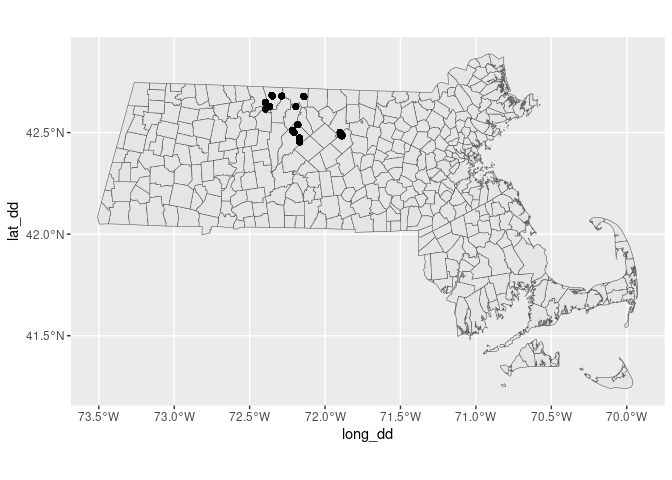
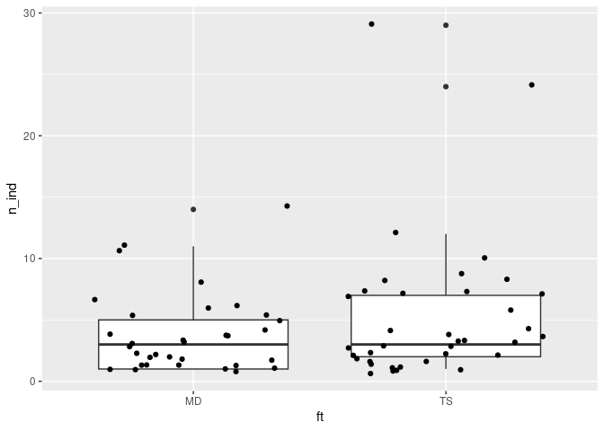

Red-backed salamander abundance and distribution in north-central
Massachusetts
================
Joshua A. Harkness
2024-02-02

## 1. Introduction

For my final project in Data Science II, I decided to use a dataset
comparing eastern red-backed salamander (Plethodon cinereus) abundance
and distribution across different forest types in north-central
Massachusetts. Harvard Forest has been involved in a number of
observational and experimental studies of changes in forest composition,
structure, and biodiversity relating to loss of important tree species
due to introduced pathogens; one of their main projects has been the
experimental removal of hemlock (Tsuga canadensis) to simulate the loss
of this species due to hemlock woolly adelgid (HWA) (Adelges tsugae).
This project is one of several observational studies relating to
biodiversity in hemlock-dominated forest stands, and how plant,
invertebrate, and vertebrate communities may be affected by the loss of
hemlock.

Data was collected in 2005 by Brooks Mathewson and Elizabeth Colburn on
properties owned by Harvard Forest and on state-owned land in
north-central Massachusetts, within a 20-mile radius of the main Harvard
Forest property in Petersham. Fifteen sites occupying a variety of
mid-elevation forested areas were selected. Two paired, fixed-radius df
(each 0.33ha in area) were located within each site using random
sampling stratified by forest type; one site of the pair being in a
hemlock-dominated stand, the other being in a mixed deciduous stand.
Hemlock-dominated sites were defined as having \>50% of total basal area
(BA) being hemlock, and mixed deciduous as \<25% of total BA being
hemlock. Each plot center was used as an intersection between two
perpendicular 50m transects, along which pairs of cover boards (ACO
stations) were placed at the transect ends and intersection. Cover
boards were sampled once every 2-3 weeks from June 13th until November
4th 2005. All amphibian and reptile species detected under cover boards
were recorded along with basic morphometrics; for P. cinereus, total
length, snout-vent length, weight, phase, and sex were recorded. For all
other herps, snout-vent length was recorded.

Data was published in six separate .csv files, one including plot
number, site, topography, location, forest type, etc., another, one
including forest inventory data from each plot, one including coarse
woody debris (CWD) measurements for each plot, one including all cover
board observations, one including P. cinereus abundance and
morphometrics, and another including abundance and morphometrics for all
other herps observed.

## 2. Data

Data citation: Mathewson B, Colburn E. 2023. Eastern Redback Salamander
Abundance in North Central Massachusetts 2005. Harvard Forest Data
Archive: HF131 (v.14). Environmental Data Initiative:
<https://doi.org/10.6073/pasta/4107874d4233c79b05929c7a93a60ca4>.

### Load Packages

``` r
#install.packages(gridExtra)
library(tidyverse)
library(broom)
library(stringr)
library(sf)
library(ggspatial)
library(readxl)
library(GGally)
library(gridExtra)
```

### Load Datafiles from GitHub Repository

``` r
plots <- read_csv("/cloud/project/data/hf131-01-plot.csv")
trees <- read_csv("/cloud/project/data/hf131-02-tree.csv")
cwd <- read_csv("/cloud/project/data/hf131-03-cwd.csv")
aco <- read_csv("/cloud/project/data/hf131-04-aco.csv")
pc <- read_csv("/cloud/project/data/hf131-05-pc-abund.csv")
herps <- read_csv("/cloud/project/data/hf131-06-herps.csv")
```

``` r
glimpse(plots)
```

    ## Rows: 150
    ## Columns: 23
    ## $ plot         <chr> "WA1TS", "WA1TS", "WA1TS", "WA1TS", "WA1TS", "WA1MD", "WA…
    ## $ site         <chr> "WA1", "WA1", "WA1", "WA1", "WA1", "WA1", "WA1", "WA1", "…
    ## $ ft           <chr> "TS", "TS", "TS", "TS", "TS", "MD", "MD", "MD", "MD", "MD…
    ## $ asn          <dbl> 1, 2, 3, 4, 5, 1, 2, 3, 4, 5, 1, 2, 3, 4, 5, 1, 2, 3, 4, …
    ## $ lat          <chr> "N 42\xb029.285'", "N 42\xb029.262'", "N 42\xb029.250'", …
    ## $ long         <chr> "W 71\xb053.882'", "W 71\xb053.882'", "W 71\xb053.909'", …
    ## $ datum        <chr> "NAD83", "NAD83", "NAD83", "NAD83", "NAD83", "NAD83", "NA…
    ## $ ba           <dbl> 56.1, 60.2, 42.6, 68.2, 62.7, 39.4, 12.5, 13.3, 41.2, 22.…
    ## $ st.ha        <dbl> 736.0, 736.0, 1358.0, 453.0, 905.0, 905.0, 736.0, 962.0, …
    ## $ ts           <dbl> 0.98, 0.80, 1.00, 1.00, 0.77, 0.00, 0.00, 0.00, 0.00, 0.0…
    ## $ bearing      <chr> "293", "298", "300", "304", "314", "265", "274", "301", "…
    ## $ aspect       <chr> "NW", "NW", "NW", "NW", "NW", "W", "W", "NW", "W", "W", "…
    ## $ slope        <chr> "10", "10", "5", "16", "12", "5", "5", "6", "5", "7", "8"…
    ## $ canopy.cover <dbl> 91, 88, 92, 88, 84, 95, 97, 93, 93, 94, 93, 91, 93, 93, 9…
    ## $ cwd.no       <dbl> 5, 10, 7, 13, 6, 5, 6, 3, 6, 8, 9, 8, 5, 10, 11, 7, 5, 12…
    ## $ cwd.con      <dbl> 4, 8, 4, 7, 5, 2, 3, 3, 1, 7, 8, 6, 4, 5, 6, 6, 4, 9, 2, …
    ## $ vcwd         <dbl> 6.2, 82.1, 44.6, 32.6, 25.8, 28.3, 33.5, 6.7, 9.5, 17.7, …
    ## $ vcwd.con     <dbl> 5.5, 80.7, 39.6, 25.0, 25.4, 23.4, 4.3, 6.7, 2.2, 16.7, 9…
    ## $ avg.dc       <dbl> 4.6, 3.1, 3.9, 3.0, 3.7, 2.4, 2.3, 3.7, 2.7, 3.6, 3.0, 3.…
    ## $ tot.snags    <dbl> 2, 0, 4, 0, 2, 2, 3, 1, 0, 3, 2, 3, 2, 1, 0, 6, 1, 8, 8, …
    ## $ avg.snag.ht  <dbl> 3, 0, 9, 0, 7, 9, 5, 2, 0, 5, 4, 8, 11, 10, 0, 5, 3, 5, 3…
    ## $ avg.snag.dbh <dbl> 10, 0, 33, 0, 14, 12, 14, 10, 0, 14, 20, 29, 17, 28, 0, 1…
    ## $ soil.ph      <dbl> 3.854, 3.827, 4.026, 3.915, 3.684, 4.108, 3.889, 3.643, 3…

``` r
glimpse(trees)
```

    ## Rows: 3,206
    ## Columns: 8
    ## $ stem.master <dbl> 1, 2, 3, 4, 5, 6, 7, 8, 9, 10, 11, 12, 13, 14, 15, 16, 17,…
    ## $ plot        <chr> "SC2MD", "SC2MD", "SC2MD", "SC2MD", "SC2MD", "SC2MD", "SC2…
    ## $ asn         <dbl> 1, 1, 1, 1, 1, 1, 1, 1, 1, 1, 1, 1, 1, 1, 1, 1, 1, 1, 1, 1…
    ## $ stem.asn    <chr> "1", "2", "3", "4", "5", "6", "7", "8", "9", "10", "11", "…
    ## $ species     <chr> "TSCA", "TSCA", "TSCA", "ACRU", "FAGR", "TSCA", "TSCA", "U…
    ## $ dbh         <dbl> 26.3, 6.0, 14.7, 35.6, 9.8, 6.0, 11.0, 19.3, 30.5, 8.5, 15…
    ## $ alive       <chr> "Y", "Y", "Y", "Y", "Y", "Y", "N", "N", "Y", "Y", "Y", "Y"…
    ## $ sh          <dbl> NA, NA, NA, NA, NA, NA, 6, NA, NA, NA, NA, NA, NA, NA, NA,…

``` r
glimpse(cwd)
```

    ## Rows: 1,103
    ## Columns: 10
    ## $ cwd.no  <dbl> 1, 2, 3, 4, 5, 6, 7, 8, 9, 10, 11, 12, 13, 14, 15, 16, 17, 18,…
    ## $ site    <chr> "SC1", "SC1", "SC1", "SC1", "SC1", "SC1", "SC1", "SC1", "SC1",…
    ## $ ft      <chr> "TS", "TS", "TS", "TS", "TS", "TS", "TS", "TS", "TS", "TS", "T…
    ## $ plot    <chr> "SC1TS", "SC1TS", "SC1TS", "SC1TS", "SC1TS", "SC1TS", "SC1TS",…
    ## $ asn     <dbl> 1, 1, 1, 1, 1, 1, 1, 1, 1, 1, 1, 1, 2, 2, 2, 2, 2, 2, 2, 3, 3,…
    ## $ tr      <dbl> 30, 30, 150, 150, 150, 150, 150, 270, 270, 270, 270, 270, 30, …
    ## $ species <chr> "UNKN", "ACRU", "BELE", "BEAL", "FAGR", "BEAL", "FAGR", "FAGR"…
    ## $ diam    <dbl> 6.2, 3.8, 3.3, 5.5, 3.1, 5.1, 9.7, 6.7, 17.2, 3.2, 2.8, 6.2, 3…
    ## $ dc      <dbl> 5, 4, 5, 3, 5, 5, 5, 3, 3, 4, 3, 4, 4, 2, 2, 2, 3, 3, 5, 4, 5,…
    ## $ c       <chr> "Y", "Y", "Y", "Y", "Y", "Y", "Y", "Y", "Y", "Y", "Y", "Y", "Y…

``` r
glimpse(aco)
```

    ## Rows: 2,380
    ## Columns: 14
    ## $ datetime <dttm> 2005-06-13 16:00:00, 2005-06-13 16:00:00, 2005-06-13 16:00:0…
    ## $ date     <date> 2005-06-13, 2005-06-13, 2005-06-13, 2005-06-13, 2005-06-13, …
    ## $ aco      <dbl> 241, 242, 243, 244, 245, 246, 247, 248, 249, 250, 251, 252, 2…
    ## $ plot     <chr> "PHTS", "PHTS", "PHTS", "PHTS", "PHTS", "PHTS", "PHTS", "PHTS…
    ## $ asn      <dbl> 1, 1, 2, 2, 3, 3, 4, 4, 5, 5, 1, 1, 2, 2, 3, 3, 4, 4, 5, 5, 1…
    ## $ airt     <dbl> 26.4, 26.4, 26.4, 26.4, 26.4, 26.4, 26.4, 26.4, 26.4, 26.4, 2…
    ## $ rh       <dbl> 93, 93, 93, 93, 93, 93, 93, 93, 93, 93, 80, 80, 80, 80, 80, 8…
    ## $ soilt    <dbl> NA, NA, NA, NA, NA, NA, NA, NA, NA, NA, NA, NA, NA, NA, NA, N…
    ## $ time     <time> 16:00:00, 16:00:00, 16:00:00, 16:00:00, 16:00:00, 16:00:00, …
    ## $ pca      <dbl> 0, 0, 1, 0, 0, 0, 0, 0, 0, 0, 0, 0, 0, 0, 0, 0, 0, 0, 0, 0, 0…
    ## $ pcn      <chr> NA, NA, "1", NA, NA, NA, NA, NA, NA, NA, NA, NA, NA, NA, NA, …
    ## $ em.aco   <dbl> NA, NA, NA, NA, NA, NA, NA, NA, NA, NA, NA, NA, NA, NA, NA, N…
    ## $ osn      <chr> NA, NA, NA, NA, NA, NA, NA, NA, NA, NA, NA, NA, NA, NA, NA, N…
    ## $ other.sp <chr> NA, NA, NA, NA, NA, NA, NA, NA, NA, NA, NA, NA, NA, NA, NA, N…

``` r
glimpse(pc)
```

    ## Rows: 250
    ## Columns: 9
    ## $ pc.no <dbl> 1, 2, 3, 4, 5, 6, 7, 8, 9, 10, 11, 12, 13, 14, 15, 16, 17, 18, 1…
    ## $ date  <date> 2005-06-13, 2005-06-14, 2006-06-14, 2005-06-16, 2005-06-16, 200…
    ## $ plot  <chr> "PHTS", "SC2TS", "SC1TS", "WA1TS", "WA2TS", "WA3TS", "WA3TS", "W…
    ## $ aco   <dbl> 243, 283, 210, 3, 24, 41, 47, 49, 58, 110, 121, 122, 125, 132, 1…
    ## $ p     <chr> "R", "R", "L", "R", "R", "R", "R", "R", "R", "R", "R", "R", "R",…
    ## $ svl   <dbl> 35, 35, NA, 35, 35, 30, 30, 35, NA, 37, 37, 37, 37, 35, 37, 40, …
    ## $ tl    <dbl> 70, 70, NA, 70, 70, 50, 60, 70, NA, 70, 87, 75, 70, 70, 77, 70, …
    ## $ wt    <dbl> 75, 75, NA, 92, 82, 50, 60, 70, NA, 92, 70, 90, 80, 82, 85, 113,…
    ## $ sex   <chr> NA, NA, NA, NA, NA, NA, NA, NA, NA, NA, NA, NA, NA, NA, NA, NA, …

``` r
glimpse(herps)
```

    ## Rows: 48
    ## Columns: 8
    ## $ osn     <dbl> 1, 2, 3, 4, 5, 6, 7, 8, 9, 10, 11, 12, 13, 14, 15, 16, 17, 18,…
    ## $ date    <date> 2005-06-14, 2005-06-30, 2005-07-01, 2004-07-05, 2005-07-11, 2…
    ## $ plot    <chr> "TS2TS", "MRMD", "PHMD", "WA1MD", "MRMD", "PHTS", "TS2MD", "TS…
    ## $ aco     <dbl> 263, 75, 259, 13, 73, 244, 279, 262, 268, 263, 264, 168, 200, …
    ## $ species <chr> "NOVI", "THIS", "AMMA", "RASY", "NOVI", "NOVI", "NOVI", "NOVI"…
    ## $ svl     <dbl> 7, NA, 45, NA, NA, 35, 40, 35, 35, 30, 20, 35, 35, NA, NA, 35,…
    ## $ tl      <dbl> NA, 30, 100, NA, NA, 60, 80, 60, 60, 45, 30, 60, 75, NA, NA, 7…
    ## $ weight  <dbl> NA, NA, 525, NA, NA, NA, NA, NA, NA, NA, NA, NA, NA, NA, NA, N…

``` r
# joining all except herps for now
plots_aco <- left_join(plots, aco)
```

    ## Joining with `by = join_by(plot, asn)`

``` r
plots_aco_cwd <- left_join(plots_aco, cwd)
```

    ## Joining with `by = join_by(plot, site, ft, asn, cwd.no)`

``` r
plots_aco_cwd_trees <- left_join(plots_aco_cwd, trees)
```

    ## Joining with `by = join_by(plot, asn, species)`

    ## Warning in left_join(plots_aco_cwd, trees): Detected an unexpected many-to-many relationship between `x` and `y`.
    ## ℹ Row 1581 of `x` matches multiple rows in `y`.
    ## ℹ Row 598 of `y` matches multiple rows in `x`.
    ## ℹ If a many-to-many relationship is expected, set `relationship =
    ##   "many-to-many"` to silence this warning.

``` r
df <- left_join(plots_aco_cwd_trees, pc)
```

    ## Joining with `by = join_by(plot, date, aco)`

    ## Warning in left_join(plots_aco_cwd_trees, pc): Detected an unexpected many-to-many relationship between `x` and `y`.
    ## ℹ Row 144 of `x` matches multiple rows in `y`.
    ## ℹ Row 70 of `y` matches multiple rows in `x`.
    ## ℹ If a many-to-many relationship is expected, set `relationship =
    ##   "many-to-many"` to silence this warning.

``` r
write_csv(df, "/cloud/project/data/df.csv")
```

## 3. Ethics review

Limitations: Sampling design has no way to identify ‘recaptures’; if the
same salamanders were staying at or returning to the same cover board
across multiple sampling days, there is no definitive way to identify
how these individuals are impacting counts. The 2-3 week sampling
interval may actually help to address this pseudoreplication, since
there may be some turnover in individuals salamanders using a cover
board station. Data was collected over only a single season and may not
be representative of P. cinereus population dynamics on a longer scale;
another year may show different patterns of abundance and distribution
and some factor other than forest type may be involved. Another
limitation is that by introducing a novel habitat feature (cover
boards), use of existing habitat features by herps is altered. Since
this is an observational and not experimental study, there is no way to
infer causation between any variables.

Reasons for using data: I wanted to work with an ecological dataset for
this project that encompassed a broad array of species-environment
interactions. I chose this specific dataset out of personal interest in
forest ecology and herpetology; and am using it to learn more about
different techniques for analysis of ecological data, as well as to
learn more about research design for ecological sampling. I declare no
conflicting interests.

Potential impacts: This data was not collected on human subjects. It
does, however, have some potential impacts on how we address
macroinvertebrate and herpetological communities in forest management,
in specific regards to retaining habitat features that aid in supporting
these communities, especially in the face of climate change and
introduced tree pests and pathogens.

## 4. Data analysis plan

### Convert degrees, decimal minutes to decimal degrees

R did not recognize the degree signs used in the `hf131-01-plot.csv`
file. I wasn’t able to find a simple function that converted degrees,
decimal minutes to decimal degrees, so I used several string functions
to replace the characters read in in place of the degree sign with a
delimiter character, then calculate the difference manually.

``` r
coords <- df %>%
  mutate(lat_deg = as.numeric(str_extract(lat, "\\d+(?=\xb0)")),
         lat_dm = as.numeric(str_extract(lat, "(?<=\xb0)\\d+.\\d+")),
         long_deg = as.numeric(str_extract(long, "\\d+(?=\xb0)")),
         long_dm = as.numeric(str_extract(long, "(?<=\xb0)\\d+.\\d+"))) %>%
  select(site, plot, asn, aco, lat_deg, lat_dm, long_deg, long_dm)
```

``` r
coords <- coords %>%
  mutate(lat_dd = lat_deg + lat_dm / 60,
         long_dd = long_deg + long_dm / 60)

# this converts all values in the the `long_dd` variable to negative.
coords$lat_dd <- round(as.numeric(coords$lat_dd), 4)
coords$long_dd <- round(as.numeric(coords$long_dd)*(-1), 4)

# this saves the new coordinates in decimal degrees to the main dataframe, but it leaves a separate smaller `coords` dataframe to work with.

df$lat_dd <- as.numeric(coords$lat_dd)
df$long_dd <- as.numeric(coords$long_dd)

coords <- coords %>%
  select(site, plot, asn, aco, lat_dd, long_dd)

write_csv(coords, path = "/cloud/project/data/coords.csv")
```

    ## Warning: The `path` argument of `write_csv()` is deprecated as of readr 1.4.0.
    ## ℹ Please use the `file` argument instead.
    ## This warning is displayed once every 8 hours.
    ## Call `lifecycle::last_lifecycle_warnings()` to see where this warning was
    ## generated.

I will also load in shapefiles of Massachusetts town boundaries, along
with state-owned land, and any applicable layers in the HF GIS.

``` r
mass_towns <- st_read("/cloud/project/data/Community Boundaries (Towns) from Survey Points.shp")
```

    ## Reading layer `Community Boundaries (Towns) from Survey Points' from data source `/cloud/project/data/Community Boundaries (Towns) from Survey Points.shp' 
    ##   using driver `ESRI Shapefile'
    ## Simple feature collection with 351 features and 14 fields
    ## Geometry type: MULTIPOLYGON
    ## Dimension:     XY
    ## Bounding box:  xmin: 33863.73 ymin: 777606.4 xmax: 330837 ymax: 959743
    ## Projected CRS: NAD83 / Massachusetts Mainland

I had some issues getting the points to plot correctly with the
shapefile, so I am transforming it to GCS WGS1984 (EPSG: 4326).

``` r
mass_towns <- st_transform(mass_towns, "+init=epsg:4326")
```

    ## Warning in CPL_crs_from_input(x): GDAL Message 1: +init=epsg:XXXX syntax is
    ## deprecated. It might return a CRS with a non-EPSG compliant axis order.

``` r
ggplot(mass_towns) +
  geom_sf() +
  geom_point(data = coords, (aes(x = long_dd, y = lat_dd)), alpha = 0.5)
```

    ## Warning: Removed 48 rows containing missing values (`geom_point()`).

<!-- -->
Zoomed-in view:

``` r
ggplot(mass_towns) +
  geom_sf() +
  geom_point(data = coords, (aes(x = long_dd, y = lat_dd, color = site))) +
  xlim(-72.5, -71.75) +
  ylim(42.4, 42.75) +
  ggspatial::annotation_scale(
    location = "bl",
    bar_cols = c("grey60", "white"),
    text_family = "ArcherPro Book"
  ) +
  ggspatial::annotation_north_arrow(
    location = "tr", which_north = "true",
    pad_x = unit(0, "in"), pad_y = unit(0.2, "in"),
    style = ggspatial::north_arrow_fancy_orienteering(
      fill = c("grey40", "white"),
      line_col = "grey20",
      text_family = "ArcherPro Book"))
```

    ## Warning: Removed 48 rows containing missing values (`geom_point()`).

<!-- -->

Based on the coordinates plotted here, data was collected within twenty
miles of Harvard Forest (HF) in Petersham, MA. The central clusters of
points appear to be from the HF properties in Petersham; the
southeastern cluster is from Mount Wachusett, and the northern and
western clusters on state land in the towns of Northfield, Warwick, and
Royalston. This provides a useful reference as to the spatial scale of
this project.

From this the following site locations can be determined: BH - Beryl
Hill ER - Erving State Forest MGSF - Mount Grace State Forest MR -
Millers River NSF - Northfield State Forest PH - Prospect Hill SC - East
Branch Swift River TS - Tom Swamp (HF) WA - Mount Wachusett State
Reservation WSF - Warwick State Forest

### Preliminary hypotheses

#### P. cinereus abundance is different between hemlock-dominated and mixed deciduous forest types.

T-test/simple linear model. Explanatory variable: forest type Response
variable: P. cinereus abundance

#### Hemlock forests offer an important refugae for P. cinereus by shading the forest floor and maintaining more stable soil temperature.

Generalized linear model. Explanatory variable: air temperature, forest
type Response variables: soil temperature

#### P. cinereus abundance is positively correlated with older, more structurally complex forest stands.

Multivariate regression. Explanatory variables: basal area, coarse woody
debris, mean stand diameter. Response variable: P. cinereus abundance.

#### P. cinereus abundance is positively correlated with higher volumes of coarse woody debris.

Generalized linear model (Poisson). Explanatory variable: coarse woody
debris volume Response variable: P. cinereus abundance

#### P. cinereus sexes are morphologically similar between forest types.

Multivariate regression/MANOVA (if applicable) Explanatory variables:
sex, forest type Response variables: total length, snout-vent length,
weight (as matrix if MANOVA).

### Exploratory visualizations

#### Forest Structure / Environmental conditions

``` r
p1 <- ggplot(df, aes(x = ba)) +
  geom_histogram(fill = "skyblue", color = "black")
p2 <- ggplot(df, aes(x = st.ha)) +
  geom_histogram(fill = "skyblue", color = "black")
p3 <- ggplot(df, aes(x = ts)) +
  geom_histogram(fill = "skyblue", color = "black")
p4 <- ggplot(df, aes(x = canopy.cover)) +
  geom_histogram(fill = "skyblue", color = "black")
p5 <- ggplot(df, aes(x = vcwd)) +
  geom_histogram(fill = "skyblue", color = "black")
p6 <- ggplot(df, aes(x = soil.ph)) +
  geom_histogram(fill = "skyblue", color = "black")
p7 <- ggplot(df, aes(x = soilt)) +
  geom_histogram(fill = "skyblue", color = "black")
p8 <- ggplot(df, aes(x = airt)) +
  geom_histogram(fill = "skyblue", color = "black")
p9 <- ggplot(df, aes(x = dbh)) +
  geom_histogram(fill = "skyblue", color = "black")

grid.arrange(p1, p2, p3, p4, p5, p6, p7, p8, p9)
```

<!-- -->

``` r
df %>%
  ggplot(aes(x = site, y = soil.ph, fill = ft)) +
  geom_boxplot()
```

<!-- -->

Boxplot of soil pH by site. Boxes are colored per forest type (“TS” =
Tsuga canadensis dominated (\>50% BA), “MD” = mixed-deciduous forest
(hemlock \<25% BA)). Hemlock dominated stands are consistently more
acidic than mixed deciduous stands with some outliers.

``` r
df %>%
  ggplot(aes(x = site, y = ba, fill = ft)) +
  geom_boxplot()
```

<!-- -->

Boxplot of basal area (m2/ha) by site. Hemlock dominated sites have
consistently higher BA than mixed deciduous sites.

``` r
df %>%
  ggplot(aes(y = vcwd, x = ba, color = ft)) +
  geom_jitter() +
  theme_bw() +
  labs(title = "Coarse Woody Debris and Basal Area",
       subtitle = "By Forest Type",
       x = "Basal area (m2/ha)",
       y = "CWD volume (m3)")
```

<!-- -->

Coarse woody debris volume is higher in stands with lower basal area,
which is reasonable given that areas that were recently affected by
blowdown events should have higher CWD and lower BA, but very dense
stands (high BA) should have less CWD. Coloring the points by forest
type, we see that it is primarily hemlock-dominated df that have high BA
and low CWD, and hardwood sites have lower BA and higher CWD volume.

#### Plethodon cinereus abundance

``` r
# creating new dataframe called pc_abund for P. cinereus abundance, grouped by plot, site, forest type, and sex.
pc_abund <- df %>%
  group_by(plot, site, ft, sex) %>%
  drop_na(pca) %>%
  filter(pca != 0) %>%
  count(pca, sort = TRUE) %>%
  summarise(n_ind = sum(n*pca))
```

    ## `summarise()` has grouped output by 'plot', 'site', 'ft'. You can override
    ## using the `.groups` argument.

``` r
pc_abund
```

    ## # A tibble: 70 × 5
    ## # Groups:   plot, site, ft [29]
    ##    plot  site  ft    sex   n_ind
    ##    <chr> <chr> <chr> <chr> <dbl>
    ##  1 BHMD  BH    MD    F         2
    ##  2 BHMD  BH    MD    M         5
    ##  3 BHMD  BH    MD    <NA>      1
    ##  4 BHTS  BH    TS    F         1
    ##  5 ER1MD ER1   MD    <NA>      6
    ##  6 ER1TS ER1   TS    F         3
    ##  7 ER1TS ER1   TS    <NA>      4
    ##  8 ER2MD ER2   MD    F        11
    ##  9 ER2MD ER2   MD    M         4
    ## 10 ER2MD ER2   MD    <NA>      4
    ## # ℹ 60 more rows

``` r
pc_abund %>%
  group_by(ft) %>%
  summarise(mean = mean(n_ind),
            sd = sd(n_ind))
```

    ## # A tibble: 2 × 3
    ##   ft     mean    sd
    ##   <chr> <dbl> <dbl>
    ## 1 MD     3.85  3.27
    ## 2 TS     5.30  5.93

``` r
pc_abund %>%
  group_by(ft) %>%
  ggplot(aes(x = ft, y = n_ind)) +
  geom_boxplot() +
  geom_jitter()
```

<!-- -->

P. cinereus abundance is higher in hemlock-dominated plots (mean = 13
+/- 15 individuals), than in mixed deciduous forest (mean = 9 +/- 6
individuals). This shows us that while hemlock-dominated plots had more
individuals, they also had greater variation in abundance.

#### Morphometrics

Plethodon cinereus:

``` r
p1 <- ggplot(df, aes(x = tl)) +
  geom_histogram(fill = "skyblue", color = "black") +
  labs(x = "Total length (mm)")
p2 <- ggplot(df, aes(x = svl)) +
  geom_histogram(fill = "skyblue", color = "black") +
  labs(x = "Snout-vent length (mm)")
p3 <- ggplot(df, aes(x = wt)) +
  geom_histogram(fill = "skyblue", color = "black") +
  labs(x = "Weight (cg)")

grid.arrange(p1, p2, p3)
```

    ## `stat_bin()` using `bins = 30`. Pick better value with `binwidth`.
    ## `stat_bin()` using `bins = 30`. Pick better value with `binwidth`.
    ## `stat_bin()` using `bins = 30`. Pick better value with `binwidth`.

<!-- -->

The total length, snout-vent length, and weight variables are all
normally distributed, with some left skew in the length variables.

``` r
df %>%
  ggpairs(aes(color = sex), columns = c("wt", "tl", "svl"))
```

<!-- -->

There appears to be a non-linear relationship between weight and total
length, as well as between weight and snout-vent length. The
relationship between total length and snout-vent length is linear.
Females appear to be somewhat longer and heavier than males.

Other herps:

``` r
herps %>%
  ggplot(aes(x = species, y = tl, fill = species)) +
  geom_boxplot() +
  coord_flip()
```

    ## Warning: Removed 11 rows containing non-finite values (`stat_boxplot()`).

<!-- -->
