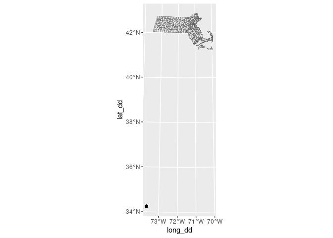
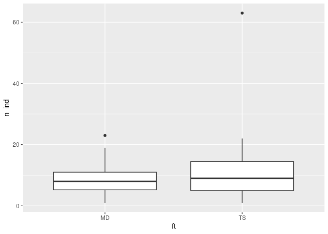
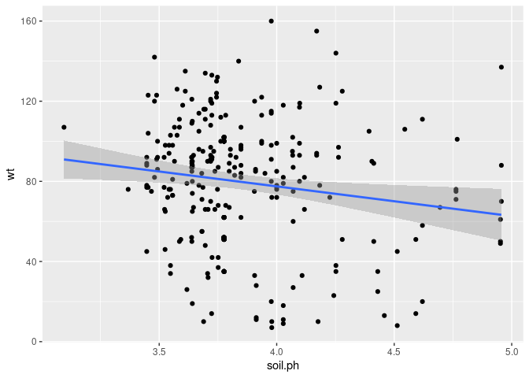

Red-backed salamander abundance and distribution in north-central
Massachusetts
================
Joshua A. Harkness
2024-02-02

## 1. Introduction

## 2. Data

### Load Packages

``` r
library(tidyverse)
library(broom)
library(stringr)
library(sf)
library(ggspatial)
library(readxl)
```

### Load Datafiles from GitHub Repository

``` r
plots <- read_csv("/cloud/project/data/hf131-01-plot.csv")
trees <- read_csv("/cloud/project/data/hf131-02-tree.csv")
cwd <- read_csv("/cloud/project/data/hf131-03-cwd.csv")
aco <- read_csv("/cloud/project/data/hf131-04-aco.csv")
pc <- read_csv("/cloud/project/data/hf131-05-pc-abund.csv")
herps <- read_csv("/cloud/project/data/hf131-06-herps.csv")
```

``` r
glimpse(plots)
```

    ## Rows: 150
    ## Columns: 23
    ## $ plot         <chr> "WA1TS", "WA1TS", "WA1TS", "WA1TS", "WA1TS", "WA1MD", "WA…
    ## $ site         <chr> "WA1", "WA1", "WA1", "WA1", "WA1", "WA1", "WA1", "WA1", "…
    ## $ ft           <chr> "TS", "TS", "TS", "TS", "TS", "MD", "MD", "MD", "MD", "MD…
    ## $ asn          <dbl> 1, 2, 3, 4, 5, 1, 2, 3, 4, 5, 1, 2, 3, 4, 5, 1, 2, 3, 4, …
    ## $ lat          <chr> "N 42\xb029.285'", "N 42\xb029.262'", "N 42\xb029.250'", …
    ## $ long         <chr> "W 71\xb053.882'", "W 71\xb053.882'", "W 71\xb053.909'", …
    ## $ datum        <chr> "NAD83", "NAD83", "NAD83", "NAD83", "NAD83", "NAD83", "NA…
    ## $ ba           <dbl> 56.1, 60.2, 42.6, 68.2, 62.7, 39.4, 12.5, 13.3, 41.2, 22.…
    ## $ st.ha        <dbl> 736.0, 736.0, 1358.0, 453.0, 905.0, 905.0, 736.0, 962.0, …
    ## $ ts           <dbl> 0.98, 0.80, 1.00, 1.00, 0.77, 0.00, 0.00, 0.00, 0.00, 0.0…
    ## $ bearing      <chr> "293", "298", "300", "304", "314", "265", "274", "301", "…
    ## $ aspect       <chr> "NW", "NW", "NW", "NW", "NW", "W", "W", "NW", "W", "W", "…
    ## $ slope        <chr> "10", "10", "5", "16", "12", "5", "5", "6", "5", "7", "8"…
    ## $ canopy.cover <dbl> 91, 88, 92, 88, 84, 95, 97, 93, 93, 94, 93, 91, 93, 93, 9…
    ## $ cwd.no       <dbl> 5, 10, 7, 13, 6, 5, 6, 3, 6, 8, 9, 8, 5, 10, 11, 7, 5, 12…
    ## $ cwd.con      <dbl> 4, 8, 4, 7, 5, 2, 3, 3, 1, 7, 8, 6, 4, 5, 6, 6, 4, 9, 2, …
    ## $ vcwd         <dbl> 6.2, 82.1, 44.6, 32.6, 25.8, 28.3, 33.5, 6.7, 9.5, 17.7, …
    ## $ vcwd.con     <dbl> 5.5, 80.7, 39.6, 25.0, 25.4, 23.4, 4.3, 6.7, 2.2, 16.7, 9…
    ## $ avg.dc       <dbl> 4.6, 3.1, 3.9, 3.0, 3.7, 2.4, 2.3, 3.7, 2.7, 3.6, 3.0, 3.…
    ## $ tot.snags    <dbl> 2, 0, 4, 0, 2, 2, 3, 1, 0, 3, 2, 3, 2, 1, 0, 6, 1, 8, 8, …
    ## $ avg.snag.ht  <dbl> 3, 0, 9, 0, 7, 9, 5, 2, 0, 5, 4, 8, 11, 10, 0, 5, 3, 5, 3…
    ## $ avg.snag.dbh <dbl> 10, 0, 33, 0, 14, 12, 14, 10, 0, 14, 20, 29, 17, 28, 0, 1…
    ## $ soil.ph      <dbl> 3.854, 3.827, 4.026, 3.915, 3.684, 4.108, 3.889, 3.643, 3…

``` r
glimpse(trees)
```

    ## Rows: 3,206
    ## Columns: 8
    ## $ stem.master <dbl> 1, 2, 3, 4, 5, 6, 7, 8, 9, 10, 11, 12, 13, 14, 15, 16, 17,…
    ## $ plot        <chr> "SC2MD", "SC2MD", "SC2MD", "SC2MD", "SC2MD", "SC2MD", "SC2…
    ## $ asn         <dbl> 1, 1, 1, 1, 1, 1, 1, 1, 1, 1, 1, 1, 1, 1, 1, 1, 1, 1, 1, 1…
    ## $ stem.asn    <chr> "1", "2", "3", "4", "5", "6", "7", "8", "9", "10", "11", "…
    ## $ species     <chr> "TSCA", "TSCA", "TSCA", "ACRU", "FAGR", "TSCA", "TSCA", "U…
    ## $ dbh         <dbl> 26.3, 6.0, 14.7, 35.6, 9.8, 6.0, 11.0, 19.3, 30.5, 8.5, 15…
    ## $ alive       <chr> "Y", "Y", "Y", "Y", "Y", "Y", "N", "N", "Y", "Y", "Y", "Y"…
    ## $ sh          <dbl> NA, NA, NA, NA, NA, NA, 6, NA, NA, NA, NA, NA, NA, NA, NA,…

``` r
glimpse(cwd)
```

    ## Rows: 1,103
    ## Columns: 10
    ## $ cwd.no  <dbl> 1, 2, 3, 4, 5, 6, 7, 8, 9, 10, 11, 12, 13, 14, 15, 16, 17, 18,…
    ## $ site    <chr> "SC1", "SC1", "SC1", "SC1", "SC1", "SC1", "SC1", "SC1", "SC1",…
    ## $ ft      <chr> "TS", "TS", "TS", "TS", "TS", "TS", "TS", "TS", "TS", "TS", "T…
    ## $ plot    <chr> "SC1TS", "SC1TS", "SC1TS", "SC1TS", "SC1TS", "SC1TS", "SC1TS",…
    ## $ asn     <dbl> 1, 1, 1, 1, 1, 1, 1, 1, 1, 1, 1, 1, 2, 2, 2, 2, 2, 2, 2, 3, 3,…
    ## $ tr      <dbl> 30, 30, 150, 150, 150, 150, 150, 270, 270, 270, 270, 270, 30, …
    ## $ species <chr> "UNKN", "ACRU", "BELE", "BEAL", "FAGR", "BEAL", "FAGR", "FAGR"…
    ## $ diam    <dbl> 6.2, 3.8, 3.3, 5.5, 3.1, 5.1, 9.7, 6.7, 17.2, 3.2, 2.8, 6.2, 3…
    ## $ dc      <dbl> 5, 4, 5, 3, 5, 5, 5, 3, 3, 4, 3, 4, 4, 2, 2, 2, 3, 3, 5, 4, 5,…
    ## $ c       <chr> "Y", "Y", "Y", "Y", "Y", "Y", "Y", "Y", "Y", "Y", "Y", "Y", "Y…

``` r
glimpse(aco)
```

    ## Rows: 2,380
    ## Columns: 14
    ## $ datetime <dttm> 2005-06-13 16:00:00, 2005-06-13 16:00:00, 2005-06-13 16:00:0…
    ## $ date     <date> 2005-06-13, 2005-06-13, 2005-06-13, 2005-06-13, 2005-06-13, …
    ## $ aco      <dbl> 241, 242, 243, 244, 245, 246, 247, 248, 249, 250, 251, 252, 2…
    ## $ plot     <chr> "PHTS", "PHTS", "PHTS", "PHTS", "PHTS", "PHTS", "PHTS", "PHTS…
    ## $ asn      <dbl> 1, 1, 2, 2, 3, 3, 4, 4, 5, 5, 1, 1, 2, 2, 3, 3, 4, 4, 5, 5, 1…
    ## $ airt     <dbl> 26.4, 26.4, 26.4, 26.4, 26.4, 26.4, 26.4, 26.4, 26.4, 26.4, 2…
    ## $ rh       <dbl> 93, 93, 93, 93, 93, 93, 93, 93, 93, 93, 80, 80, 80, 80, 80, 8…
    ## $ soilt    <dbl> NA, NA, NA, NA, NA, NA, NA, NA, NA, NA, NA, NA, NA, NA, NA, N…
    ## $ time     <time> 16:00:00, 16:00:00, 16:00:00, 16:00:00, 16:00:00, 16:00:00, …
    ## $ pca      <dbl> 0, 0, 1, 0, 0, 0, 0, 0, 0, 0, 0, 0, 0, 0, 0, 0, 0, 0, 0, 0, 0…
    ## $ pcn      <chr> NA, NA, "1", NA, NA, NA, NA, NA, NA, NA, NA, NA, NA, NA, NA, …
    ## $ em.aco   <dbl> NA, NA, NA, NA, NA, NA, NA, NA, NA, NA, NA, NA, NA, NA, NA, N…
    ## $ osn      <chr> NA, NA, NA, NA, NA, NA, NA, NA, NA, NA, NA, NA, NA, NA, NA, N…
    ## $ other.sp <chr> NA, NA, NA, NA, NA, NA, NA, NA, NA, NA, NA, NA, NA, NA, NA, N…

``` r
glimpse(pc)
```

    ## Rows: 250
    ## Columns: 9
    ## $ pc.no <dbl> 1, 2, 3, 4, 5, 6, 7, 8, 9, 10, 11, 12, 13, 14, 15, 16, 17, 18, 1…
    ## $ date  <date> 2005-06-13, 2005-06-14, 2006-06-14, 2005-06-16, 2005-06-16, 200…
    ## $ plot  <chr> "PHTS", "SC2TS", "SC1TS", "WA1TS", "WA2TS", "WA3TS", "WA3TS", "W…
    ## $ aco   <dbl> 243, 283, 210, 3, 24, 41, 47, 49, 58, 110, 121, 122, 125, 132, 1…
    ## $ p     <chr> "R", "R", "L", "R", "R", "R", "R", "R", "R", "R", "R", "R", "R",…
    ## $ svl   <dbl> 35, 35, NA, 35, 35, 30, 30, 35, NA, 37, 37, 37, 37, 35, 37, 40, …
    ## $ tl    <dbl> 70, 70, NA, 70, 70, 50, 60, 70, NA, 70, 87, 75, 70, 70, 77, 70, …
    ## $ wt    <dbl> 75, 75, NA, 92, 82, 50, 60, 70, NA, 92, 70, 90, 80, 82, 85, 113,…
    ## $ sex   <chr> NA, NA, NA, NA, NA, NA, NA, NA, NA, NA, NA, NA, NA, NA, NA, NA, …

``` r
glimpse(herps)
```

    ## Rows: 48
    ## Columns: 8
    ## $ osn     <dbl> 1, 2, 3, 4, 5, 6, 7, 8, 9, 10, 11, 12, 13, 14, 15, 16, 17, 18,…
    ## $ date    <date> 2005-06-14, 2005-06-30, 2005-07-01, 2004-07-05, 2005-07-11, 2…
    ## $ plot    <chr> "TS2TS", "MRMD", "PHMD", "WA1MD", "MRMD", "PHTS", "TS2MD", "TS…
    ## $ aco     <dbl> 263, 75, 259, 13, 73, 244, 279, 262, 268, 263, 264, 168, 200, …
    ## $ species <chr> "NOVI", "THIS", "AMMA", "RASY", "NOVI", "NOVI", "NOVI", "NOVI"…
    ## $ svl     <dbl> 7, NA, 45, NA, NA, 35, 40, 35, 35, 30, 20, 35, 35, NA, NA, 35,…
    ## $ tl      <dbl> NA, 30, 100, NA, NA, 60, 80, 60, 60, 45, 30, 60, 75, NA, NA, 7…
    ## $ weight  <dbl> NA, NA, 525, NA, NA, NA, NA, NA, NA, NA, NA, NA, NA, NA, NA, N…

### Convert degrees, minutes, seconds to decimal degrees

``` r
#latitude
plots <- plots %>%
  mutate(lat = str_replace_all(lat, "\xb0", ":"))

plots <- plots %>%
  mutate(lat = str_remove_all(lat, "N"))

plots <- plots %>%
  mutate(lat = str_remove_all(lat, "'"))

plots <- plots %>%
  mutate(lat = str_squish(lat))

#longitude
plots <- plots %>%
  mutate(long = str_replace_all(long, "\xb0", ":"))

plots <- plots %>%
  mutate(long = str_remove_all(long, "W"))

plots <- plots %>%
  mutate(long = str_remove_all(long, "'"))

plots <- plots %>%
  mutate(long = str_squish(long))
```

``` r
#extract values to create separate columns for degrees, decimal minutes, and hemisphere

plots <- plots %>%
  mutate(lat_deg = str_extract_all(plots$lat, "..(?=:)"),
         lat_dm = str_extract_all(plots$lat, "(?<=:)......"),
         long_deg = str_extract_all(plots$long, "..(?=:)"),
         long_dm = str_extract_all(plots$long, "(?<=:)......"))

plots$lat_deg <- as.numeric(plots$lat_deg)
plots$lat_dm <- as.numeric(plots$lat_dm)
plots$long_deg <- as.numeric(plots$long_deg)
plots$long_dm <- as.numeric(plots$long_dm)
```

``` r
coords <- plots %>%
  select(plot, lat_deg, lat_dm, long_deg, long_dm) %>%
  mutate(lat_dd = lat_deg + lat_dm / 60,
         long_dd = long_deg + long_dm / 60) %>%
  select(plot, lat_dd, long_dd)

coords$long_dd <- coords$long_dd*(-1)

plots$lat_dd <- coords$lat_dd
plots$long_dd <- coords$long_dd
```

``` r
coords %>%
  ggplot(aes(x = long_dd, y = lat_dd)) +
  geom_point()
```

    ## Warning: Removed 3 rows containing missing values (`geom_point()`).

<!-- -->

Based on the coordinates plotted here, data was collected within about
fifteen miles of Harvard Forest (HF) in Petersham, Massachusetts. The
central clusters of points appear to be from the HF properties in
Petersham; the southeastern cluster is from Mount Wachusett, and the
northern and western clusters on state land in the towns of Northfield,
Warwick, and Royalston. This provides a useful reference as to the
spatial scale of this project.

``` r
mass_towns <- st_read("/cloud/project/data/Community Boundaries (Towns) from Survey Points.shp")
```

    ## Reading layer `Community Boundaries (Towns) from Survey Points' from data source `/cloud/project/data/Community Boundaries (Towns) from Survey Points.shp' 
    ##   using driver `ESRI Shapefile'
    ## Simple feature collection with 351 features and 14 fields
    ## Geometry type: MULTIPOLYGON
    ## Dimension:     XY
    ## Bounding box:  xmin: 33863.73 ymin: 777606.4 xmax: 330837 ymax: 959743
    ## Projected CRS: NAD83 / Massachusetts Mainland

``` r
ggplot(mass_towns) +
  geom_sf() +
  geom_point(data = coords, (aes(x = long_dd, y = lat_dd)), color = "black", alpha = 0.5)
```

    ## Warning: Removed 3 rows containing missing values (`geom_point()`).

<!-- -->

Not sure why I’m getting this mismatch in coordinates. My points appear
in the correct location when plotted with X/Y coordinates, but they’re
showing up about 8 degrees too far south and a little west when plotted
with this shapefile of Massachusetts towns. Maybe because the points
don’t have a coordinate reference system assigned? I haven’t had this
issue before though. I’ll try loading these points into ArcGIS to see if
I figure out the source of the issue.

### Join data files

``` r
# joining all except herps for now
plots_aco <- full_join(plots, aco)
```

    ## Joining with `by = join_by(plot, asn)`

``` r
plots_aco_cwd <- full_join(plots_aco, cwd)
```

    ## Joining with `by = join_by(plot, site, ft, asn, cwd.no)`

``` r
plots_aco_cwd_trees <- full_join(plots_aco_cwd, trees)
```

    ## Joining with `by = join_by(plot, asn, species)`

    ## Warning in full_join(plots_aco_cwd, trees): Detected an unexpected many-to-many relationship between `x` and `y`.
    ## ℹ Row 1581 of `x` matches multiple rows in `y`.
    ## ℹ Row 598 of `y` matches multiple rows in `x`.
    ## ℹ If a many-to-many relationship is expected, set `relationship =
    ##   "many-to-many"` to silence this warning.

``` r
df <- full_join(plots_aco_cwd_trees, pc)
```

    ## Joining with `by = join_by(plot, date, aco)`

    ## Warning in full_join(plots_aco_cwd_trees, pc): Detected an unexpected many-to-many relationship between `x` and `y`.
    ## ℹ Row 144 of `x` matches multiple rows in `y`.
    ## ℹ Row 70 of `y` matches multiple rows in `x`.
    ## ℹ If a many-to-many relationship is expected, set `relationship =
    ##   "many-to-many"` to silence this warning.

## 3. Ethics review

## 4. Data analysis plan

### Forest Structure / Environmental conditions

``` r
df %>%
  ggplot(aes(x = site, y = soil.ph, fill = ft)) +
  geom_boxplot()
```

    ## Warning: Removed 7502 rows containing non-finite values (`stat_boxplot()`).

<!-- -->

Boxplot of soil pH by site. Boxes are colored per forest type (“TS” =
Tsuga canadensis dominated (\>50% BA), “MD” = mixed-deciduous forest
(hemlock \<25% BA)). Hemlock dominated stands are consistently more
acidic than mixed deciduous stands with some outliers.

``` r
df %>%
  ggplot(aes(x = site, y = ba, fill = ft)) +
  geom_boxplot()
```

    ## Warning: Removed 7502 rows containing non-finite values (`stat_boxplot()`).

<!-- -->

Boxplot of basal area (m2/ha) by site. Hemlock dominated sites have
consistently higher BA than mixed deciduous sites.

``` r
df %>%
  ggplot(aes(y = vcwd, x = ba, color = ft)) +
  geom_jitter() +
  theme_bw() +
  labs(title = "Coarse Woody Debris and Basal Area",
       x = "Basal area (m2/ha)",
       y = "CWD volume (m3)")
```

    ## Warning: Removed 7502 rows containing missing values (`geom_point()`).

<!-- --> Coarse
woody debris volume is higher in stands with lower basal area, which is
reasonable given that areas that were recently affected by blowdown
events should have higher CWD and lower BA, but very dense stands (high
BA) should have less CWD. Coloring the points by forest type, we see
that it is primarily hemlock-dominated plots that have high BA and low
CWD, and hardwood sites have lower BA and higher CWD volume.

#### Is soil temp more or less associated with air temperature in hemlock dominated vs mixed-deciduous plots?

``` r
df %>%
  filter(ft != "NA") %>%
  ggplot(aes(x = airt, y = soilt, shape = ft, color = ft)) +
  geom_point() +
  geom_smooth(method = "lm", fullrange = TRUE, se = FALSE) +
  labs(title = "Soil temp as function of air temp",
       subtitle = "In hemlock and mixed deciduous forest",
       x = "Air temp (°C)",
       y = "Soil temp (°C)")
```

    ## `geom_smooth()` using formula = 'y ~ x'

<!-- --> Modelling
soil temperature as a function of air temperature and forest type
indicates that there is not much sheltering effect of hemlock-dominated
canopy cover on soil temperature, which could be an important factor for
P. cinereus abundance.

### Plethodon cinereus abundance

``` r
df %>%
  group_by(plot, site) %>%
  drop_na(pca) %>%
  filter(pca != 0) %>%
  count(pca, sort = TRUE)
```

    ## # A tibble: 43 × 4
    ## # Groups:   plot, site [29]
    ##    plot  site    pca     n
    ##    <chr> <chr> <dbl> <int>
    ##  1 SC1TS SC1       1    39
    ##  2 WSFMD WSF       1    15
    ##  3 ER2TS ER2       1    14
    ##  4 SC2TS SC2       1    13
    ##  5 SC1TS SC1       2    12
    ##  6 WA3MD WA3       1    12
    ##  7 NSFMD NSF       1    11
    ##  8 ER2MD ER2       1    10
    ##  9 TS1TS TS1       1     9
    ## 10 WA3TS WA3       1     9
    ## # ℹ 33 more rows

``` r
df %>%
  group_by(ft) %>%
  drop_na(pca) %>%
  filter(pca != 0) %>%
  count(pca, sort = TRUE) %>%
  summarise(mean(n))
```

    ## # A tibble: 2 × 2
    ##   ft    `mean(n)`
    ##   <chr>     <dbl>
    ## 1 MD         37  
    ## 2 TS         53.3

``` r
df %>%
  group_by(site) %>%
  drop_na(pca) %>%
  filter(pca != 0) %>%
  count(pca, sort = TRUE) %>%
  ggplot(aes(x = site, y = n)) +
  geom_boxplot()
```

<!-- -->

``` r
df %>%
  group_by(ft) %>%
  drop_na(pca) %>%
  filter(pca != 0) %>%
  count(pca, sort = TRUE) %>%
  ggplot(aes(x = ft, y = n)) +
  geom_boxplot()
```

<!-- -->

P. cinereus abundance is higher in hemlock dominated forest (mean = 53
individuals), than in mixed deciduous forest (mean = 37 individuals).

``` r
df %>%
  group_by(vcwd) %>%
  drop_na(pca) %>%
  filter(pca != 0) %>%
  count(pca) %>%
  ggplot(aes(x = vcwd, y = n)) +
  geom_jitter() +
  geom_smooth(method = "lm") +
  labs(title = "P. cinereus abundance",
       y = "n Observations",
       x = "Volume CWD (m2)")
```

    ## `geom_smooth()` using formula = 'y ~ x'

<!-- -->

P. cinereus abundance as function of soil ph

``` r
df %>%
  group_by(soil.ph) %>%
  drop_na(pca) %>%
  filter(pca != 0) %>%
  count(pca, sort = TRUE) %>%
  ggplot(aes(x = soil.ph, y = n)) +
  geom_jitter() +
  geom_smooth()
```

    ## `geom_smooth()` using method = 'loess' and formula = 'y ~ x'

<!-- -->

``` r
df %>%
  group_by(soil.ph, wt) %>%
  drop_na(wt) %>%
  ggplot(aes(x = soil.ph, y = wt)) +
  geom_point()
```

    ## Warning: Removed 6 rows containing missing values (`geom_point()`).

<!-- -->

### Other herp morphometrics

``` r
herps %>%
  count(species, sort = TRUE)
```

    ## # A tibble: 6 × 2
    ##   species     n
    ##   <chr>   <int>
    ## 1 NOVI       34
    ## 2 RASY        4
    ## 3 AMMA        3
    ## 4 EUBI        3
    ## 5 STOC        3
    ## 6 THIS        1

``` r
herps %>%
  ggplot(aes(x = species, y = tl, fill = species)) +
  geom_boxplot() +
  coord_flip()
```

    ## Warning: Removed 11 rows containing non-finite values (`stat_boxplot()`).

<!-- -->

``` r
df %>%
  ggplot(aes(x = vcwd, y = wt)) +
  geom_point()
```

    ## Warning: Removed 9717 rows containing missing values (`geom_point()`).

<!-- -->
